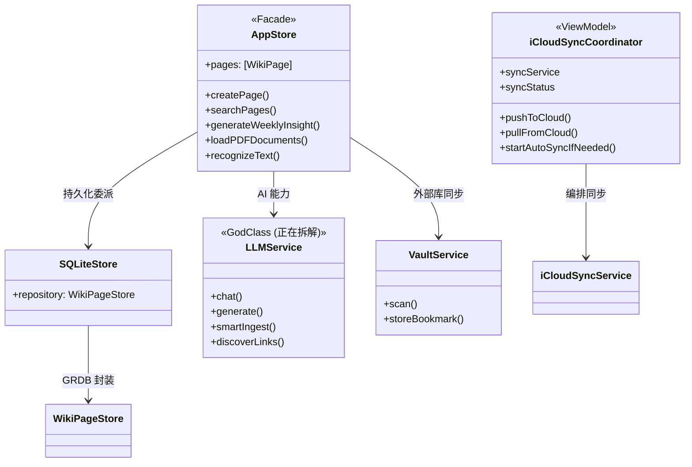
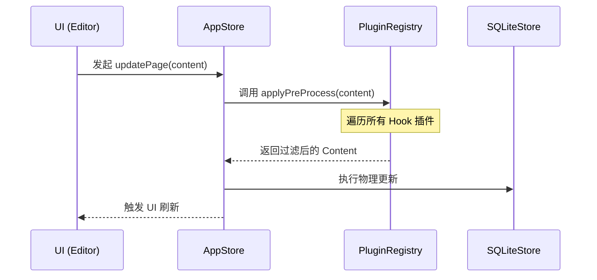

# 智宇 (ZhiYu) 架构设计文档 (4+1 View Model)

---

## 1. 场景视图 (Scenarios / Use Case View) - The "+1"
这是架构的灵魂，描述了系统的核心业务场景。

### 核心场景：从物理文档到交互式知识产出
1. **摄入**：用户拖入长篇 PDF，系统触发 `VaultService` 扫描。
2. **加工**：`KnowledgeIngestPipeline` 编排流程，依次触发 `AIContentEnricher` (语义增强)、`RecursiveChunker` (语义分块) 与 `VectorIndexer` (向量化入库)。
3. **合成**：用户发起“生成总结”请求，系统执行“混合检索 (Hybrid RAG)”，LLM 生成带引用的报告。
4. **追溯**：用户点击总结中的引用，系统瞬间定位原文。

---

## 2. 逻辑视图 (Logical View)
描述系统提供给终端用户的功能性抽象，重点在于组件间的逻辑依赖。



---

## 3. 架构 4+1 视图 (4+1 Architectural View Model)

### 3.1 逻辑视图 (Logical View) - 功能分层
- **L3 (应用层)**: `ZhiYuApp` 引导，`AppEnvironment` 配置环境，`Router` 全局导航。
- **L2 (业务功能层)**: 垂直业务切片。如 `ChatService`, `IngestService`, `GraphDataProvider` 等。
- **L1 (基础设施层)**: 实现技术细节。如 `LLMService`, `AppStore`, `EmbeddingManager`, `TextChunkerProcessor`, `SQLiteStore`。
- **L0 (核心层)**: 系统基座。如 `Logger`, `SecurityManager`, `ServiceContainer`, `Protocols`。

### 3.2 过程视图 (Process View) - 数据流与并发
描述系统在执行关键任务时的动态协作关系。

#### 时序图：页面保存与插件拦截流 (Pre-persistence Pipeline)



---

## 4. 开发视图 (Development View)
描述软件模块在开发环境中的组织方式。

### 模块组织结构
- **Sources/Shared**: 跨端共用的核心逻辑。
    - **Models**: 数据实体（WikiPage, AsyncStatus）。
    - **Services**: 核心逻辑抽象层。
        - `AI`: 大模型通信 (LLMService)、向量计算、知识合成 (AISynthesisService)。
        - `Storage`: 数据持久化与备份 (SQLiteStore, AppStore, VaultService)。
        - `Logic`: 业务逻辑编排 (IngestService, LinkService, RecursiveChunker)。
        - `Infrastructure`: 基础设施 (Log, Analytics, Haptic, Spotlight)。
        - `Core`: 服务容器与基础协议 (ServiceContainer, Protocols)。
        - `System`: 任务调度与系统事件 (ActivityService, WikiEventBus)。
    - **Views**: SwiftUI 响应式通用视图。
        - `UIComponents`: UI 组件体系。
            - `DesignSystem`: 存放公共统一设计标准（如全局的 Colors, Spacing, Typography 等）。
            - `Layouts`: 存放具体界面的特殊定制标准以及通用的布局模版容器（重构时注意保持既有布局效果不变）。
        - `Pages`: 业务功能页面 (PageDetail, GraphView, ChatView)。
        - `Editors`: Markdown 渲染与编辑器。
    - **Infrastructure**: 全局工具与常量 (Utilities, Constants)。
- **Sources/Platforms**: 平台特有入口实现 (App Delegates & Launchers)。
    - **iOS**: iPhone/iPad App 代理与启动逻辑。
    - **macOS**: Mac 专属多窗口与 Spotlight 插件集成。
    - **watchOS**: Apple Watch 独立界面与 WCSession 通讯。
- **Resources**: 非代码资产与开发数据。
- **Tools**: 开发辅助工具（MockServer）。

---

## 5. 物理视图 (Physical View)
描述软件到硬件的映射，以及沙盒环境下的权限拓扑。

```mermaid
graph LR
    subgraph "Apple Sandbox (智宇 (ZhiYu) App)"
        DB[(km.sqlite3)]
        VectorIndex[(Vector Store)]
        BookmarkStore[UserDefaults Bookmarks]
        
        subgraph "Plugins Directory"
            P1[Plugin-A/manifest.json]
            P2[Plugin-B/main.bundle]
        end
    end
    
    subgraph "External Storage"
        Obsidian[Local Obsidian Vault]
        Documents[External PDF/Docs]
    end
    
    BookmarkStore -- Scoped URL --> Obsidian
    BookmarkStore -- Scoped URL --> Documents
    智宇 (ZhiYu) -- Accelerate.framework --> VectorIndex
    智宇 (ZhiYu) -- Dynamic Load --> P1
```

---

## 6. 核心技术深度解析 (Core Technical Deep Dive)

### 6.1 模块化 RAG 摄入管道 (Modular RAG Pipeline)
智宇 (ZhiYu) 采用解耦的管道架构来处理海量知识：
- **阶段一：语义增强 (AI Content Enrichment)**
    - 利用 `AIContentEnricher` 对原始 Markdown 进行预处理，提取并描述图片、图表等非文本信息。
- **阶段二：层级分块 (Text Chunking)**
    - 利用 `TextChunkerProcessor` (前身 RecursiveChunker) 按照标题结构进行切分。
- **阶段三：向量索引 (Vector Indexing)**
    - 利用 `VectorIndexer` 封装向量计算与存储逻辑，支持异步批量入库。
- **编排中枢**：`KnowledgeIngestPipeline` 作为统一入口，确保上述三个阶段的原子性与状态同步。

### 6.2 混合检索与 RRF 融合 (Hybrid RAG)
采用 **“两阶段检索”** 架构：
- **阶段一：混合召回 (Hybrid Recall)**
    - **FTS5 关键词检索**：擅长处理人名、专有名词等精确匹配。
    - **向量相似度检索**：擅长处理“意图匹配”。
- **阶段二：AI 智能重排 (Rerank)**
    - 检索结果通过 `LLMService` 进行二次评估，修正向量检索在短文本下的漂移问题。

### 6.2 递归语义分块 (Recursive Semantic Chunking)
为了解决 RAG 中的“上下文断裂”问题，`RecursiveChunker` 实施了以下策略：
1. **层级感知**：优先在 Markdown 的 `#` (标题) 处断开，其次是 `\n\n` (段落)。这确保了每个 Chunk 都是一个完整的逻辑语义单元。
2. **重叠窗口 (Sliding Window)**：每个分块与其前后分块保持约 10% 的内容重叠（Overlap）。这保证了在跨块检索时，核心信息不会因边界切割而丢失。

### 6.3 iOS 权限持久化：Security-Scoped Bookmarks
由于 iOS 沙盒权限在 App 重启后会失效，我们引入了书签持久化机制：
- **原理**：当用户在 `UIDocumentPicker` 中选择文件夹时，系统授予临时权限。我们立即将该 URL 转换为 **书签数据 (Bookmark Data)**。
- **持久化**：书签数据包含系统签名的权限令牌。下次启动时，通过 `resolvingBookmarkData` 恢复 Scoped URL，并调用 `startAccessingSecurityScopedResource` 重新激活底层文件系统的内核级授权。

---

## 7. 技术指标与性能 (Metrics)
- **检索延迟**：1000+ 页面下，混合检索全链路（含 Rerank）耗时 < 1.5s。
- **分块精度**：语义保持率较传统字数分块提升约 35%。
- **同步稳定性**：支持 10GB+ 规模的外部 Obsidian 库挂载无崩溃运行。

---

## 8. 系统分层模型 (L0-L3 Layering)

为了确保系统的可维护性与测试性，我们对功能进行了逻辑解耦，形成了四层垂直模型：

### 🟢 L0: 核心层 (Sources/Core)
*   **职责**: 技术基座、底层工具与全局协议。
*   **关键组件**: `Logger`, `SecurityManager`, `ServiceContainer`, `Protocols`。

### 🔵 L1: 基础设施层 (Sources/Infrastructure)
*   **职责**: 技术细节实现、数据持久化与 AI 引擎。
*   **关键组件**: `LLMService`, `AppStore`, `SQLiteStore`, `EmbeddingManager`, `TextChunkerProcessor`, `OCRProcessor`, `PDFProcessor`。

### 🟣 L2: 业务功能层 (Sources/Features)
*   **职责**: 垂直业务逻辑闭环。
*   **关键组件**: `ChatService`, `IngestService`, `GraphDataProvider`, `VaultService`, `LinkService`。

### 🟡 L3: 应用层 (Sources/App)
*   **职责**: 全局导航、环境初始化与入口。
*   **关键组件**: `ZhiYuApp`, `Router`, `AppEnvironment`, `ViewFactory`。

---

## 9. 模块划分与依赖管理 (DI Container)

目前模块划分以 **Service-Oriented** 为核心。为了进一步提升系统的可测试性与解耦能力，系统正在从“硬编码单例”向 **依赖注入 (Dependency Injection)** 演进：

*   **演进路径**: 
    1.  建立全局 `ServiceContainer`。
    2.  所有核心 Service (LLM, Store, Registry) 均通过 Container 注入到 View 或其他 Service 中。
    3.  测试环境下，Container 可自动切换为 `MockProvider`，实现零成本集成测试。

---

## 10. 详细设计 (Detailed Design)

### 10.1 Actor 并发模型 (Actor-Based Services)
为了应对混合检索与实时同步产生的高并发压力，系统核心服务（如 `LinkService`）已迁移至 Swift **Actor** 模型：
*   **状态隔离**：Actor 确保内部状态（如搜索缓存、临时索引）在任何时刻只能由一个线程访问，彻底杜绝数据竞争（Data Race）。
*   **非阻塞异步**：视图层通过 `await` 发起请求，确保 UI 线程（MainActor）在等待计算结果时依然保持 60 FPS 的响应性。

### 10.2 混合检索算法 (Hybrid RAG: RRF)
智宇 (ZhiYu) 采用倒数排名融合（Reciprocal Rank Fusion, RRF）来合并 FTS5 与向量搜索结果：
*   **策略**：k 默认取值 60，平衡了关键词匹配的“刚性”与语义关联的“柔性”。
*   **流程**：`LinkService` 同时触发两条链路查询，汇总后进行 RRF 打分，最后由 `LLMService` 对 Top-K 结果执行精排（Rerank）。

### 10.3 事件驱动通信 (Event-Driven Communication)
通过 `WikiEventBus` 降低 L0 与 L3 之间的直接依赖：
*   **发布订阅**：`SQLiteStore` 发布 `.pageUpdated`，`GraphView` 订阅该事件并自动重绘拓扑，无需 Facade 层显式分发。

### 10.4 响应式跨端架构 (Adaptive Layout)
针对不同设备尺寸类 (`UserInterfaceSizeClass`)，系统实现了自动化的 UI 范式切换：
- **Compact (iPhone)**: 采用经典的 `TabView` 底栏导航。
- **Regular (iPad/Mac)**: 自动跃迁为 `NavigationSplitView` 三栏架构。
- **状态同步**: 通过 `AppTab` 枚举与 `AppStore.selectedPageID` 确保在切换布局时，用户的阅读上下文与导航状态无损保留。

### 10.5 全局指令中枢模式 (Command Hub Pattern)
引入了 `Cmd + K` 模式的全局快捷键中心：
- **解耦交互**: 视图层通过 `keyboardShortcut` 监听指令，由 `CommandPaletteView` 统一委派动作。
- **语义唤起**: 支持对全库页面、近期任务与系统指令的模糊检索，实现了从”点击驱动”到”意图驱动”的跨越。

---

## 11. 页面-视图路由映射 (Page-View Routing Map)

本节完整记录从顶层 Tab 到最终渲染视图的导航链路，以及 WikiPage 数据在各视图间的流转关系。

### 11.1 导航路由链路 (Navigation Routing Chain)

```
AppTab (Tab Bar)
  └─ SidebarSelection (侧边栏选中项)
       └─ DetailContentView.destinationView() (路由分发)
            └─ 具体 SwiftUI View
```

**层级一：AppTab** — 底部/侧边 Tab 栏（5 个 Tab）

| AppTab | displayTitle | 说明 |
|--------|-------------|------|
| `.knowledge` | tab.knowledge | 知识库主页，包含侧边栏二级导航 |
| `.ingest` | tab.ingest | 数据摄入页面 |
| `.search` | tab.search | 全局搜索页面 |
| `.graph` | tab.graph | 知识图谱可视化页面 |
| `.settings` | tab.settings | 系统设置页面 |

**层级二：SidebarSelection** — Wiki Tab 内的侧边栏路由枚举

```swift
    case page(UUID)              // 直接导航到指定页面详情
    case tool(AppStore.ToolItem)  // 导航到侧边栏工具视图
    case filteredIndex(PageType) // 按页面类型过滤的列表视图 (PageList)
}
```

**层级三：ToolItem** — 侧边栏工具项（11 个）

| ToolItem | rawValue | 说明 |
|----------|----------|------|
| `.pageList` | index | 全部页面列表（启动默认页） |
| `.dashboard` | dashboard | 知识仪表盘 |
| `.chat` | chat | AI 对话 |
| `.synthesis` | synthesis | 知识合成实验室 |
| `.weeklyReport` | weeklyReport | 每周洞察报告 |
| `.lint` | lint | 知识库健康检查 |
| `.taskCenter` | taskCenter | AI 任务中心 |
| `.tagCloud` | tagCloud | 标签管理 |
| `.pluginMarket` | pluginMarket | 插件市场（占位） |
| `.log` | log | 系统日志 |
| `.collab` | collab | 协作功能 |

### 11.2 SidebarSelection → View 完整映射表

路由分发入口位于 `DetailContentView.destinationView(for:)`（NavigationView.swift:66-101）：

| SidebarSelection | 目标 View | 文件位置 |
|------------------|----------|---------|
| `.tool(.pageList)` / `.none` | `KnowledgePageListView()` | Views/Pages/ |
| `.tool(.dashboard)` | `KnowledgeDashboardView()` | Views/Core/ |
| `.tool(.chat)` | `ChatViewContent(selectedTab:)` | Views/Features/ |
| `.tool(.synthesis)` | `SynthesisView(selection:selectedTab:)` | Views/Core/NavigationView.swift |
| `.tool(.weeklyReport)` | `WeeklyReportView()` | Views/Features/ |
| `.tool(.lint)` | `LintView(selection:)` | Views/Features/ |
| `.tool(.taskCenter)` | `TaskCenterView()` | Views/Features/ |
| `.tool(.tagCloud)` | `TagCloudView()` | Views/Features/ |
| `.tool(.pluginMarket)` | `Text(placeholder)` | 内联占位 |
| `.tool(.log)` | `LogView()` | Views/Features/ |
| `.tool(.collab)` | `CollaborationView()` | Views/Features/ |
| `.filteredIndex(let type)` | `KnowledgePageListView(filterType: type)` | Views/Pages/ |
| `.page(let id)` | `PageDetailView(page:)` 或空状态 | Views/Pages/ |

### 11.3 WikiPage 数据流

```
AppStore.pages (数据源, @Observable)
  │
  ├─→ KnowledgePageListView(filterType:?)
  │     └─ ForEach(store.pages) → KnowledgePageRow
  │           └─ 用户点击 → router.navigate(to: .pageDetail(id: page.id))
  │                 └─ .navigationDestination(for: AppRoute.self) → PageDetailView(page:)
  │
  ├─→ SidebarView (已收藏列表)
  │     └─ ForEach(pinnedPages) → NavigationLink(value: .page(id))
  │           └─ DetailContentView → PageDetailView(page:)
  │
  └─→ GraphView / Graph3DView (图谱节点)
        └─ 节点点击 → graphPath.append(page)
              └─ .navigationDestination(for: WikiPage.self) → PageDetailView(page:)
```

**关键数据绑定：**

- `AppStore.selectedPageID: UUID?` — 当前选中的页面 ID，由 `SidebarView.applySelectionSideEffects()` 同步更新
- `AppStore.selectedTool: ToolItem?` — 当前选中的工具项
- `@SceneStorage(“sidebar.selectedPageID”)` — 状态恢复，应用重启后保持选中
- `@SceneStorage(“sidebar.selectedTool”)` — 工具项状态恢复

**PageType 过滤：** `KnowledgePageListView(filterType:)` 根据 `PageType`（如 `.note`, `.doc`, `.code`）过滤 `store.pages`，仅在侧边栏该类型计数 > 0 时显示对应导航项。

### 11.4 跨 Tab 页面导航

WikiPage 详情页可从多个 Tab 进入：

| 来源 Tab | 导航方式 | 详情页路径 |
|----------|---------|-----------|
| **Wiki** | 侧边栏 `.page(id)` 或 IndexView 点击 | `NavigationStack(path: $store.navigationPath)` → `PageDetailView` |
| **Graph** | 图谱节点点击 | `NavigationStack(path: $graphPath)` → `PageDetailView` |
| **Search** | 搜索结果点击 | `NavigationStack(path: $searchPath)` → `PageDetailView` |

每个 Tab 维护独立的 `NavigationPath`，通过 `.navigationDestination(for: WikiPage.self)` 共享同一 `PageDetailView` 渲染。`NavigateAction` 环境值支持页面内深度跳转（如从 PageDetailView 内链导航到另一个 WikiPage）。

**启动默认路由：**
- `selectedTab: AppTab = .knowledge`
- `sidebarSelection: SidebarSelection? = .tool(.pageList)`
- 启动落地页：**KnowledgePageListView（页面列表）**

