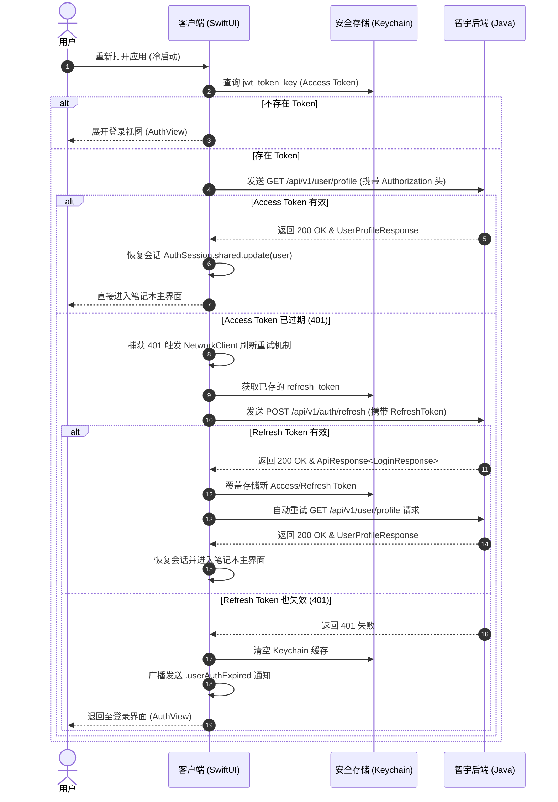

# 多认证系统前后端整体和分层架构

> 更新时间: 2026-06-12 (基于“记住登录与 Nacos 动态超时”特性重构)

## 一、系统架构概览

```
┌──────────────────────────────────────────────────────────────────────┐
│                        客户端层 Client Layer                          │
│                iOS / macOS / watchOS App (SwiftUI)                    │
└──────────────────────────────────────────────────────────────────────┘
                                  │
                                  ▼
┌──────────────────────────────────────────────────────────────────────┐
│                    网关与鉴权层 API Gateway                           │
│           Spring Cloud Gateway  +  UFP Auth 认证拦截                  │
└──────────────────────────────────────────────────────────────────────┘
                                  │
                                  ▼
┌──────────────────────────────────────────────────────────────────────┐
│                      业务服务层 Business Layer                        │
│  zhiyu-app-service  │  zhiyu-auth  │  zhiyu-subscription  │  ufp-auth │
└──────────────────────────────────────────────────────────────────────┘
                                  │
                                  ▼
┌──────────────────────────────────────────────────────────────────────┐
│                        数据层 Data Layer                             │
│       MySQL 8.0 (持久化)  │  Redis 7 (Token黑名单与短信验证码缓存)     │
└──────────────────────────────────────────────────────────────────────┘
                                  │
                                  ▼
┌──────────────────────────────────────────────────────────────────────┐
│  外部认证服务: WeChat OAuth · Google OAuth · Apple Sign-In · 运营商网关  │
└──────────────────────────────────────────────────────────────────────┘
```

---

## 二、前端分层架构 (SwiftUI 客户端)

### 2.1 表现层 Presentation Layer [L3]

| 视图组件 | 职责 / 调用方式 |
|---------|---------------|
| `AuthView` | 多渠道登录面板（支持手机号验证码、密码、Apple、Google、GitHub 及游客一键登录） |
| `ContentView` | 应用程序根视图，挂载全局状态。在 `onAppear` 触发自动登录验证，并监听全局 `.userAuthExpired` 广播以处理会话退登 |
| `UserProfileView` | 用户个人资料设置页，支持更新昵称、性别、生日及模拟上传头像 |

### 2.2 领域与服务层 Service & Domain [L1.5 - L2]

| 组件 | 职责 |
|------|------|
| `AuthService` | 实现 `AuthServiceProtocol`，统一封装密码登录、OAuth 登录、自动登录 `tryAutoLogin()`、修改资料及安全退登逻辑 |
| `AuthSession` | 基于 Swift 6 `@Observable` 宏构建的全局会话，提供响应式的 `currentUser` 属性以供视图层决定渲染流分支 |
| `KeychainService` | 底层安全加密存储，负责将 Access Token 及长效 Refresh Token 存储于硬件物理沙盒密钥区 |
| `NetworkClient` | 网络客户端，负责 Header Authorization Token 的自动拦截注入、并在捕获 401 时发起 Token 刷新重试 |

### 2.3 物理代码结构归位对齐

项目采用垂直化功能架构 (Vertical Slices)，代码不再放在 Shared 目录下，而是按照职责深度物理归位：

```
Sources/
├── App/
│   └── Scenes/
│       └── ContentView.swift        # 监听 .userAuthExpired 并在启动时调用 tryAutoLogin
├── Core/
│   ├── Base/
│   │   └── Constants/
│   │       └── AppConstants.swift   # 定义网络接口路径与 Key 等静态常量
│   └── System/
│       └── Security/
│           └── KeychainService.swift # 物理 Keychain 强加密安全存储层
├── Domain/
│   └── Protocols/
│       └── FeatureProtocols.swift   # 定义 AuthServiceProtocol 等契约
├── Features/
│   └── System/
│       ├── Auth/
│       │   ├── Models/
│       │   │   ├── AuthDTOs.swift   # 存放 UserProfileResponse, LoginResponse 等 DTO
│       │   │   └── AuthSession.swift # 存放 @Observable AuthSession 全局会话状态
│       │   ├── Service/
│       │   │   └── AuthService.swift # 提供 tryAutoLogin(), login(), logout() 核心服务
│       │   └── View/
│       │       ├── AuthView.swift   # 多端登录控制视图
│       │       └── UserProfileView.swift # 个人信息修改视图
└── Infrastructure/
    └── Network/
        └── NetworkClient.swift      # 拦截 401 并使用 /api/v1/auth/refresh 换取新 Token
```

---

## 三、后端分层架构 (Java / Spring Boot)

### 3.1 网关层 Gateway Layer
* **Spring Cloud Gateway**：统一路由分发、API 限流（整合 Sentinel）与 JWT 验签拦截。

### 3.2 认证与安全层 Security Layer (`ufp-auth` & `zhiyu-auth`)
* **JwtService**：基于 RS256 非对称算法（使用私钥签名，公钥验签）签发与解密 Token。
* **JwtProperties**：标注 `@RefreshScope`，与 Nacos 全局配置中心连通，支持不重启服务的情况下动态更新超时时间。
* **TokenBlacklist**：通过 Redis 7 缓存已退登或废弃的 Access/Refresh Token，防范 Token 窃取与重放攻击。

---

## 四、接口 API 设计

所有 Auth 相关的 API 均使用 `/api/v1` 进行版本化修饰：

| 方法 | 路径 | 鉴权要求 | 说明 |
|-----|-----|---------|-----|
| `POST` | `/api/v1/auth/login` | 免鉴权 | 统一登录接口（支持密码及短信验证码形式） |
| `POST` | `/api/v1/auth/carrier` | 免鉴权 | 运营商一键免密登录（首次登录自动注册） |
| `POST` | `/api/v1/auth/refresh` | 免鉴权 | 使用 RefreshToken 换取新令牌对（旧 RefreshToken 作废） |
| `POST` | `/api/v1/auth/logout` | 需 Bearer | 退出登录，并主动拉黑当前使用的 Token 对 |
| `GET` | `/api/v1/user/profile` | 需 Bearer | 拉取当前登录用户的完整个人资料（用于冷启动自动登录） |
| `PUT` | `/api/v1/user/profile` | 需 Bearer | 更新当前用户的个人资料（昵称、头像、性别等） |

---

## 五、核心时序流程

### 5.1 冷启动自动静默登录流程



---

## 六、安全设计

* **双 Token 寿命与动态刷新**：系统签发的普通用户 Access Token 默认在 `15分钟 ~ 2小时` 后失效，长效 Refresh Token 默认 `30天` 失效。超时时间支持在 **Nacos 配置中心** 动态调节并实时热生效。
* **一次性 Refresh Token (Rotation)**：每次刷新操作完成后，旧的 Refresh Token 均会被拉入 Redis 黑名单作废，降低拦截重放风险。
* **传输安全 (TLS 1.3)**：强制 HTTPS 协议加密传输。
* **凭证隔离**：将凭证托管于系统级的 Apple Keychain 沙盒，隔绝其它应用越界读取。