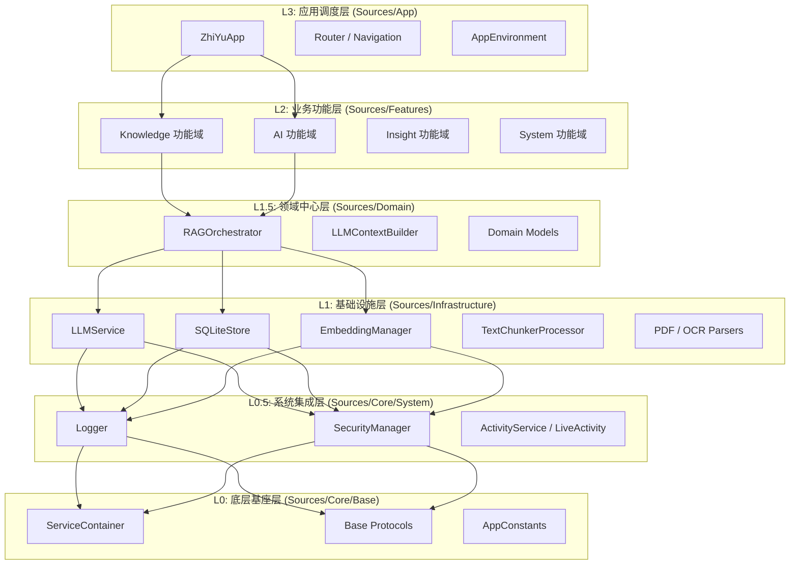

# 智宇 (ZhiYu) 概要设计文档 (High Level Design)

**版本**：2.1  
**作者**：架构师团队  
**日期**：2026-06-23  

---

## 1. 物理与逻辑分层架构

智宇采用严格的垂直功能切片与层级解耦模式，系统分层依赖自顶向下单向流转，禁止反向越级依赖。



---

## 2. 核心模块交互时序

### 2.1 物理多笔记本 (Vault) 热插拔切换时序

在多 Vault 架构中，系统通过 WAL 机制安全挂载不同的物理 `.sqlite3` 数据库文件。

```mermaid
sequenceDiagram
    autonumber
    participant UI as NotebookHubView (L2)
    participant VS as VaultService (L2)
    participant DB as DatabaseManager (L1)
    participant AS as AppStore (L1)
    participant EM as EmbeddingManager (L1)

    UI->>VS: 切换笔记本 selectVault(vaultId)
    VS->>DB: 物理热切换 switchDatabase(to: vaultId)
    
    rect rgb(40, 45, 55)
        Note over DB: 1. 关闭当前 SQLite 连接并提交 WAL 缓存
        Note over DB: 2. 释放 Security-Scoped Bookmarks 权限
        Note over DB: 3. 挂载新物理库 vault.sqlite3 并检查 Migrations
    end
    
    DB-->>VS: 切换成功
    DB->>AS: 广播全局通知 .databaseDidSwitch
    
    par 监听并清理旧内存数据
        AS->>AS: 清空旧页面元数据缓存
        AS->>DB: 从新库拉取最新 KnowledgePage 集
    and
        EM->>EM: 驱逐旧库向量计算缓存
        EM->>DB: 重新热加载当前库向量特征数据
    end
    
    AS-->>UI: 触发 UI 刷新，进入新笔记本空间
```



---

## 3. 数据流向图 (Data Flow Diagram - DFD)

### 3.1 数据摄入与 RAG 构建流 (DFD Level 1)

从物理媒介（PDF、Markdown、剪贴板、语音）到混合检索就绪的全生命周期数据加工与转换链路：

```
[外部输入] ──► (1.0 物理文件解析) ──► [纯文本/元数据]
                      │
                      ▼
               (2.0 语义分块) ──► [PageChunk 数组]
                      │
                      ├───────────────────────┐
                      ▼                       ▼
              (3.0 文本向量化)         (4.0 Wiki 链接分析)
                      │                       │
                      ▼                       ▼
              [Vector 向量缓存]       [双向链接关系网]
                      │                       │
                      ▼                       ▼
              (5.0 向量库写入)         (6.0 SQLite 写入)
                      │                       │
                      ▼                       ▼
              [(Vector Store Cache)]  [(vault.sqlite3 FTS5)]
```

---

## 4. 关键接口与依赖倒置协议 (DIP)

为了保证 L1.5/L2 与底层的彻底解耦，系统定义了一系列能力协议，所有依赖必须面向接口：

### 4.1 核心存储契约: `AnyPageStoreCapabilities`
```swift
/// @Sources/Domain/Protocols/AnyPageStoreCapabilities.swift
public protocol AnyPageStoreCapabilities: Sendable {
    func fetchPages() async throws -> [KnowledgePage]
    func insertPage(_ page: KnowledgePage) async throws
    func updatePage(_ page: KnowledgePage) async throws
    func deletePage(id: UUID) async throws
}
```

### 4.2 核心模型推理契约: `LLMServiceProtocol`
```swift
/// @Sources/Domain/Protocols/LLMServiceProtocol.swift
public protocol LLMServiceProtocol: Sendable {
    func directChat(systemPrompt: String, query: String, history: [ChatMessageDTO]) async throws -> ChatMessageDTO
    func directChatStream(systemPrompt: String, query: String, history: [ChatMessageDTO]) -> AsyncThrowingStream<String, Error>
    func generate(prompt: String, systemPrompt: String) async throws -> String
    func rerank(query: String, candidates: [any KnowledgePageRepresentable]) async throws -> [any KnowledgePageRepresentable]
}
```

---

## 5. 已知架构偏差与代码质量全景

### 5.1 跨层访问违例一览 (截至 2026-06)

| 严重度 | 源文件 | 问题描述 |
|--------|--------|----------|
| 🔴 P0 | `Sources/Core/Base/Protocols/RouterProtocol.swift:41,48` | L0 协议引用 L3 类型 `ToolItem`、`AppTab` |
| 🔴 P0 | `Sources/Domain/Models/RAGModels.swift:12` | Domain 层依赖 L0 `import GRDB` (3 文件) |
| 🔴 P0 | `Sources/Features/Knowledge/Vault/Service/VaultService.swift:13-14` | L2 业务服务 `import GRDB` + `import SwiftUI` 双跨层 |
| 🟡 P1 | `Sources/Core/Base/Protocols/LLMProtocols.swift:29` | L0 协议引用 Domain 类型 |
| 🟡 P1 | `Sources/Infrastructure/Storage/Sync/iCloudSyncCoordinator.swift:21-22` | L1 同步协调器引用 L3 AppStore |

### 5.2 模块健康度矩阵（2026-06-23 更新）

| 模块 | 文件数 | 主要改进方向 |
|------|--------|-------------|
| `Core/` | 76 | 并发安全 (@unchecked Sendable → actor) |
| `Infrastructure/` | 99 | PluginRegistry SRP 拆分完成（706→159） |
| `Domain/` | 53 | GRDB import 已清零 ✅ |
| `Features/` | 208 | #if os 宏 46→10 ✅, 9 文件 SRP 重构完成 ✅ |
| `Shared/` | 103 | PlatformModifiers 协议化, SRP 拆分（3 文件） |
| `Platforms/` | 62 | 新增 12 个协议实现类 + 3 个 Registrar |
| `App/` | 18 | AuthView/AuthService/SynthesisView 拆分 |
| `Localization/` | 41 | — |
| **合计** | **660** | P0/P1 全部清零 ✅ |

### 5.3 已完成的代码质量修复

| 阶段 | 完成项 | 涉及文件 |
|------|--------|----------|
| 架构审计 | 602 文件 18 维度全量代码审计（2026-06-22） | 全项目 |
| P0 修复 | 98 个 View 文件 `[L2]`→`[L3]` 层级标注修正 | 98 文件 |
| P0 修复 | 12 个 Domain/Models 文件描述去模板化 | 12 文件 |
| P1 修复 | 17 处硬编码 URL + 18 处 UserDefaults key → `AppConstants` | 13 文件 |
| P1 修复 | `#if os()` 宏协议化：Phase 1（46→19）+ Phase 2（19→10） | 11 文件 + 12 新文件 |
| P1 修复 | `@preconcurrency import SwiftUI` 清理 | 4 文件 |
| P1 修复 | `iOSSpeechService` 宏密度降低（10→4 处） | 1 文件 → 2 文件 |
| P1 修复 | 14 大文件 SRP 重构（9 主文件 → 34 新文件） | 9 文件 + 34 新文件 |
| CI 增强 | 3 个新 Gatekeeper 脚本 + 12 个 CI 检查项全量通过 | Tools/Gatekeeper/ |
| 测试增强 | 17 个跨平台协议单元测试 + 852 全量测试通过 | Tests/Unit/ |
| 文档更新 | 新增 `PLATFORM_PROTOCOL_ARCHITECTURE.md` + `srp-file-organization.md` | 2 新文档 |
| Docker 清理 | 释放 206 GB (85%) — 清理 120+ 旧版镜像 | 3 个微服务 |
| Mock 服务重构 | 抽取 mock_constants.py, 消除重复参数模板 | 4 Python 文件 (-191 行) |

> **审计报告**：[`Tools/Audit/ZhiYu_Codebase_Audit_2026-06-22.md`](../../Tools/Audit/ZhiYu_Codebase_Audit_2026-06-22.md) — P0/P1 全部清零 ✅

---
*本文档为智宇系统的高阶概要设计，实现细节请参阅详细设计 [DETAILED_DESIGN.md](../Design/DETAILED_DESIGN.md)。*
