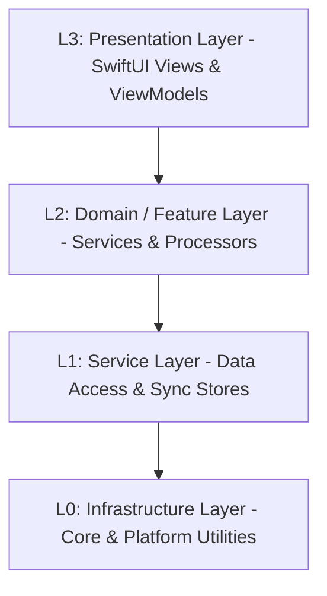

# 智宇 (ZhiYu) 架构分层定义 (L0-L3)

本文档定义了“智宇”系统的核心分层架构，旨在指导模块化重构、依赖管理和开发规范。

## 架构全景图 (Logical View)

---

## L0: Core Layer (核心基座层)
**职责**：提供与操作系统和第三方库的最底层交互，定义全局协议与工具。此层代码严禁依赖上层。

**核心目录** (`Sources/Core/`):
| 目录 | 内容 | 关键组件 |
| :--- | :--- | :--- |
| `Logger/` | 结构化日志系统 | `Logger.swift` |
| `Security/` | 加密与钥匙串管理 | `KeychainService`, `SecurityManager` |
| `Protocols/` | 核心抽象协议 | `LLMServiceProtocol`, `EmbeddingProvider` |
| `Utils/` | 跨平台通用工具 | `Localized`, `ThemeManager`, `ServiceContainer` (DI) |

## L1: Infrastructure Layer (基础设施层)
**职责**：实现 AI、RAG 和存储的具体技术细节，为业务层提供技术能力支撑。

**核心目录** (`Sources/Infrastructure/`):
| 目录 | 内容 | 关键组件 |
| :--- | :--- | :--- |
| `LLM/` | LLM 适配与网络客户端 | `LLMClient`, `LLMService`, `PromptService` |
| `Storage/` | 持久化存储实现 | `AppStore`, `SQLiteStore`, `iCloudSyncManager` |
| `VectorDB/` | 向量索引与检索 | `EmbeddingManager`, `VectorIndexer` |
| `Processors/` | 物理文档处理器 | `DocumentProcessor`, `OCRProcessor`, `PDFProcessor` |

## L2: Features Layer (业务功能层)
**职责**：垂直功能切片。每个模块封装特定的业务逻辑、视图和数据状态，实现功能闭环。

**核心目录** (`Sources/Features/`):
| 目录 | 内容 | 组织模式 |
| :--- | :--- | :--- |
| `Chat/` | 对话实验室 | 内部按 V-VM-M-S 组织 (View, ViewModel, Model, Service) |
| `Ingest/` | 智能摄取系统 | 包含队列管理与任务调度 |
| `Dashboard/` | 知识洞察仪表盘 | 综合展示与搜索入口 |
| `Settings/` | 系统配置与插件中心 | 集中管理应用状态与偏好 |

## L3: App Layer (应用层)
**职责**：负责应用的生命周期管理、全局环境初始化以及模块间的导航路由。

**核心目录** (`Sources/App/`):
| 组件 | 职责 |
| :--- | :--- |
| `ZhiYuApp` | 应用入口，执行 L0/L1 层服务的注册与启动 |
| `AppEnvironment` | 管理全局依赖的状态与并发环境配置 |
| `Router` | 跨 Features 模块的全局导航调度中心 |
| `ViewFactory` | 依据业务逻辑动态构建视图实例 |

---

## Shared: 共享层 (非功能分层)
**职责**：定义应用级的共享标准，确保多模块间的视觉与交互一致性。

**核心目录** (`Sources/Shared/`):
- `DesignSystem/`: 原子设计令牌 (Spacing, Typography, Colors, Animations)。
- `UIComponents/`: 跨模块通用的 SwiftUI 视图、布局模板与玻璃拟态修饰符。
- `Models/`: 全局共享的核心领域模型 (如 `KnowledgePage`)。

---

## 核心开发准则
1.  **单向依赖**：上层可以依赖下层，下层严禁依赖上层。跨层调用需通过协议 (Protocols) 解耦。
2.  **DI (依赖注入)**：使用 `@Inject` 模式在 L2/L3 层注入 L1 服务，禁止在服务内部直接使用 `.shared`（逐步淘汰中）。
3.  **Actor 隔离**：UI 绑定代码必须标注 `@MainActor`，异步服务应标记为 `actor` 以符合 Swift 6 要求。

## ⚠️ 架构审计状态（2026-05-13 更新）
经过代码重构，已基本清除 L1/L2 层对 SwiftUI 的直接依赖。

| 类型 | 状态 | 涉及文件 / 说明 |
|:--- |:--- |:--- |
| **跨层 UI 引用** | ✅ 已修复 | `PDFProcessor.swift`, `SynthesisStore.swift` 等已剥离 Color/withAnimation |
| **import 管理** | ✅ 已修复 | `IngestStore`, `SearchStore`, `LLMService` 等已移除 `import SwiftUI` |
| **单例泛滥** | 🟡 正在迁移 | `HapticFeedback` 已支持 DI 但部分存量代码仍使用 `.shared` |
| **ViewModel 覆盖率** | 🟡 持续重构 | 核心页面已覆盖，小型功能视图逻辑仍在持续剥离 |

### 重构经验记录
1. **表现层扩展 (UI Extensions)**：当模型或服务需要定义颜色、图标等 UI 属性时，在 `Views/Styles/` 目录下创建 `Model+UI.swift` 扩展，确保逻辑层纯粹性。
2. **Observation 框架**：在 L1/L2 层，使用 `import Observation` 替代 `import SwiftUI` 来获取 `@Observable` 能力。
3. **解耦动画**：`withAnimation` 应留在 View 层或 ViewModel 层，Service 层仅负责数据状态变更。

---

## 补充：视图耦合与平台差异化治理规范 (2026-05-13)

### 1. 视图与业务耦合问题
尽管本次重构极大地提升了系统的层级清晰度，但在部分小型功能代码中，依然可能存在“视图与业务偶尔耦合”的历史债务。为了彻底消除这一隐患，必须遵循以下准则：
- **全面推进 ViewModel (MVVM)**：UI 视图应彻底转变为纯粹的状态呈现层 (State Reflection)。所有的业务逻辑、API 发起和状态变更计算，必须下沉到独立的 ViewModel 中。
- **视图侧严禁耗时操作**：例如数据库直接访问、网络请求或文件 IO，这些逻辑应当交由 Service 层封装，View 仅通过 `@Environment` 或 `@Inject` 与之交互。

### 2. 多端差异化与平台预编译宏的使用
由于智宇支持 iOS、macOS 和 watchOS 跨平台，代码库中会存在平台预编译宏（如 `#if os(iOS)`）。为了防止代码变得碎片化和难以阅读，制定以下“差异化控制”策略：
1. **协议层屏蔽 (Protocol-based Injection)**：严禁在核心业务逻辑中堆砌 `#if` 分支。应提取跨平台协议（例如 `HapticFeedbackProtocol` 或 `PDFServiceProtocol`），然后分别实现如 `iOSHapticService` 等具体类。
2. **依赖注入容器 (DI Container) 路由**：使用 `#if` 的唯一合法非 UI 场所是 `ModuleRegistrar.swift` 这样的 DI 注册入口，以此来决定向容器中注入哪个平台的具体实现。业务调用方只应面对协议。
3. **特有 UI 的优雅隔离**：仅在极少数不可避免的视图表现差异（例如 NavigationSplitView 与现代 TabView 切换）时，允许在 SwiftUI 文件中使用条件编译，但必须将该部分的分支提炼为独立的 `@ViewBuilder` 组件或独立的局部 View 结构，确保主 View 文件的干净整洁。
