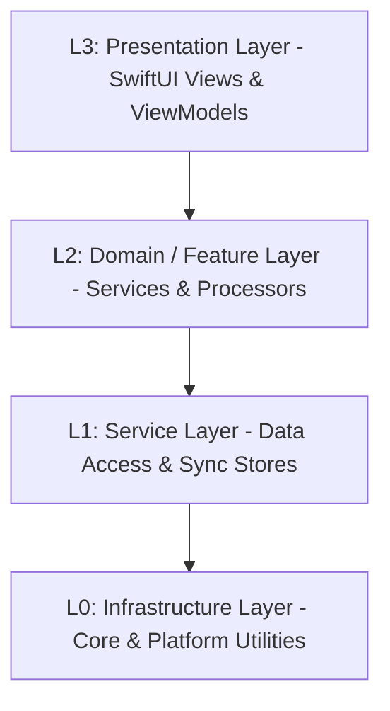

# 智宇 (ZhiYu) 架构分层定义 (L0-L3)

本文档定义了“智宇”系统的核心分层架构，旨在指导模块化重构、依赖管理和开发规范。

## 架构全景图 (Logical View)

---

## L0: Infrastructure Layer (基础设施层)
**职责**：提供与操作系统和第三方库的最底层交互，定义全局协议与工具。

**核心目录** (`Sources/Shared/Core/`):
| 目录 | 内容 | 关键组件 |
| :--- | :--- | :--- |
| `Platform/` | 系统级工具与平台桥接 | `Logger`, `SecurityManager`, `HapticFeedback`, `SpotlightService`, `DeepLinkService`, `PencilManager`, `AccessibilityService`, `PerformanceService`, `WatchConnectivityService`, `WebViewExportService`, `AppRouter`, `AppTab`, `AppNotifications`, `ShortcutManager`, `TooltipManager` |
| `Protocols/` | 核心协议定义 | `LLMServiceProtocol`, `LoggerProtocol`, `EmbeddingProvider` |
| `Utilities/` | 通用 Swift 扩展 | `Localized`, `Character+CJK`, `WikiUI`, `DemoDataGenerator` |
| `ServiceContainer.swift` | DI 容器 | 实现全局服务定位与注入的核心组件 |

## L1: Service Layer (基础服务层)
**职责**：对底层持久化技术进行原子化抽象，提供跨业务的通用数据管理能力。

**核心目录** (`Sources/Shared/Data/`):
| 目录 | 内容 | 关键组件 |
| :--- | :--- | :--- |
| `Persistence/` | 物理存储引擎与仓库 | `SQLiteStore`, `KnowledgePageStore`, `AppStore`, `AppBackupService`, `VaultStorageService`, `DatabaseManager`, `SearchStore`, `SettingsStore`, `IngestStore`, `SynthesisStore`, `AIWorkflowStore` |
| `Sync/` | 多端同步引擎 | `AppCloudSyncService`, `FileSystemSyncService`, `iCloudSyncManager`, `iCloudSyncCoordinator` |

## L2: Domain / Feature Layer (业务领域层)
**职责**：封装核心业务算法与文档处理器，实现复杂的功能闭环。

**核心目录** (`Sources/Shared/Domain/`):
| 目录 | 内容 | 关键组件 |
| :--- | :--- | :--- |
| `Logic/` | AI 逻辑与领域算法 | `LLMService`, `AISynthesisService`, `KnowledgeInsightService`, `GraphClusteringService`, `EmbeddingManager`, `IngestQueue`, `PromptService`, `LLMClient`, `RAGEvaluationService`, `PluginRegistry` |
| `Processors/` | 专门文档处理 | `TextChunkerProcessor`, `OCRProcessor`, `PDFProcessor`, `SpeechProcessor`, `MarkdownProcessor`, `WebScraperProcessor`, `KnowledgeIngestPipeline` |
| `Features/` | 高级功能编排 | `IngestService`, `CollaborationService`, `LintService`, `UndoService`, `ActivityService`, `AppEventBus`, `TaskCenter` |

## L3: Presentation Layer (表现层)
**职责**：响应用户交互，展示状态，驱动导航。包含声明式 UI 与业务编排逻辑。

**核心目录** (`Sources/Shared/`):
| 目录 | 内容 | 关键组件 |
| :--- | :--- | :--- |
| `ViewModels/` | 视图模型层 | `ChatViewModel`, `GraphViewModel`, `PageDetailViewModel` (解耦 View 与 Service) |
| `Views/` | SwiftUI 视图库 | `ContentView`, `Dashboard`, `Editors`, `GraphView`, `CommandPalette` |

---

## 核心开发准则
1.  **单向依赖**：上层可以依赖下层，下层严禁依赖上层。跨层调用需通过协议 (Protocols) 解耦。
2.  **DI (依赖注入)**：使用 `@Inject` 模式在 L2/L3 层注入 L1 服务，禁止在服务内部直接使用 `.shared`（逐步淘汰中）。
3.  **Actor 隔离**：UI 绑定代码必须标注 `@MainActor`，异步服务应标记为 `actor` 以符合 Swift 6 要求。

## ⚠️ 已知架构违规（2026-05-07 审计）
以下违反分层原则的问题已确认，正在逐步修复：

| 类型 | 问题 | 涉及文件 | 当前状态 |
|:--- |:--- |:--- |:--- |
| **跨层 UI 引用** | 服务层 import SwiftUI 仅为了 Color 类型 | `GraphClusteringService.swift`, `LintService.swift` | 🔴 待修复 |
| **单例泛滥** | 部分核心服务仍依赖 `.shared` 静态属性而非 DI 注入 | `WebViewExportService`, `HapticFeedback` | 🔴 待修复 |
| **Store 过载** | AppStore 承担了过多原子服务的代理职责 | `AppStore.swift` | 🟡 正在解耦至子 Store |
| **ViewModel 覆盖率** | 核心页面 (Chat, Graph) 已覆盖，但小型功能视图仍逻辑内联 | 多个子视图 | 🟡 持续重构中 |
| **模型污染** | 部分 Model 包含 icon/Color 等表现层属性 | `PageType.swift` | 🟡 计划迁移至 View Extension |
