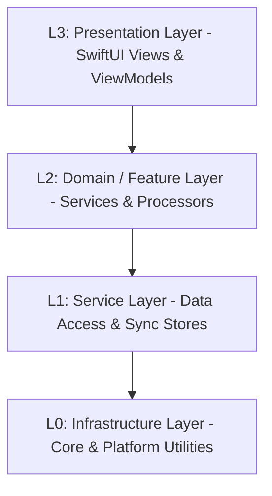

# 智宇 (ZhiYu) 架构分层定义 (L0-L3)

本文档定义了“智宇”系统的核心分层架构，旨在指导模块化重构、依赖管理和开发规范。

## 架构全景图 (Logical View)

---

## L0: Infrastructure Layer (基础设施层)
**职责**：提供与操作系统和第三方库的最底层交互，定义全局协议与工具。

**核心目录** (`Sources/Shared/Core/`):
| 目录 | 内容 | 关键组件 |
| :--- | :--- | :--- |
| `Platform/` | 系统级工具与平台桥接 | `Logger`, `SecurityManager`, `HapticFeedback`, `SpotlightService`, `DeepLinkService`, `PerformanceService`, `Router`, `AppTab`, `ShortcutManager` |
| `Protocols/` | 核心协议定义 | `LLMServiceProtocol`, `LoggerProtocol`, `EmbeddingProvider`, `LLMClientProtocol` |
| `Utilities/` | 通用工具与管理器 | `Localized`, `Character+CJK`, `ThemeManager`, `ServiceContainer` |

## L1: Service Layer (基础服务层)
**职责**：对底层持久化技术进行原子化抽象，提供跨业务的通用数据管理能力。

**核心目录** (`Sources/Shared/Data/`):
| 目录 | 内容 | 关键组件 |
| :--- | :--- | :--- |
| `Persistence/` | 物理存储仓库 | `SQLiteStore/` (Facade, CRUD, Search, Stats, Tags), `KnowledgePageStore`, `AppStore`, `AppBackupService`, `DatabaseManager`, `SearchStore`, `SettingsStore`, `IngestStore`, `SynthesisStore`, `AIWorkflowStore` |
| `Sync/` | 多端同步引擎 | `AppCloudSyncService`, `iCloudSyncManager` |

## L2: Domain / Feature Layer (业务领域层)
**职责**：封装核心业务算法与文档处理器，实现复杂的功能闭环。

**核心目录** (`Sources/Shared/Domain/`):
| 目录 | 内容 | 关键组件 |
| :--- | :--- | :--- |
| `Logic/AI/` | AI 专项服务群 | `LLMService` (Orchestrator), `LLMIngestService`, `LLMRetrievalService`, `LLMChatService`, `LLMRefactorService`, `LLMClient`, `LLMContextBuilder` |
| `Logic/` | 领域算法与评估 | `AISynthesisService`, `KnowledgeInsightService`, `EmbeddingManager`, `PromptService`, `RAGEvaluationService`, `PluginRegistry` |
| `Processors/` | 专门文档处理 | `TextChunkerProcessor`, `OCRProcessor`, `PDFProcessor`, `KnowledgeIngestPipeline`, `VectorIndexer` |
| `Features/` | 高级功能编排 | `IngestService`, `CollaborationService`, `LintService`, `UndoService`, `TaskCenter`, `AppEventBus` |

## L3: Presentation Layer (表现层)
**职责**：响应用户交互，展示状态，驱动导航。包含声明式 UI 与业务编排逻辑。

**核心目录** (`Sources/Shared/`):
| 目录 | 内容 | 关键组件 |
| :--- | :--- | :--- |
| `ViewModels/` | 视图模型层 | `ChatViewModel`, `GraphViewModel`, `PageDetailViewModel` (解耦 View 与 Service) |
| `Views/` | SwiftUI 视图库 | `ContentView`, `Dashboard`, `Editors`, `GraphView`, `CommandPalette` |

---

## 核心开发准则
1.  **单向依赖**：上层可以依赖下层，下层严禁依赖上层。跨层调用需通过协议 (Protocols) 解耦。
2.  **DI (依赖注入)**：使用 `@Inject` 模式在 L2/L3 层注入 L1 服务，禁止在服务内部直接使用 `.shared`（逐步淘汰中）。
3.  **Actor 隔离**：UI 绑定代码必须标注 `@MainActor`，异步服务应标记为 `actor` 以符合 Swift 6 要求。

## ⚠️ 架构审计状态（2026-05-13 更新）
经过代码重构，已基本清除 L1/L2 层对 SwiftUI 的直接依赖。

| 类型 | 状态 | 涉及文件 / 说明 |
|:--- |:--- |:--- |
| **跨层 UI 引用** | ✅ 已修复 | `PDFProcessor.swift`, `SynthesisStore.swift` 等已剥离 Color/withAnimation |
| **import 管理** | ✅ 已修复 | `IngestStore`, `SearchStore`, `LLMService` 等已移除 `import SwiftUI` |
| **单例泛滥** | 🟡 正在迁移 | `HapticFeedback` 已支持 DI 但部分存量代码仍使用 `.shared` |
| **ViewModel 覆盖率** | 🟡 持续重构 | 核心页面已覆盖，小型功能视图逻辑仍在持续剥离 |

### 重构经验记录
1. **表现层扩展 (UI Extensions)**：当模型或服务需要定义颜色、图标等 UI 属性时，在 `Views/Styles/` 目录下创建 `Model+UI.swift` 扩展，确保逻辑层纯粹性。
2. **Observation 框架**：在 L1/L2 层，使用 `import Observation` 替代 `import SwiftUI` 来获取 `@Observable` 能力。
3. **解耦动画**：`withAnimation` 应留在 View 层或 ViewModel 层，Service 层仅负责数据状态变更。

---

## 补充：视图耦合与平台差异化治理规范 (2026-05-13)

### 1. 视图与业务耦合问题
尽管本次重构极大地提升了系统的层级清晰度，但在部分小型功能代码中，依然可能存在“视图与业务偶尔耦合”的历史债务。为了彻底消除这一隐患，必须遵循以下准则：
- **全面推进 ViewModel (MVVM)**：UI 视图应彻底转变为纯粹的状态呈现层 (State Reflection)。所有的业务逻辑、API 发起和状态变更计算，必须下沉到独立的 ViewModel 中。
- **视图侧严禁耗时操作**：例如数据库直接访问、网络请求或文件 IO，这些逻辑应当交由 Service 层封装，View 仅通过 `@Environment` 或 `@Inject` 与之交互。

### 2. 多端差异化与平台预编译宏的使用
由于智宇支持 iOS、macOS 和 watchOS 跨平台，代码库中会存在平台预编译宏（如 `#if os(iOS)`）。为了防止代码变得碎片化和难以阅读，制定以下“差异化控制”策略：
1. **协议层屏蔽 (Protocol-based Injection)**：严禁在核心业务逻辑中堆砌 `#if` 分支。应提取跨平台协议（例如 `HapticFeedbackProtocol` 或 `PDFServiceProtocol`），然后分别实现如 `iOSHapticService` 等具体类。
2. **依赖注入容器 (DI Container) 路由**：使用 `#if` 的唯一合法非 UI 场所是 `ModuleRegistrar.swift` 这样的 DI 注册入口，以此来决定向容器中注入哪个平台的具体实现。业务调用方只应面对协议。
3. **特有 UI 的优雅隔离**：仅在极少数不可避免的视图表现差异（例如 NavigationSplitView 与现代 TabView 切换）时，允许在 SwiftUI 文件中使用条件编译，但必须将该部分的分支提炼为独立的 `@ViewBuilder` 组件或独立的局部 View 结构，确保主 View 文件的干净整洁。
