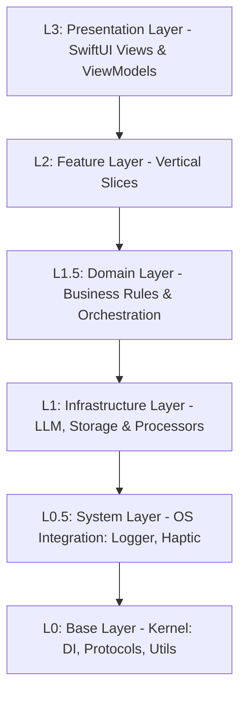

# 智宇 (ZhiYu) 架构分层定义 (L0-L3)

本文档定义了“智宇”系统的核心分层架构，旨在指导模块化重构、依赖管理和开发规范。

## 架构全景图 (Logical View)

---

## L0: Base Layer (底层基座层)
**职责**：提供应用运行的最底层支撑，严禁包含任何业务逻辑或对系统服务的直接调用。

**核心目录** (`Sources/Core/Base/`):
| 目录 | 内容 | 关键组件 |
| :--- | :--- | :--- |
| `ServiceContainer.swift` | 依赖注入容器 | `@Inject`, `ServiceContainer` |
| `Protocols/` | 全局抽象协议 | `ReminderServiceProtocol`, `LoggerProtocol` |
| `Constants/` | 基础常量定义 | `AppConstants`, `Keys` |
| `Extensions/` | 基础类型扩展 | `Date+App`, `String+Utils` |

## L0.5: System Layer (系统集成层)
**职责**：封装 OS 级能力，抹平硬件与系统 API 差异。

**核心目录** (`Sources/Core/System/`):
| 目录 | 内容 | 关键组件 |
| :--- | :--- | :--- |
| `Logger/` | 结构化日志服务 | `Logger` |
| `Haptic/` | 触感反馈系统 | `HapticFeedback` |
| `Security/` | 生物识别与加密 | `SecurityManager` |
| `Routing/` | 物理导航与 DeepLink | `DeepLinkService` |

## L1: Infrastructure Layer (基础设施层)
**职责**：实现具体的技术能力，如 LLM 通信、数据库持久化和物理文档解析。

**核心目录** (`Sources/Infrastructure/`):
| 目录 | 内容 | 关键组件 |
| :--- | :--- | :--- |
| `LLM/` | 模型客户端实现 | `LLMClient`, `DeepSeekProvider` |
| `Storage/` | 持久化引擎实现 | `SQLiteStore`, `Repository` |
| `Processors/` | 物理文档处理器 | `PDFProcessor`, `OCRProcessor` |

## L1.5: Domain Layer (领域中心层)
**职责**：承载核心业务大脑，定义跨模块的业务规则、领域行为及合成策略。

**核心目录** (`Sources/Domain/`):
| 目录 | 内容 | 关键组件 |
| :--- | :--- | :--- |
| `Models/` | 核心领域模型 | `KnowledgePage`, `PageLink` |
| `RAG/` | 检索增强生成策略 | `AIContentEnricher`, `LinkService` |
| `Protocols/` | 业务模块契约 | `AuthServiceProtocol`, `VaultServiceProtocol` |

## L2: Features Layer (业务功能层)
**职责**：垂直功能切片。按业务域分组（Knowledge, AI, Insight, System），负责 UI 呈现与本地交互状态。

**核心目录** (`Sources/Features/`):
| 领域 (Sub-Domain) | 包含模块 | 核心职责 |
| :--- | :--- | :--- |
| **Knowledge** | `Ingest`, `Graph`, `Search`, `Vault`, `NotebookHub` | 核心知识流：数据采集、图谱演化、语义搜索与存储。 |
| **AI** | `Chat`, `Synthesis`, `TaskCenter`, `VoiceNote`, `Quiz` | AI 实验室：对话交互、合成润色、任务调度与多模态。 |
| **Insight** | `Dashboard`, `Log`, `Lint`, `MedalWall` | 洞察与质量：数据可视化、系统日志、质量检查与成就系统。 |
| **System** | `Auth`, `Settings`, `Collaboration` | 通用系统：身份认证、应用配置、跨端实时协作。 |

## L3: App Layer (应用层)
**职责**：负责应用的生命周期管理、全局环境初始化以及模块间的导航路由。

**核心目录** (`Sources/App/`):
| 组件 | 职责 |
| :--- | :--- |
| `ZhiYuApp` | 应用入口，执行 L0/L1 层服务的注册与启动 |
| `AppEnvironment` | 管理全局依赖的状态与并发环境配置 |
| `Router` | 跨 Features 模块的全局导航调度中心 |
| `ViewFactory` | 依据业务逻辑动态构建视图实例 |

---

## Shared: 共享层 (非功能分层)
**职责**：定义应用级的共享标准，确保多模块间的视觉与交互一致性。

**核心目录** (`Sources/Shared/`):
- `DesignSystem/`: 原子设计令牌 (Spacing, Typography, Colors, Animations)。
- `UIComponents/`: 跨模块通用的 SwiftUI 视图、布局模板与玻璃拟态修饰符。

---

## 核心开发准则
1.  **单向依赖**：上层可以依赖下层，下层严禁依赖上层。跨层调用需通过协议 (Protocols) 解耦。
2.  **DI (依赖注入)**：使用 `@Inject` 模式在 L2/L3 层注入 L1 服务，禁止在服务内部直接使用 `.shared`（逐步淘汰中）。
3.  **Actor 隔离**：UI 绑定代码必须标注 `@MainActor`，异步服务应标记为 `actor` 以符合 Swift 6 要求。

## ⚠️ 架构审计状态（2026-05-16 全深度审查更新）

经过 2026-05-16 的全工程深度审查，智宇项目在架构纯净度上表现优异，但在核心契约和状态聚合上发现了关键优化点。

| 类型 | 状态 | 涉及文件 / 说明 |
|:--- |:--- |:--- |
| **存储层重构** | ✅ 已修复 | 已完成 Repository 模式迁移，且存储协议已全部异步化适配 Actor。 |
| **依赖倒置 (DIP)** | ✅ 已修复 | 所有的仓储协议已物理下沉至 L1.5 (Domain) 层，实现彻底解耦。 |
| **AppStore 治理** | ✅ 已修复 | `AppStore` 已完成瘦身，标签、统计、PDF 等逻辑已迁移至专有领域 Store。 |
| **跨层 UI 引用** | ✅ 已修复 | 逻辑层已完全剥离 SwiftUI 依赖。 |
| **平台宏泄漏** | ✅ 已修复 | 已通过 `LiveActivityProtocol` 抽象硬件能力，业务层无宏。 |
| **常量治理** | ✅ 已修复 | 业务常量已从 AppConstants 迁移至 BusinessConstants。 |

### 2026-05-16 深度审查核心结论 (已实施)
1. **Repository 协议下沉**：已完成所有仓储协议从 L1 (Infrastructure) 至 L1.5 (Domain) 的物理迁移，实现了物理层面的依赖倒置。
2. **Facade 精简**：`AppStore` 已剥离非核心业务，PDF、OCR 逻辑下沉至 `IngestStore`，标签管理下沉至 `TagStore`，统计下沉至 `AIInsightStore`。
3. **消除残留宏**：通过 `LiveActivityProtocol` 成功屏蔽了硬件差异，`TaskCenter` 等核心业务已实现跨平台无宏编译。

### 重构经验记录
1. **Repository 模式 (仓储模式)**：在 L1 层通过 `Repository` 封装具体的 GRDB SQL 逻辑，业务层通过协议与之交互。这实现了业务模型与物理数据库表的解耦，并极大地提升了单元测试的便利性。
2. **表现层扩展 (UI Extensions)**：当模型或服务需要定义颜色、图标等 UI 属性时，在 `Views/Styles/` 目录下创建 `Model+UI.swift` 扩展，确保逻辑层纯粹性。
3. **Observation 框架**：在 L1/L2 层，使用 `import Observation` 替代 `import SwiftUI` 来获取 `@Observable` 能力。
3. **解耦动画**：`withAnimation` 应留在 View 层或 ViewModel 层，Service 层仅负责数据状态变更。

---

## 补充：视图耦合与平台差异化治理规范 (2026-05-13)

### 1. 视图与业务耦合问题
尽管本次重构极大地提升了系统的层级清晰度，但在部分小型功能代码中，依然可能存在“视图与业务偶尔耦合”的历史债务。为了彻底消除这一隐患，必须遵循以下准则：
- **全面推进 ViewModel (MVVM)**：UI 视图应彻底转变为纯粹的状态呈现层 (State Reflection)。所有的业务逻辑、API 发起和状态变更计算，必须下沉到独立的 ViewModel 中。
- **视图侧严禁耗时操作**：例如数据库直接访问、网络请求或文件 IO，这些逻辑应当交由 Service 层封装，View 仅通过 `@Environment` 或 `@Inject` 与之交互。

### 2. 多端差异化与平台预编译宏的使用
由于智宇支持 iOS、macOS 和 watchOS 跨平台，代码库中会存在平台预编译宏（如 `#if os(iOS)`）。为了防止代码变得碎片化和难以阅读，制定以下“差异化控制”策略：
1. **协议层屏蔽 (Protocol-based Injection)**：严禁在核心业务逻辑中堆砌 `#if` 分支。应提取跨平台协议（例如 `HapticFeedbackProtocol` 或 `PDFServiceProtocol`），然后分别实现如 `iOSHapticService` 等具体类。
2. **依赖注入容器 (DI Container) 路由**：使用 `#if` 的唯一合法非 UI 场所是 `ModuleRegistrar.swift` 这样的 DI 注册入口，以此来决定向容器中注入哪个平台的具体实现。业务调用方只应面对协议。
3. **特有 UI 的优雅隔离**：仅在极少数不可避免的视图表现差异（例如 NavigationSplitView 与现代 TabView 切换）时，允许在 SwiftUI 文件中使用条件编译，但必须将该部分的分支提炼为独立的 `@ViewBuilder` 组件或独立的局部 View 结构，确保主 View 文件的干净整洁。
