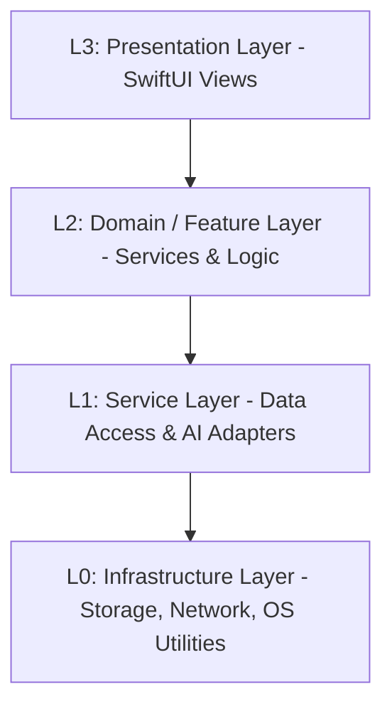

# 智宇 (ZhiYu) 架构分层定义 (L0-L3)

本文档定义了“智宇”系统的核心分层架构，旨在指导模块化重构、依赖管理和开发规范。

## 架构全景图 (Logical View)



---

## L0: Infrastructure Layer (基础设施层)
**职责**：提供与操作系统和第三方库的最底层交互。

**子目录** (`Sources/Shared/Core/`):
| 目录 | 内容 | 关键组件 |
| :--- | :--- | :--- |
| `Platform/` | 系统级工具与平台桥接 | `LogService`, `SecurityManager`, `HapticManager`, `SpotlightService`, `DeepLinkService`, `PencilManager`, `AccessibilityService`, `OnboardingService`, `DataExportService`, `LocalAnalyticsService`, `PerformanceService`, `WorkflowService`, `WatchConnectivityService`, `SnapshotService`, `ShortcutManager`, `WebViewExportService`, `AppRouter`, `AppTab`, `DemoDataGenerator`, `GraphDataProvider`, `AppKeyboardShortcuts`, `SecurityReinforcement`, `Logger`, `HapticFeedback` |
| `Protocols/` | 核心协议定义 | 跨层级通信与依赖注入所需的基础协议 |

## L1: Service Layer (基础服务层)
**职责**：对底层技术进行原子化抽象，提供跨业务的通用能力。

**子目录** (`Sources/Shared/`):
| 目录 | 内容 | 关键组件 |
| :--- | :--- | :--- |
| `Data/Persistence/` | 物理存储引擎与仓库 | `SQLiteStore`, `KnowledgePageStore`, `VaultStorageService`, `AppBackupService`, `AppStore` |
| `Data/Sync/` | 多端同步引擎 | `iCloudSyncManager`, `AppCloudSyncService`, `FileSystemSyncService` |
| `Domain/Logic/` | 核心业务算法 | `LinkService`, `KnowledgeInsightService`, `GraphClusteringService`, `PluginRegistry` |
| `Domain/Processors/` | 专门文档处理 | `MarkdownProcessor`, `OCRProcessor`, `PDFProcessor`, `TextChunkerProcessor` |

## L2: Domain / Feature Layer (业务领域层)
**职责**：封装核心业务逻辑，实现复杂的功能闭环。

**子目录** (`Sources/Shared/Domain/`):
| 目录 | 内容 | 关键组件 |
| :--- | :--- | :--- |
| `Logic/AI/` | 大模型通信与推理 | `LLMService`, `LLMClient`, `AISynthesisService`, `EmbeddingManager`, `IngestQueue`, `PromptService` |
| `Features/` | 高级功能编排 | `IngestService`, `CollaborationService`, `LintService`, `TaskCenter`, `UndoService`, `ActivityService`, `AppEventBus` |
| `Features/Gamification/` | 用户激励系统 | `MedalService` |

## L3: Presentation Layer (表现层)
**职责**：响应用户交互，展示状态，驱动导航。

**子目录** (`Sources/Shared/Views/`):
| 目录 | 内容 |
| :--- | :--- |
| `Core/` | 主框架：`ContentView`, `NavigationView`, `SidebarView`, `KnowledgeDashboardView`, `SearchView` |
| `Pages/` | 业务页面：页面列表、详情、历史版本 |
| `Editors/` | Markdown 编辑器与源码模式 |
| `Features/` | 高级功能视图：`GraphView`, `Graph3DView`, AI 合成视图 |
| `Components/` | 原子化可复用 UI 组件 |
| `CommandPalette/` | `Cmd+K` 全局指令面板 |
| `Settings/` | 设置相关视图 |

### ViewModel / Coordinator (视图模型层)
部分业务编排已从 View 中提取到 `@Observable` Coordinator 类，属于 L3 但独立于具体 View：
| 类 | 位置 | 职责 |
|:--- |:--- |:--- |
| `iCloudSyncCoordinator` | `Data/Sync/` | 编排 iCloud 同步的完整生命周期（UI 状态 + 业务调用） |
| *未来* | — | ChatView、IngestView 等大型视图应逐步引入 ViewModel |

---

## 核心开发准则
1.  **单向依赖**：上层可以依赖下层，下层严禁依赖上层。跨层调用需通过协议 (Protocols) 解耦。
2.  **DI (依赖注入)**：使用 `@Inject` 模式在 L2/L3 层注入 L1 服务，方便进行 Mock 测试。
3.  **Actor 隔离**：L1/L2 服务原则上应标记为 `@MainActor` 或 `actor`，以符合 Swift 6 严格并发要求。

## ⚠️ 已知架构违规（来自深度审计）
以下违反分层原则的问题已确认，需要逐步修复：

| 类型 | 问题 | 涉及文件 | 当前状态 |
|:--- |:--- |:--- |:--- |
| **跨层 UI 引用** | 服务层 import SwiftUI 仅为了 Color 类型 | `GraphClusteringService.swift`, `LintService.swift` | 🔴 未修复 |
| **跨层 UI 引用** | L1 服务直接调用 HapticManager | `LLMService.swift` | 🔴 未修复 |
| **跨层 UI 引用** | L1 服务依赖 WKWebView (AISynthesisService → WebViewExportService) | `AISynthesisService.swift` | 🔴 未修复 |
| **单例泛滥** | 19 个 `.shared` 全局单例破坏 DI | 多个服务文件 | 🔴 未修复 |
| **Store 上帝类** | AppStore 承担 11+ 职责（PDF/OCR/标签/导出/图谱刷新） | `AppStore.swift` | 🔴 未修复 |
| **死代码** | SQLiteStore 中 3 个未调用方法 | `SQLiteStore.swift` | 🔴 未修复 |
| **模型层污染** | 3 个 Model 文件 import SwiftUI（含 Color/icon 属性） | `PageType.swift`, `LintIssue.swift`, `LogAction.swift` | 🟡 已从 6 个降至 3 个 |
| **缺少 ViewModel** | 79 个 View 文件全用 @State，无 ViewModel class | 所有 Views | 🔴 未修复 |
| **API Key 安全** | LLMConfigStore 使用 UserDefaults 明文存储 API Key | `LLMModels.swift:168` | 🔴 未修复 |

### 跨层调用规则
```
L3 (Views) ──────→ L2 (Services) ──────→ L1 (Store/Adapters) ──────→ L0 (Infra)
  │                    │                      │
  └── ✅ 允许 ────────┘  ❌ L2 不能反向调用    └── ✅ 通过协议
  └── HapticManager.* ── ❌ L1 服务不能调用 UI 层设施
  └── SwiftUI.Color ──── ❌ 服务层不能 import SwiftUI
```
