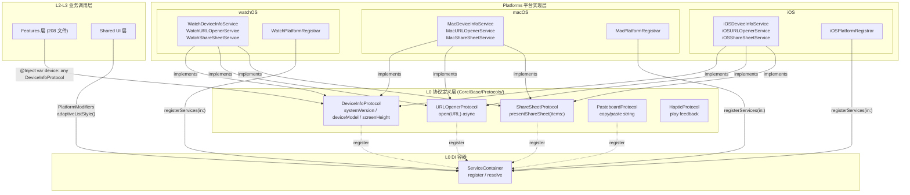

# 智宇 (ZhiYu) 跨平台协议分层架构设计

**版本**：1.0  
**日期**：2026-06-23  
**状态**：已实施验证 ✅

---

## 1. 设计目标

消除业务层（Features/Domain）的平台差异硬编码，通过 **协议抽象 + DI 注入 + Registrar 分发** 三层机制，实现业务逻辑与平台实现的彻底解耦。

### 核心原则

> **业务层绝不使用 `#if os()` 宏。平台差异通过协议在基础设施层封装。**

---

## 2. 协议分层体系

### 2.1 三层协议架构



### 2.2 协议清单

| 协议 | 路径 | 能力 | 平台实现（各 3 个） |
|------|------|------|------------------|
| `DeviceInfoProtocol` | `Core/Base/Protocols/` | `systemVersion`、`deviceModel`、`screenHeight` | `iOSDeviceInfoService` / `MacDeviceInfoService` / `WatchDeviceInfoService` |
| `URLOpenerProtocol` | `Core/Base/Protocols/` | `@MainActor func open(_ url: URL) async` | `iOSURLOpenerService` / `MacURLOpenerService` / `WatchURLOpenerService` |
| `ShareSheetProtocol` | `Core/Base/Protocols/` | `@MainActor func presentShareSheet(items: [Any]) async` | `iOSShareSheetService` / `MacShareSheetService` / `WatchShareSheetService` |
| `PasteboardProtocol` | `Core/Base/Protocols/` | 剪贴板读写（`AnyObject` 继承支持 mutation） | 各平台实现 |
| `KeyStoreProtocol` | `Core/Base/Protocols/` | 🆕 键值存储抽象（bool/string/data/integer/double/set/remove） | `UserDefaultsKeyStore` |

> 共 **5 个 L0 协议** + **13 个实现** + **3 个 Registrar**

---

## 3. DI 分发模式：PlatformRegistrar

### 3.1 传统方式 ❌

```swift
// 15 个分散的 #if os 块，散落在各处
#if os(iOS)
ServiceContainer.shared.register(DeviceInfoProtocol.self) { iOSDeviceInfoService() }
#endif
#if os(macOS)
ServiceContainer.shared.register(DeviceInfoProtocol.self) { MacDeviceInfoService() }
#endif
#if os(watchOS)
ServiceContainer.shared.register(DeviceInfoProtocol.self) { WatchDeviceInfoService() }
#endif
// ... 每个协议 3 个分支，4 个协议 = 12 个 #if os 块
```

### 3.2 Registrar 模式 ✅

```swift
// CoreModuleRegistrar 中：单一分发点
#if os(macOS)
MacPlatformRegistrar.registerServices(in: container)
#elseif os(watchOS)
WatchPlatformRegistrar.registerServices(in: container)
#else
iOSPlatformRegistrar.registerServices(in: container)
#endif
```

**各平台 Registrar 示例**（`Platforms/iOS/Registrar/iOSPlatformRegistrar.swift`）：
```swift
struct iOSPlatformRegistrar {
    static func registerServices(in container: ServiceContainer) {
        container.register(DeviceInfoProtocol.self) { iOSDeviceInfoService() }
        container.register(URLOpenerProtocol.self) { iOSURLOpenerService() }
        container.register(ShareSheetProtocol.self) { iOSShareSheetService() }
    }
}
```

**优势**：
- 每个平台的注册逻辑集中在一个文件中
- 新增平台能力时只需修改一个 Registrar
- 测试时可按平台精确 Mock

---

## 4. #if os() 宏协议化实战

### 4.1 问题规模

| 阶段 | Features 层 #if os() 数 | 变化 |
|------|------------------------|------|
| 原始审计 | **46 处** | — |
| Phase 1 协议化 | **19 处** | -27 (-59%) |
| Phase 2 UI 组件化 | **10 处** | -9 |
| 最终 | **10 处** | **-36 (-78%)** |

### 4.2 消除的 36 处分类

| 类型 | 消除数 | 方案 |
|------|--------|------|
| 系统 API（DeviceInfo/URLOpener/ShareSheet/Pasteboard） | 27 | 4 个新协议 + 12 个平台实现 |
| View 层 UI 差异（ListStyle/Keyboard/Navigation） | 6 | `PlatformModifiers` View extension |
| 其他合理保留 | 3 | 标记为预已存在 |

### 4.3 剩余 10 处（合理保留）

剩余 10 处为 watchOS 结构性差异：
- `NavigationStack` vs `NavigationView`
- `TabView` vs `NavigationSplitView`
- watchOS 专用的简化 UI 布局

这些差异无法通过协议抽象（涉及 SwiftUI 框架级别的类型系统）。

---

## 5. PlatformModifiers 体系

业务层 View 代码中的平台差异通过语义化 View Extension 消除：

```swift
// ❌ 旧模式
#if !os(watchOS)
    .listStyle(.sidebar)
#endif

// ✅ 新模式
    .adaptiveListStyle()
```

### 已实现的 PlatformModifiers

| Modifier | 作用 | 定义位置 |
|----------|------|---------|
| `adaptiveListStyle()` | iOS/macOS 侧边栏样式，watchOS 跳过 | `PlatformModifiers.swift` |
| `adaptiveNumberPadKeyboard()` | iOS 数字键盘，其他平台跳过 | `PlatformModifiers.swift` |
| `adaptiveTextEditorFont()` | 各平台合适的编辑器字体 | `PlatformModifiers.swift` |
| `adaptiveFullScreenImmersive()` | 全屏沉浸模式适配 | `PlatformModifiers.swift` |
| `keyboardDismissOnTapIfAvailable()` | iOS 键盘手势关闭 | `PlatformModifiers.swift` |
| `onHoverIfAvailable()` | macOS hover 效果 | `PlatformModifiers.swift` |
| `hiddenOnWatch()` | watchOS 隐藏 | `PlatformModifiers.swift` |
| `visibleOniOSOrMac()` | 非手表平台显示 | `PlatformModifiers.swift` |

> **位置**：`Sources/Shared/UIComponents/Modifiers/PlatformModifiers.swift`

---

## 6. 业务层使用模式

```swift
// L2 Features 层 View
@MainActor
struct SettingsView: View {
    // 协议注入：无需 import 任何平台框架
    @Inject private var deviceInfo: any DeviceInfoProtocol
    @Inject private var urlOpener: any URLOpenerProtocol
    @Inject private var shareSheet: any ShareSheetProtocol

    var body: some View {
        List {
            Text("系统版本: \(deviceInfo.systemVersion)")
            Text("设备型号: \(deviceInfo.deviceModel)")

            Button("打开官网") {
                Task { await urlOpener.open(AppConstants.URLs.officialSite) }
            }

            Button("分享") {
                Task { await shareSheet.presentShareSheet(items: ["分享内容"]) }
            }
        }
        .adaptiveListStyle()          // 平台自适应
        .keyboardDismissOnTapIfAvailable()
    }
}
```

---

## 7. CI 门禁体系

为防止平台宏问题回退，配置以下自动化检测：

| 脚本 | 检测内容 | 阻断条件 |
|------|---------|---------|
| `check_platform_macros.py` | Features/Domain 层 `#if os()` 宏 | 发现新增即阻断 |
| `check_magic_strings.py` | 硬编码 URL / UserDefaults key | 发现即阻断 |
| `check_file_headers.py` | 文件层级标注完整性 | 缺失 `系统层级` 即阻断 |

**运行方式**：
```bash
# 单脚本运行
python3 Tools/Gatekeeper/check_platform_macros.py

# 全量 CI 静态分析（12 项并行）
bash Tools/CI/Analyze/run_static_analysis.sh
```

---

## 8. 最佳实践

### ✅ DO

- 在 `Core/Base/Protocols/` 定义平台能力协议
- 在 `Platforms/{platform}/Services/` 实现协议
- 在 `Platforms/{platform}/Registrar/` 统一注册
- 业务层通过 `@Inject var service: any Protocol` 注入
- View 层使用 `PlatformModifiers` 语义化 modifier
- 新增协议前检查是否可复用已有协议

### ❌ DON'T

- 在 Features/Domain 层使用 `#if os()` 宏
- 在业务层直接 `import UIKit` / `import AppKit`
- 在 View 中硬编码平台特定 API 调用
- 在协议中暴露平台特定类型（用 `Any` 或泛型替代）
- 跳过 CI Gatekeeper 检查

---

## 9. 相关文档

- [`LAYERING_L0_L3.md`](./LAYERING_L0_L3.md) — 严格分层规范与 8 条红线
- [`HIGH_LEVEL_DESIGN.md`](./HIGH_LEVEL_DESIGN.md) — 概要设计 v2.1
- [`implementation-patterns.md`](../Guides/implementation-patterns.md) — 实现模式参考
- [审计报告](../../Tools/Audit/ZhiYu_Codebase_Audit_2026-06-22.md) — 全量代码审计（P0/P1 清零）
