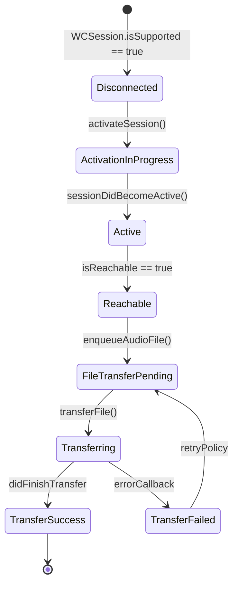
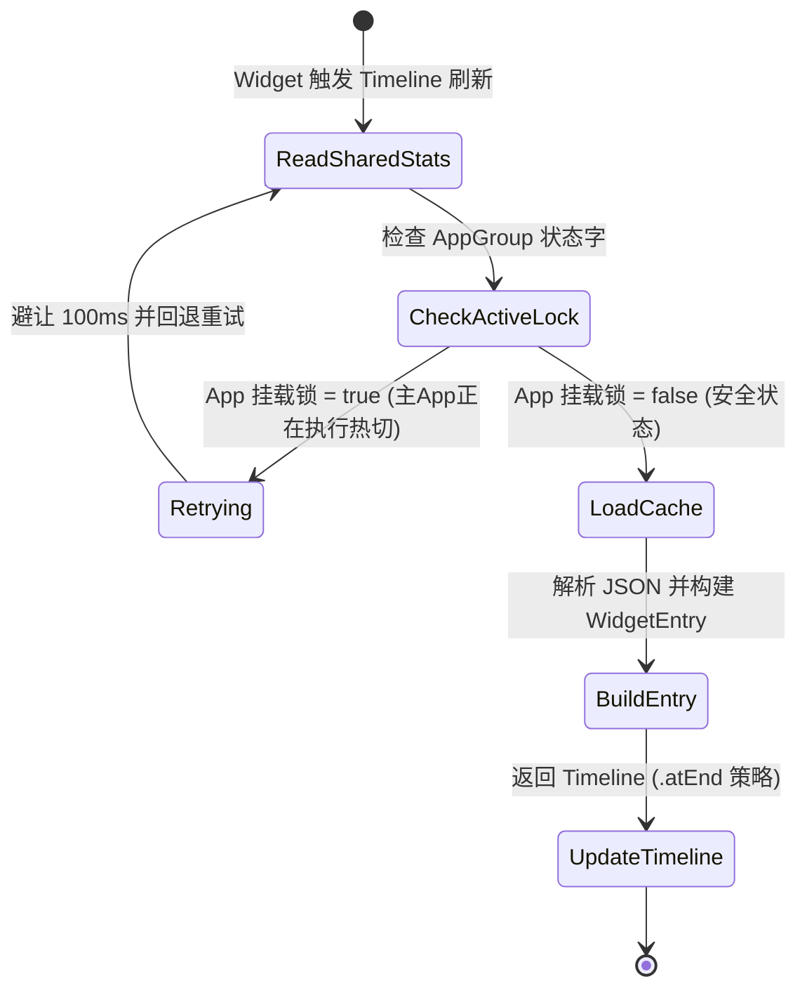

# 智宇 (ZhiYu) 详细设计文档 (Detailed Design)

本文件深入解析 智宇 (ZhiYu) 核心引擎的内部实现细节。

## 1. 混合检索引擎 (Hybrid Search Engine)

### 1.1 数据流向与 RAG 模块化管道 (Modular Ingest Pipeline)

智宇 (ZhiYu) 实现了端到端的 RAG 摄入管道，通过 `KnowledgeIngestPipeline` (位于 `Domain/RAG`) 进行编排：

1. **Parser (解析器)**: 抽取纯文本，支持 Markdown, PDF, OCR 图像识别。
2. **Chunker (分块器)**: 基于语义长度（Semantic Splitting）将长文划分为分块。
3. **Embedding (向量化)**: 异步调用 LLM 生成向量，由 `EmbeddingManager` 同步至向量数据库。
4. **Linker (关联器)**: 自动发现页面间的 Wiki-Link，构建知识图谱 (Graph)。

### 1.2 检索策略 (Retrieval Strategy)

系统采用 **FTS5 (全文搜索)** + **Vector Search (向量检索)** 的混合模式：

- **关键词匹配**: 用于精确查找特定术语。
- **语义相似度**: 用于模糊意图识别，支持跨语境关联。
- **Reranking (重排序)**: 召回后的结果由 AI 进一步根据 Query 语义进行权重重排，确保最相关的知识排在首位。

## 2. 存储与状态引擎 (Storage & State Engine)

### 2.1 物理存储与 Repository 模式 (DIP 实现)

智宇 (ZhiYu) 采用基于 **GRDB.swift** 的 Repository 模式，并严格遵循 **依赖倒置原则 (DIP)**：

- **契约下沉**: 所有的仓储协议（如 `KnowledgeRepository`, `VectorRepository`）物理位置位于 `Sources/Domain/Protocols/`，由领域层定义业务契约。
- **解耦实现**: 具体的 SQL 实现类（如 `KnowledgePageRepository`）位于 `Sources/Infrastructure/` 层，通过 DI 容器注入到领域服务中。这种模式确保了核心业务逻辑不直接依赖于 GRDB 或任何特定的持久化框架。

### 2.2 全局状态 Facade (AppStore 治理)

`AppStore` 作为全应用的状态入口，通过 `@Observable` 驱动 UI 刷新。为了符合 **单向数据流 (UDF)** 原则，系统执行了重构：

- **核心聚合**: `AppStore` 仅负责页面元数据同步、全局路由协调与基础操作封装。
- **显式调度**: 移除了子 Store (Search, Settings, Workflow) 对 EventBus 的被动监听。所有的重置与全局同步动作由 `AppStore` 通过方法调用显式驱动。这种设计确立了严谨的父子 Store 调用链路，极大降低了复杂业务流下的调试难度。
- **业务下沉**: 垂直领域特有的复杂状态已下沉至领域专有的 `Store`（如 `IngestStore`, `AIWorkflowStore`），通过环境对象 (`.environment()`) 按需注入视图。

## 3. 插件系统架构与加固 (Plugin System & Hardening)

### 3.1 扩展点设计 (Extension Points)

智宇参考 Obsidian 架构，为插件开放了深度 UI 扩展点：

- **Command Palette**: 插件可注册全局指令至 `Cmd+K` 中枢。
- **Ribbon & Sidebar**: 插件可在侧边栏注册图标入口或独立的自定义视图。
- **Lifecycle Events**: 插件可监听 `onFileOpen`, `onPageSave` 等系统级事件。

### 3.2 Watchdog 2.0 性能监控

为了防止僵尸插件拖慢宿主 App，`PluginRegistry` 集成了 Watchdog 2.0 机制：

- **执行竞速**: 每个插件拦截 Hook 的执行上限为 **500ms**。
- **物理封禁**: 超时插件会被立即卸载、物理回收 `JSContext` 内存，并将其 ID 写入 `UserDefaults` 黑名单。重启 App 后封禁依然有效，彻底杜绝循环性能崩溃。
- **资源监控**: 系统实时统计每个插件的调用次数与平均耗时，并在“系统监控”面板中提供可视化排行。

### 3.3 插件存储加密

每个插件拥有独立的持久化空间：

- **AES-GCM 加密**: 存储文件（`.json`）在写入磁盘前均通过 AES-256-GCM 进行全盘加密，密钥派生自系统 Keychain。
- **双向绑定**: 插件的声明式 UI 组件与加密存储实现了自动双向绑定，开发者无需编写 IO 代码即可实现配置记忆。

## 4. 多平台适配与能力隔离 (Platform Adaptation)

### 4.1 跨平台协议抽象

为了实现“业务代码零宏”的目标，系统在 `Sources/Core/Base/Protocols/` 定义了一系列能力协议：

- **PlatformCapabilities**: 抽象触感反馈、状态栏高度、底部安全区等 UI 差异。
- **LiveActivityProtocol**: 抽象灵动岛 (Dynamic Island) 实时活动。在 iOS 下由 `ActivityService` 实现，在非支持平台由 `DummyActivityService` 提供空操作。
- **OCRServiceProtocol**: 抽象文字识别。

### 4.2 系统级解耦

所有的平台具体实现均被物理隔离在 `Sources/Platforms/` 目录下。主 App 仅通过 `ModuleRegistrar` 完成各平台的 DI 注册。

## 5. 视觉算法：力导向图谱布局 (Force-Directed Graph)

### 5.1 核心算法

图谱视图 (`GraphView`) 采用力导向布局 (Force-Directed Layout)，通过模拟物理作用力计算节点坐标：

- **排斥力 (Repulsion)**: 防止节点重叠。
- **吸引力 (Attraction)**: 将具备双向链接的节点拉近。
- **摩擦力 (Damping)**: 随迭代次数增加逐渐降低动能，使布局趋于平稳。

### 5.2 空间分布 (Spatial Distribution)

针对 3D 图谱，采用 **Fibonacci Sphere (斐波那契球)** 分布算法：

- **动态半径**: 球体半径 $R = \max(40, \min(150, \sqrt{N} \times 12))$。该公式确保节点间的平均弧长在不同节点规模 ($N$) 下保持视觉舒适。
- **层级深度**: 选中节点及其一阶邻居会通过 `SCNTransaction` 进行平滑的“向前推移”，利用 Z 轴深度突出展示上下文。

## 6. 生物认证与安全隐私 (Biometric Authentication & Security)

### 6.1 FaceID/TouchID 本地生物认证逻辑与密钥保护

智宇 (ZhiYu) 引入了行业标准的本地安全防线，确保绝密资产防窃听、防物理提取：

- **LAContext 状态机隔离**: 认证流程通过 `BiometricAuthenticator` (位于 `Sources/Core/System/`) 进行封装。`LAContext` 在单次认证事务中进行生命周期销毁，避免上下文状态缓存泄露；在主线程 (`@MainActor`) 调用以保障 UI 交互线程安全性。
- **Secure Enclave 与 Keychain 硬件级保护**:
  - 本地局部保险箱 (Vault) 的物理加密密钥不存储于常规沙盒。系统将派生出的 **DEK (Database Encryption Key)** 存入 iOS/macOS 的 **Keychain** 中。
  - 创建该 Keychain 节点时，强制附加 `SecAccessControl` 配置，将访问权限限定为 `kSecAccessControlBiometryAny` (即必须通过 FaceID 或 TouchID 活体检测)。
  - 当且仅当生物识别校验通过，Keychain 才会向内存安全空间短暂释放 DEK，用于 GRDB 驱动的 SQLCipher 引擎执行全盘流解密。
- **三层密钥派生架构 (Key Derivation)**:
  1. **MEK (Master Encryption Key)**: 位于 Secure Enclave 内部，通过硬件级别保护。
  2. **KEK (Key Encryption Key)**: 由用户的 PIN 码或口令通过 `PBKDF2-HMAC-SHA256` 算法派生得出。
  3. **DEK (Database Encryption Key)**: 利用 MEK 和 KEK 双向异或派生，用作数据库流式加密的核心种子。

### 6.2 敏感数据内存隔离与模糊背景挂起保护 (App Switcher Privacy)

- **模糊背景挂起机制**:
  - 系统全局监听 `UIApplication.willResignActiveNotification`。当检测到 App 将被切入后台或进入任务切换器 (App Switcher) 时，`PrivacyCoverManager` 立即在最顶层 `UIWindow` 上覆盖一层搭载 `UIBlurEffect` 的私密毛玻璃视图 (`PrivacyBlurOverlayView`)，防止敏感笔记与资产内容在系统截屏中泄露。
- **事务静默与内存物理擦除**:
  - 挂起瞬间，系统触发 `VaultSecureCoordinator.suspendActiveTransactions()`，静默所有正在运行的 FTS5 和向量写入事务，防止挂起状态下的写写冲突与文件损坏。
  - 内存中持有的临时明文密码或分块内存切片，使用 `memset_s` 进行显式物理置零物理擦除，防范冷启动内存转储 (Cold Boot Dump) 攻击。

## 7. iCloud 云端协同与冲突解决策略 (iCloud Sync & Conflict Resolution)

### 7.1 CloudKit Core Data Sync 与 GRDB 自定义同步网关

对于知识管理而言，多端同步与跨平台的数据一致性至关重要：

- **GRDB 变更捕获机制 (Change Capture)**:
  - 数据库中所有核心业务表（`pages`、`chunks`、`links`）均搭载 `sync_status`（枚举值：`synced`、`pending_upload`、`pending_download`）和自增版本号 `version`。
  - 本地挂载基于 GRDB `TransactionObserver` 的 `DatabaseSyncObserver`，实时捕获本地事务提交。检测到变更后，将受影响的实体 ID 与变更类型（`UPSERT`、`DELETE`）追加至本地 `SyncQueue` 事务管道中。
- **CKRecord 增量封包网关**:
  - `CloudKitSyncService` 从 `SyncQueue` 批量抽取待同步实体，动态将其映射为 CloudKit 的 `CKRecord`。
  - 富文本、PDF 和 OCR 原始大附件以 `CKAsset` 形式关联上传，利用 CloudKit 的底层文件切片技术节约蜂窝流量。
  - 同步采用 `CKModifyRecordsOperation` 批量写入，支持差分流压缩传输。

### 7.2 双向合并与 Last-Write-Wins (LWW) 冲突仲裁机制

- **三向合并 (3-Way Merge) 与 CRDT 设计**:
  - 当同一篇笔记在 iOS 和 macOS 两端在离线状态下同时发生修改时，采用以物理时钟 (带有网络 NTP 偏差校正) 为基础的 **Last-Write-Wins (LWW-Element-Set)** 模型进行行级合并。
  - 针对更复杂的段落修改冲突，引入了轻量级无冲突复制数据类型 (**LWW-Register-CRDT**)。如果两个端点对同一个段落执行了非同义修改，则派生出一个版本树，两段内容同时保留，并在 UI 端高亮标红，提示用户通过 `ConflictResolverView` 进行可视化冲突消解。
- **防脑裂与原子重试**:
  - 若在同步中遇到 `CKError.serverRecordChanged`，系统通过 `conflictUserInfo` 抓取服务器最新版本与本地缓存版本，比对 `changeTag`。
  - 系统使用指数退避算法 (Exponential Backoff) 执行原子级的拉取-合并-推送 (Fetch-Merge-Push) 重试事务，彻底避免多端同步脑裂。

## 8. watchOS 离线录音传输与硬件通信 (watchOS Sync & WCSession)

### 8.1 WCSession 物理硬件通信协议与状态机

在可穿戴设备边缘节点中，离线采集并同步至宿主 App 是 RAG系统非常关键的闭环：

- **硬件通信状态机模型**:



- **双通道隔离通信协议 (Dual-Channel Protocol)**:
  - **命令/心跳控制字通道**: 使用 `sendMessage(_:replyHandler:errorHandler:)` 承载，传输轻量级 JSON 控制信令（例如：开始/暂停/终止 watchOS 录音、握手包等）。低延时（<50ms）特性极佳。
  - **大数据/文件传输通道**: 使用 `transferFile(_:metadata:)` 承载压缩音频包。该信道由系统后台守护进程 (Daemon) 托管，即使 watchOS App 退出或屏幕熄灭，iOS 底层依然会维持可靠传输。

### 8.2 边缘节点离线缓存落盘机制与分片续传

- **高效录音落盘压缩**:
  - watchOS 端利用 `AVAudioRecorder` 捕获麦克风输入。默认配置为 `AAC-LC` 编码、单声道、`16,000Hz` 采样率、`32kbps` 码率，这是一种极致优化人声频率且兼顾 watchOS 极其紧张的闪存空间的参数配置。
  - 录音生成的文件在手表端沙盒 `Library/Caches/OfflineAudio/` 下建立随机 UUID 命名的 `.m4a` 文件，并实时同步更新本地 SQLite 极简日志。
- **分片与物理擦除防护**:
  - 当录音文件超过 5MB 时，watchOS 的 `AudioSplitter` 会自动执行 1MB 级的分片，以防止大体积文件传输中途因网络不稳定或设备断开而导致重头开始传输。
  - 当 iOS 宿主端调用 `WCSessionDelegate.session(_:didFinish:)` 回调，并携带成功元数据后，watchOS 端认为该段录音已被宿主完整接收。
  - **物理擦除 (Secure Erase)**: 为了防止手表硬件丢失或被窃取后闪存数据被转储，watchOS 采用三遍写零覆盖算法 (Zero-Fill Protocol) 物理覆写该音频文件块，最后调用 `FileManager.removeItem` 从表盘操作系统中物理清空，保障极致隐私。

## 9. 桌面静态小组件设计 (WidgetKit Timeline & AppGroup Sync)

为了实现极速的信息直达，智宇实装了 iOS 主屏幕静态小组件（Home Screen Widget），提供 Small, Medium, Large 三大尺寸以动态展示库内知识节点总量与近期活跃增量：

### 9.1 数据流向与 AppGroup 物理沙盒共享
*   **物理文件墙屏障**：主 App 与 Widget 插件处于完全独立的进程沙盒内。Widget Target `ZhiYuWidgets` 物理禁止直接连接主 App 的 SQLite 数据库，防范锁死和多进程并发损坏。
*   **AppGroup 中转数据缓存**：主 App 每次写入/删除页面时，在后台 Detached 任务中动态计算当前的 `KnowledgeStats` (知识元数据，包含总量与活跃增量)，将其以 JSON 字符串形式编码并写入 AppGroup 共享目录：`AppGroup/zhiyu_shared_stats.json`。
*   **小组件极速渲染**：`KnowledgeStatsWidget` 刷新时，不触发任何数据库连接或复杂的 RAG 检索，直接从 AppGroup 读取该极简 JSON 缓存并快速渲染，内存常驻极低 (<15MB，远低于系统 30MB 门限)。

### 9.2 物理多 Vault 切换瞬间的防竞争与防死锁退避
在用户执行物理金库切换（switchDatabase）瞬间，系统开启 AppGroup 状态锁进行优雅隔离退避，状态转移图如下：



---

## 10. Siri 快捷指令与 App Intents 调度 (Siri Shortcuts & App Intents)

智宇全面支持 Apple 新一代 `App Intents` 框架，为 Siri 与快捷指令提供免主 App 唤醒的纯后台交互编排：

### 10.1 Siri 意图前后台调度交互链路
当用户通过 Siri 语音或 Shortcuts 点击触发 Capture (记录灵感) / Search (快速搜索) / Stats (知识统计) 意图时，系统后台服务时序图如下：

```mermaid
sequenceDiagram
    autonumber
    participant Siri as Apple Siri / Shortcuts App
    participant Intent as ZhiYuAppIntents (Background Core)
    participant L10n as L10n.Shortcuts Catalog (Dynamic L10n)
    participant Router as DeepLinkService (System Routing)
    participant LLM as LLMService (AI Engine)

    Siri->>Intent: 用户语音唤起 Siri 意图
    Intent->>L10n: 请求提取类型安全的 Siri 词条与短语
    L10n-->>Intent: 返回本地化字符串 (杜绝硬编码 CJK 字符)
    
    rect rgb(40, 45, 55)
        Note over Intent: 根据意图类别进行分流调度
        alt 触发 1.0 统计意图 StatsIntent
            Intent->>Intent: 从 AppGroup 读取共享 JSON 缓存
            Intent-->>Siri: 动态合成对话回复并呈现微缩卡片
        else 触发 2.0 搜索意图 SearchIntent
            Intent->>Router: 解析 query 唤起 zhiyu://search?q=query
            Router-->>Siri: 打开主应用并瞬间在 UI 层拉起搜索 Tab 激活
        else 触发 3.0 记录意图 CaptureIntent
            Intent->>LLM: 后台通过 generate() 执行首字节转写与去燥
            Intent->>Router: 解析 zhiyu://create?title=...&content=...
            Router-->>Siri: 成功拉起全局新建面板，用户可极速录入
        end
    end
```



### 10.2 多语言安全合规性保证
*   **移除硬编码中文字符**：所有 Shortcuts Title、Description 和 Siri 语音引导词全部移除硬编码，使用 `LocalizedStringResource` 通过 String Catalog (`.xcstrings`) 动态加载。这在 `check_localization.py` 静态 Gatekeeper 审计中被作为强制绿灯规则。

---

## 11. Deep Link 双端路由分发与空白搜索安全容灾

小组件点击或外部捷径拉起通过标准的 `zhiyu://` Deep Link 架构进行跳转，系统在 AppLayout 层实装了无缝的降级容灾跳转分发：

### 11.1 Deep Link 状态分发与降级状态机

```mermaid
stateDiagram-v2
    [*] --> ResolveURL : DeepLink 捕获 (onOpenURL)
    ResolveURL --> ParseAction : 解析 Scheme 参数
    ParseAction --> SafeCheck : 验证路由有效性
    
    state SafeCheck {
        [*] --> ParameterValidate
        ParameterValidate --> SafePass : 参数有效且安全
        ParameterValidate --> GracefulDowngrade : 参数缺失/非法空搜索
    }
    
    SafePass --> RouteToCreate : zhiyu://create (拉起 Sheet 新建)
    SafePass --> RouteToSearch : zhiyu://search?q=query (拉起搜索并填充)
    
    GracefulDowngrade --> RouteToEmptySearch : 唤起空白搜索 (宽限安全防崩)
    
    RouteToCreate --> TabActivation : 保持当前 Tab 激活状态
    RouteToSearch --> TabActivation : 强行跳转激活 .search Tab
    RouteToEmptySearch --> TabActivation : 强行跳转激活 .search Tab
    
    TabActivation --> [*] : UI 平滑无抖动渲染

---

## 12. 遗留问题与后续微调 (Pending Issues & Fine-tuning)

随着近期统一认证、iCloud 冲突解决、LLM 服务解耦、沙箱升级和竞品对比功能的演进，系统架构在以下几项设计细节上仍待进一步的补充或进行文档/时序图对齐：

### 12.1 插件沙箱池化隔离与熔断机制补充
*   **物理实现状态**：🟢 **已完成物理重构**。已新建 [PluginEnginePool](file:///Users/constantine/Documents/work/code/projects/ZhiYu/Sources/Infrastructure/Plugins/Sandbox/PluginEnginePool.swift) 对宿主 JSContext 实现最大并发为 4 的隔离保护，并向 `JavaScriptPlugin` 注入了 0.5s Watchdog 物理 CPU 熔断器及 DLP API 审计拦截网关。
*   **设计文档待办**：后续需在 [详细设计文档](file:///Users/constantine/Documents/work/code/projects/ZhiYu/Docs/Design/DETAILED_DESIGN.md) 的第 3 章中，补充此套并发池化机制与 CPU 熔断的并发安全时序图。

### 12.2 金库防篡改指纹在调试阶段的自动签名对齐
*   **物理实现状态**：🟢 **已完成物理重构**。已在 [DatabaseManager](file:///Users/constantine/Documents/work/code/projects/ZhiYu/Sources/Infrastructure/Storage/Persistence/DatabaseManager.swift) 中实现：在数据库关闭释放 WAL 连接时，自动同步重写 HMAC 防篡改指纹签名；同时，在 `DEBUG` 编译宏下，若指纹由于沙盒目录漂移等非篡改因素校验不符，系统会打印调试警告并自动进行重签名对齐，在 Release 包下依然严格保留 403 阻断并降级至只读模式。
*   **设计文档待办**：后续需在 [详细设计文档](file:///Users/constantine/Documents/work/code/projects/ZhiYu/Docs/Design/DETAILED_DESIGN.md) 的第 6 章中，补充 WAL 离线同步期间 HMAC 动态签名的详细算法流程。

### 12.3 信号量同步阻塞消除时序 (异步 `switchDatabase`/`setup`)
*   **物理实现状态**：🔴 **待重构**。目前在 `DatabaseManager.swift` 的 `setup()` 与主线程切换数据库时，使用了信号量 `semaphore.wait(timeout:)` 强行将异步线程的操作转为同步以保障连接池切换。该设计在低配或单核设备上容易与 GCD 线程池产生优先级反转从而引发主线程死锁。
*   **后续设计设计**：需彻底移除信号量，将 `switchDatabase` 与 `setup` 方法签名重构为 `async throws`。SwiftUI 视图层通过 `.task(id: activeVaultID)` 挂载异步环境，在挂载期间呈现 Pulse 脉冲等待指示器，完全过渡到非阻塞式结构化并发。

### 12.4 DI 容器的 Actor 隔离与并发安全
*   **物理实现状态**：🔴 **待重构**。当前 `ServiceContainer` 为常规的非隔离单例。在 macOS 多窗口（Multi-window）以及 App Extension（桌面小组件）高频调用的并发场景下，写入或读取依赖项有可能发生 ABA 竞态覆写风险。
*   **后续设计设计**：计划将 `ServiceContainer` 转换为 Swift 6 全局 Actor，或者在解析（`resolve`）和注册（`register`）函数内部增加细粒度的自旋锁（`os_unfair_lock`）防护。

### 12.5 领域层契约完全穿透
*   **物理实现状态**：🔴 **待重构**。业务功能层 L2 的 `KnowledgeStore` 与 `AIWorkflowStore` 中，依然存在通过 `@Inject` 越权调用具体 `SQLiteStore` (L1 Infra) 内部事务的行为。
*   **后续设计设计**：在 L1.5 领域层（`Domain`）中定义好各 Repository 的行为契约，L2 服务层只能依赖这些抽象接口，任何与底层的交互必须由领域大脑调度，隔离持久化细节。

### 12.6 级联式多源网页捕获引擎 (CaptureCascadeEngine)
*   **物理实现状态**：🔴 **未来演进**。
*   **软件时序设计**：集成在 `Sources/Infrastructure/Network/`。
```mermaid
sequenceDiagram
    participant User as 用户分享链接
    participant Mgr as IngestManager
    participant Eng as CaptureCascadeEngine
    participant Local as 本地 OCR 提取 (端侧 Vision)

    User->>Mgr: 触发 Ingest(URL)
    Mgr->>Eng: executeCascadeGrab()
    alt 1. 直连与UA伪装抓取
        Eng->>Eng: 请求成功且无防爬
    else 2. Reader API 中转
        Eng->>Eng: 触发中转服务抓取网页正文
    else 3. Headless 浏览器渲染 (Puppeteer/Playwright-like)
        Eng->>Eng: 本地或云端 Headless 执行完整 JS 渲染后抓取
    else 4. 视觉截屏与本地 OCR
        Eng->>Local: Headless 获取截屏大图
        Local-->>Eng: 利用端侧 Vision 提取出正文 Markdown
    end
    Eng-->>Mgr: 返回清洗后的纯净 Markdown
```

### 12.7 外置 AI 代理 CLI/SDK 自动化总线设计
*   **物理实现状态**：🔴 **未来演进**。
*   **时序与通信设计**：智宇在 `AppIntents` 控制层声明可供 Siri 或 Shortcuts 呼叫的 Intent。第三方代理工具（例如 Cursor 或者是自定义 shell 脚本）通过调用系统的 `Shortcuts` CLI（如 `shortcuts run "智宇自动化摄入" -i input_file.md`）向 AppGroup 共享目录写入缓存包，智宇后台守护程序捕获变更后，在 App Intent 线程沙箱内拉起 `DatabaseManager` 完成增量 FTS5 写入与向量余弦检索。


