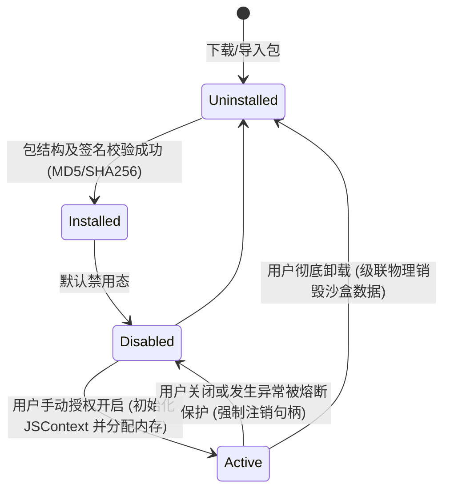

# 智宇 (ZhiYu) 插件市场 (Plugin Market) 高阶设计文档 (HLD)

## 1. 架构总览 (Architecture Overview)

为了在保证本地知识库绝对隐私与系统高安全性的前提下，赋予 **智宇 (ZhiYu)** 极限的功能拓展与定制能力，本设计方案规划了面向全平台（iOS、macOS）的微端插件架构体系。

```
┌────────────────────────────────────────────────────────────────────────┐
│                              宿主应用 (ZhiYu)                           │
└────────────────────────────────────┬───────────────────────────────────┘
                                     │
                    通过 Swift 6 Actor 提供安全通信信道
                                     │
                                     ▼
┌────────────────────────────────────────────────────────────────────────┐
│                          安全插件虚拟运行沙盒                          │
│                                                                        │
│   ┌───────────────────────┐         ┌──────────────────────────────┐   │
│   │    JSContext 沙盒     │         │      API 控制与熔断控制器     │   │
│   │   (运行插件业务逻辑)   │  ◄───►  │  (PluginContext Rate Limit)  │   │
│   └───────────────────────┘         └──────────────┬───────────────┘   │
│                                                    │                   │
│                                           基于权限清单 (Manifest)       │
│                                                    │                   │
│                                                    ▼                   │
│                                     ┌──────────────────────────────┐   │
│                                     │  受控宿主桥接 (Host Bridge)   │   │
│                                     └──────────────┬───────────────┘   │
└────────────────────────────────────────────────────┼───────────────────┘
                                                     │
                                                     ▼
                                      ┌──────────────────────────────┐
                                      │    受限底层服务 (RAG/LLM)     │
                                      └──────────────────────────────┘
```

系统由以下三个核心组件组成：
1. **声明式配置清单 (Manifest.json)**：插件静态声明其名称、版本、作者、以及申请的细粒度敏感权限（如 `requestAIAccess`、`readActivePage` 等）。
2. **虚拟运行沙盒 (Sandbox)**：基于 Swift 原生 `JSContext` 封装的非阻塞隔离沙盒，执行插件编译后打包的 JavaScript 代码，完全隔绝插件对原生底层系统文件 I/O、网络套接字（Sockets）的直接访问。
3. **安全注入桥接层 (Host Bridge)**：以事件或 RPC 驱动的进程内双向代理，仅透传经由宿主授权的只读/隔离型上下文。

---

## 2. 安全隔离与沙盒机制 (Security Sandbox)

### 2.1 权限细粒度模型 (Entitlement Model)
插件必须在其根目录的 `manifest.json` 中声明所需的敏感权限权限。宿主应用在安装时向用户进行强提示，并由系统授予：

| 权限标识符 | 描述 | 安全风险等级 | 防范策略 |
|---|---|---|---|
| `ai:inference` | 允许调用宿主配置的大模型进行推理 | 🔴 高 (配额损耗) | 宿主端分钟级滑动窗口 Rate Limit 强隔离限制 |
| `page:read_active`| 允许读取当前正在编辑的页面正文 Markdown | 🟡 中 (隐私侵犯) | 仅在用户主动触发该插件交互时单向透传，禁止后台常驻拉取 |
| `page:write_active`| 允许修改/回写当前正在编辑的页面正文 | 🟡 中 (数据污染) | 由 UndoService 统一包揽事务，支持用户一键撤销修改 |
| `vault:read_all` | 允许读取当前 Notebook 金库内的所有卡片 | 🔴 极高 (知识泄露)| 默认禁止，企业受控插件需二次生物识别 (FaceID) 授权解锁 |

### 2.2 运行期滑动窗口限流与熔断 (Runtime Rate Limiter)
所有插件对敏感桥接 API（如调用 LLM 推理 `requestAIAccess`）的调用将经过 `PluginWatchdog` 和 `PluginRateLimiter` 的严格看守：
1. **流量窗口（Rate Limit）**：采用 Token Bucket（令牌桶）算法，限制单个插件最大调用频率为 **60次/分钟**。
2. **超时判定（Watchdog）**：单次 JavaScript 同步阻塞执行时间不得超过 **2.0 秒**。如若超时，Watchdog 强行关闭该 `JSContext` 句柄，回收内存，向用户广播插件崩溃并释放物理资源，防止死锁与主线程卡顿。

---

## 3. 插件生命周期管理 (Lifecycle State Machine)

插件在宿主系统内的生命周期包含 5 种状态，其流转关系如下图所示：



*   **Installed（已安装）**：插件已被解压至宿主沙盒的专属插件只读路径中，`manifest.json` 挂载完毕。
*   **Active（激活态）**：宿主为该插件开辟了独立的 `JSContext`，将宿主桥接 API（`hostBridge`）绑定至全局作用域，开始监听应用层事件。
*   **Disabled（禁用态）**：物理注销 `JSContext`，将所有事件流订阅解绑，释放内存开销，确保 0 功耗常驻。

---

## 4. 插件分发与热插拔机制 (Distribution & Hot Swapping)

### 4.1 插件打包标准
插件统一以 `.zyplugin` 压缩包（ZIP 格式）分发，适用于本地安装与商店下载。内部物理目录拓扑规范如下：
```
plugin_root/
├── manifest.json       # 静态配置信息（版本、作者、声明权限、依赖最低宿主版本）
├── index.js           # 经过混淆与打包的单体 JavaScript 逻辑（ES6 标准）
└── assets/            # 静态资源（图标、配图、多语言字符串 catalog）
```

本地安装时将 `.zyplugin` 文件放入 `Documents/Plugins/` 目录，App 启动时自动扫描、解压并加载。商店分发同样使用此格式，由 `PluginMarketService` 下载后委派 `PluginRegistry` 解压加载。

### 4.2 热插拔加载时序
宿主支持无感热插拔加载插件，无需重启应用即可实现功能的无缝替换：
1. **校验并挂载**：解包 `.zyplugin` 到沙盒 `Library/Application Support/Plugins/` 下。
2. **卸载旧版本（若存在）**：若检测到同 ID 插件运行，`PluginRegistry` 触发旧插件析构流程，注销原有 `JSContext`，通知全局 UI 热刷新。
3. **热加载新版**：初始化新版本，加载 `index.js`，重建运行时上下文并热挂载。

---

## 5. 安全审核与签名认证机制 (Approve & Signature)

为了彻底打通开源社区分发渠道并确保企业级防黑客篡改完整性，插件市场实施双轨签名合规体系：

```
                    ┌──────────────────────────────┐
                    │    开发者本地打包 .zyplugin   │
                    └──────────────┬───────────────┘
                                   │
                                   ▼
                    ┌──────────────────────────────┐
                    │    第一轨：开发者私钥签名     │
                    │   (生成 SHA256withRSA 指纹)   │
                    └──────────────┬───────────────┘
                                   │
                                   ▼
                    ┌──────────────────────────────┐
                    │      智宇云端安全静态审计     │
                    │   (检测 eval/网络请求敏感词)  │
                    └──────────────┬───────────────┘
                                   │
                                   ▼
                    ┌──────────────────────────────┐
                    │     第二轨：智宇应用商店签名   │
                    │ (加盖 com.zhiyu.trusted 印章)│
                    └──────────────┬───────────────┘
                                   │
                                   ▼
                    ┌──────────────────────────────┐
                    │     客户端安装：双轨指纹验证  │
                    │      (防止中间人篡改攻击)      │
                    └──────────────────────────────┘
```

1. **第一轨：开发者本端物理签名**：开发者使用其在官方注册并经 Keychain 派生的公私钥对，对 `index.js` 物理字节流进行 SHA256 哈希，生成签名指纹挂载在 Manifest 中。
2. **云端安全合规审计**：上架至应用商店前，通过云端 AST（抽象语法树）静态词法分析，强制检测是否违规包含 `eval`、`Function` 动态代码构建等可能绕过沙盒的后门操作。
3. **第二轨：智宇官方 CA 签名**：审核通过后，智宇云端加盖官方受信任数字签名，由宿主应用在客户端进行双向数字证书链验证，非受信任或签名损毁的插件强制拒绝载入并报警。
