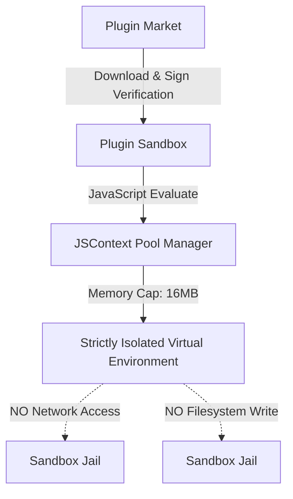

# 智宇 (ZhiYu) 第三方扩展插件市场商业与技术产品需求文档 (PRD)

## 1. 业务背景与商业价值

智宇 (ZhiYu) 是一款 AI 原生知识管理应用。为了构建完善的 RAG 与二次开发生态，我们设计并打造了智宇插件市场 (ZhiYu Plugin Market)。
通过向第三方开发者开放 JavaScript 拦截与预处理管道能力，允许开发者自定义：
- 专属知识源拉取器 (Connectors)
- 各种专业大模型 prompt 生成拦截与格式化插件 (Interceptors)
- 数据可视化与图谱主题插件 (Visualizer Themes)

通过插件市场，智宇可以实现快速的功能外延扩展，同时通过分成模型激发社区开发活力，形成良性商业闭环。

---

## 2. 商业模式与分成体系

为了激励开发者并保障平台持续运营，插件市场采用固定比例的交易与订阅分成体系：

### 2.1 分成比例 (Revenue Split)
- **开发者分成比例**：70%
- **平台分成比例**：30%
- 结算周期为月度结，开发者账户余额需达到 100 USD (或等值人民币) 方可发起物理提现。所有跨境税费与支付通道费（如 Stripe/支付宝通道费）均从平台 30% 留存部分中平摊扣除，保障第三方开发者的净得利益。

### 2.2 销售模型 (Monetization Models)
1. **买断制 (One-time Purchase)**：一次性付费解锁插件的永久使用权及生命周期内的所有小版本升级。
2. **订阅制 (Subscription)**：支持月度、年度订阅，解锁持续更新的云服务或高级数据同步功能。
3. **免费增值制 (Freemium)**：插件基础能力免费，高级 RAG 优化模板或长文本翻译过滤收费。

---

## 3. 安全隔离沙箱规范 (Plugin Sandbox)

为了确保用户本地“知识金库”的数据安全性，防止恶意插件静默盗取或上传用户知识文档，所有的第三方插件必须运行在严格受限的沙箱环境中。



### 3.1 JSContext 物理硬隔离
- 所有的第三方 JavaScript 代码只能在 `JSContext` 虚拟机内部执行。
- **内存限制**：为单个插件的 `JSContext` 线程设置 16MB 的内存配额硬限制，杜绝由于恶意内存泄露造成的 App OOM 崩溃。
- **CPU 时间片约束**：执行单个拦截任务 (如 `preProcess`) 的 CPU 运行时间片不得超过 500ms，超时则直接中断销毁虚拟机实例。

### 3.2 权限沙箱隔离 (Permissions Sandbox)
- **网络隔离**：默认禁止一切 `XMLHttpRequest`、`fetch` 等网络通信行为。任何需要调用外部 API 的插件必须在 `manifest.json` 中显式声明 `network` 权限，并在上架时接受平台的严格人工代码审计。
- **文件系统读写禁绝**：插件不得直接读取或写入任何用户本地的磁盘路径。所有输入输出必须通过 `JSContext` 包装的方法参数传入和传出（例如，仅允许接收 Markdown 文本并返回格式化后的 Markdown 文本）。

---

## 4. 交易流转与退款仲裁流程

保障消费者权益，平台提供基于智能合约与人工客服协同的退款仲裁机制。

### 4.1 24小时无理由退款窗口
- 用户在购买或订阅插件后的 24 小时内，可以在 App Store 或智宇内置账户中心点击“一键退款”，资金原路退回，无需人工介入。退款发生后，插件的本地沙箱授权许可证将立即失效。

### 4.2 退款仲裁流程 (Arbitration Flow)
超过 24 小时但在 14 天内的退款申请，需进入人工仲裁通道：
1. **开发者协商阶段**：用户提交退款申请并阐明原因（如：插件与某系统版本不兼容，发生崩溃），系统自动通知开发者。开发者可在 48 小时内选择同意或拒绝并给出解决方案。
2. **平台介入仲裁**：若开发者拒绝或超时未响应，用户可一键申请平台介入。平台仲裁委员会将在 3 个工作日内调取插件的 Crash 日志以及用户反馈的证据，决定是否强制划扣退款。

---

## 5. 熔断与黑名单下架机制

针对在上架后通过远程注入木马或恶意规避检测的违法/违规插件，平台设计了“线上熔断与本地禁绝”的双重熔断系统。

```
平台云端控制台 ──────────────────> 动态下架并广播黑名单信号 (OTA Broadcast)
                                                  │
                                                  ▼
智宇本地应用端 ──> 匹配黑名单 ID ──> 本地沙箱实时禁用该插件 ──> 触发物理销毁与警示
```

### 5.1 线上实时熔断 (Cloud Kill-Switch)
- 平台控制台提供一键熔断按钮。当确认某插件存在严重安全隐患时，管理员可将其状态一键更新为 `TERMINATED`。
- 系统会实时更新并向全网发布 `blacklist.json` 黑名单哈希表，内含已被禁用的插件 ID 和对应版本哈希。

### 5.2 本地热自愈与销毁 (Local Purge)
- 智宇客户端在每次冷启动或网络发生变化时，会静默拉取最新的黑名单列表。
- 一旦匹配到本地已安装的插件处于黑名单中，客户端将立即执行以下安全熔断步骤：
  1. **内存断电**：立即将该插件的 `JSContext` 连接池中的实例彻底销毁。
  2. **物理文件擦除**：在本地磁盘中强行删除该插件的整个 `.zip` 解压目录。
  3. **用户警示**：在插件管理界面向用户显示红色警示弹窗：“该插件已被检测到包含违规操作，已由平台安全机制强制禁用并彻底擦除，以保护您的数据安全。”
