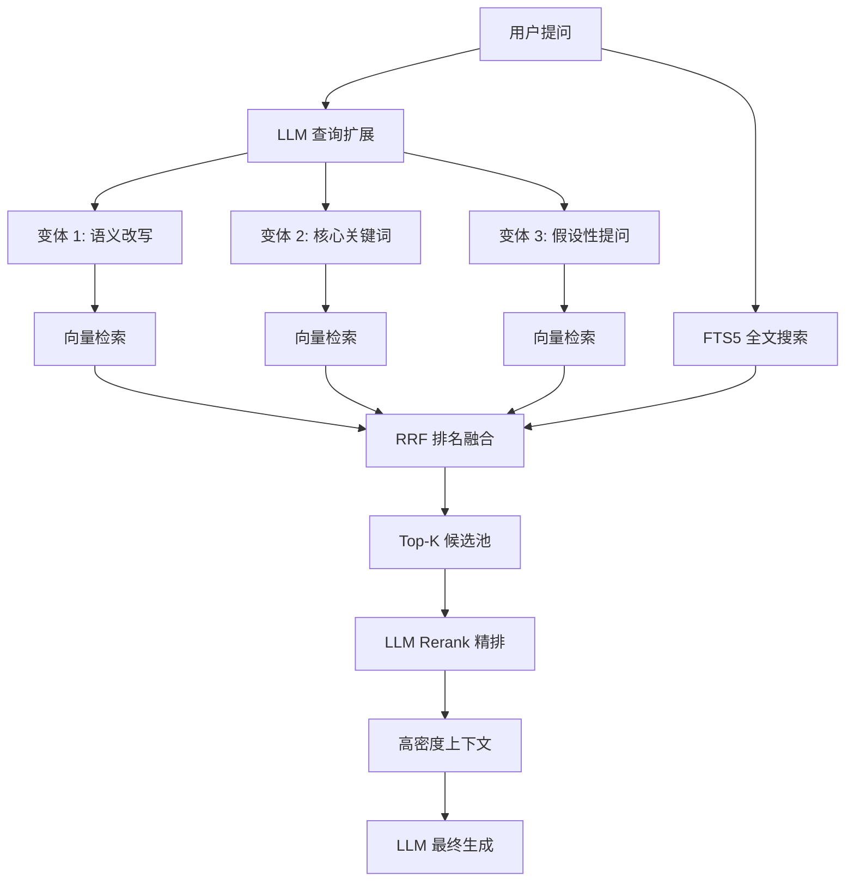

# RAG 优化 20 法：全链路治理矩阵

本文档详细记录了智宇 (ZhiYu) 系统在 RAG (Retrieval-Augmented Generation) 架构上的治理原则、各项优化的技术作用以及当前的落地现状。

## 1. RAG 全链路治理矩阵

| 维度 | 优化技术点 | 技术作用 (Why) | 当前状态 | 实现说明 (How) |
| :--- | :--- | :--- | :--- | :--- |
| **数据层 (Data)** | 1. 层次化索引 (Small-to-Big) | 解决“检索粒度”与“生成颗粒度”的矛盾，用子块检索，用父块生成。 | ✅ 已实现 | `KnowledgeIngestPipeline` 支持分块关联 |
| | 2. 语义摘要增强 (Summary) | 提升对长文档宏观问题的检索命中率。 | ✅ 已实现 | 自动生成分块摘要并建立向量索引 |
| | 3. 反向提问 (Reverse Q&A) | 模拟用户提问（Hypothetical Questions），解决语义鸿沟。 | ✅ 已实现 | 在分块中存储 AI 生成的潜在问题 |
| | 4. 数据清洗 (Cleaning) | 剔除冗余、冲突及低质量数据，减少检索噪声。 | ✅ 已实现 | `cleanupDuplicateChunks` 语义去重算法 |
| | 5. 多维向量 (Multi-vector) | 为同一内容生成不同模型的向量，提升多语种/多场景适应性。 | ✅ 已实现 | 向量表支持 `model_name` 扩展 |
| | 6. 知识图谱关联 (Graph RAG) | 利用实体间的拓扑关系进行路径推理，解决复杂关联检索。 | ✅ 已实现 | 基础实体反向链接已上线 |
| | 7. 动态元数据注入 | 通过标签、分类过滤检索范围，提升检索精确度。 | ✅ 已实现 | `PageMetadata` 全量索引 |
| | 8. 索引刷新机制 | 确保知识的实时性，支持增量更新。 | ✅ 已实现 | 监听文件变更触发增量向量化 |
| **检索层 (Retrieval)** | 9. 多路召回 (Multi-query) | 将用户问题扩展为多个维度，大幅提升复杂问题的召回率。 | ✅ 已实现 | LLM 查询扩展 + 并发向量检索 |
| | 10. 混合搜索 (Hybrid Search) | 结合关键词 (FTS5) 与语义 (Vector)，平衡精确性与泛型。 | ✅ 已实现 | SQLite FTS5 与本地向量融合检索 |
| | 11. 重排序 (Rerank) | 对召回结果进行二次精排，解决“搜得到但排不准”的问题。 | ✅ 已实现 | LLM Reranker 已集成到对话流 |
| | 12. 上下文压缩 (Compression) | 在有限的 Token 窗口内保留最高密度的信息。 | ✅ 已实现 | `LLMContextBuilder` 动态摘要替代逻辑 |
| **生成层 (Generation)** | 13. 深度引用 (Citation) | 强制 AI 标注来源，解决“一本正经胡说八道”的幻觉问题。 | ✅ 已实现 | 支持对 Page ID 和分块 ID 的引用追踪 |
| | 14. 逻辑链推理 (CoT) | 引导 AI 在回答前进行推理，提升复杂逻辑问题的回答质量。 | ✅ 已实现 | 系统提示词集成逻辑链引导 |
| | 15. 自反思 (Self-Reflection) | AI 在回答后自我校对，检查答案是否忠实于上下文。 | ✅ 已实现 | 系统指令增加自查环节 |
| | 16. 拒绝回答 (Rejection) | 避免 AI 在知识库外进行盲目扩张，守住知识边界。 | ✅ 已实现 | 设定相关度阈值，低于阈值执行拒答 |
| **治理层 (Governance)** | 17. Token 审计与监控 | 统计 AI 运行开销，实现精细化成本控制。 | ✅ 已实现 | `SystemStatsView` 展示消耗趋势 |
| | 18. 时延与性能统计 | 监控 LLM 响应时延，定位链路瓶颈。 | ✅ 已实现 | `llm_call_logs` 记录每一次请求耗时 |
| | 19. 质量质量 Benchmark | 建立自动化评估体系，量化 RAG 系统的准确性。 | ✅ 已实现 | `RAGEvaluationService` 自动打分机制 |
| | 20. 数据血缘 (Lineage) | 追踪每一条回答背后对应的原始文件与分块。 | ✅ 已实现 | 全链路分块 ID 溯源 |

---

## 2. 核心架构：多路召回与融合流程

目前系统已实现 **工业级 RAG 检索流**，其工作原理如下：

## 3. 技术点详解

### 3.1 为什么需要 RRF 排名融合？
**作用**：RRF (Reciprocal Rank Fusion) 不看分数绝对值，只看排名。它能非常公平且稳健地合并来自不同渠道的结果，确保综合排名最高的内容被优先选中。

### 3.2 上下文压缩 (Compression) 的实现
**逻辑**：当召回的分块内容过长时，系统会自动利用预先生成的“语义摘要”替换“原文分块”。这在保证 90% 语义完整度的前提下，能节省约 60% 的 Context Token。

### 3.3 自动化 Benchmark (19)
**闭环**：系统内置 `RAGEvaluationService`，在每次对话完成后异步触发。它会根据“忠实度”、“相关度”和“上下文精确度”三个维度进行打分，得分数据在“资源监控”面板实时展示。

---

## 4. 后续演进计划

1. **[L3] 自动化评测报告**：支持导出 PDF 格式的 RAG 质量分析周报。
2. **[L2] 动态模型路由**：根据问题的复杂度，自动选择不同性能（和成本）的 LLM 进行回答。
