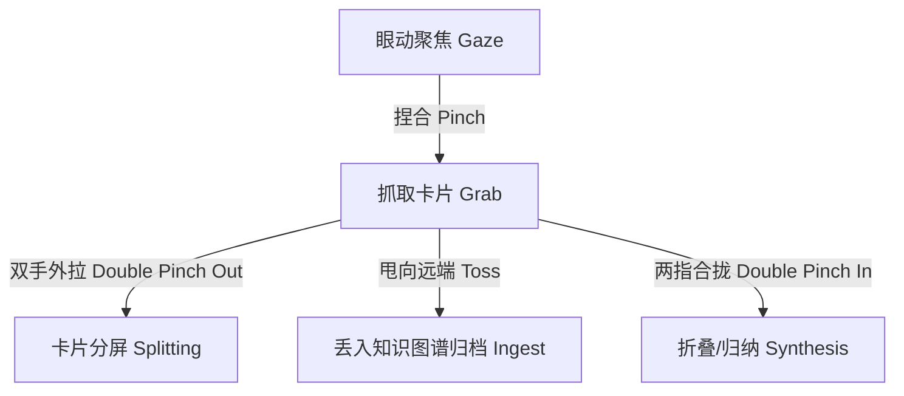

# 智宇 (ZhiYu) Vision Pro 空间视图 (VisionOS) 高阶设计文档 (HLD)

## 1. 空间计算设计哲学 (Spatial Philosophy)

在 **智宇 (ZhiYu)** 的三维计算视界中，知识卡片不再被局限在二维物理屏幕内，而是转换为用户真实物理空间中的“空间实体”。

```
                        [用户眼动聚焦 (Gaze Target)]
                                     │
                                     ▼
┌────────────────────────────────────────────────────────────────────────┐
│                        Apple Vision Pro 空间视界                        │
│                                                                        │
│       ┌─────────────────┐             ┌─────────────────┐              │
│       │ 磨砂玻璃卡片 A   │  Z-Axis 景深 │ 磨砂玻璃卡片 B   │              │
│       │  (Active View)  │ ◄─────────► │ (Outline View)  │              │
│       └────────┬────────┘             └────────┬────────┘              │
│                │                               │                       │
│                └───────────────┬───────────────┘                       │
│                                │ RealityKit 空间连线                    │
│                                ▼                                       │
│                       ┌─────────────────┐                              │
│                       │  3D 核心知识图谱  │                              │
│                       │   (3D Entity)   │                              │
│                       └─────────────────┘                              │
└────────────────────────────────────────────────────────────────────────┘
```

空间计算的核心设计理念包括：
1. **轻量磨砂视效 (Glassmorphism & Depth)**：卡片采用高动态磨砂玻璃材质，物理光照透过卡片产生高保真折射，通过景深（Z-Axis Depth）传递卡片的知识关联度与活动等级。
2. **多模态直觉手势 (Multimodal Interaction)**：以“眼动追踪（Eye Gaze）”为选择锚点，辅以“手势捏合（Tap & Pinch）”完成信息的抓取、重组与归档。
3. **沉浸式图谱共鸣 (Immersive Node Symphony)**：用户可在三维物理空间中直接“步入”庞大的知识宇宙，感受连线的律动与节点的多维立体映射。

---

## 2. 3D 知识拓扑图谱系统 (3D Entity Chart)

### 2.1 物理建模与 RealityKit 拓扑设计
在 `visionOS` 共享空间（Shared Space）或全沉浸式空间（Full Space）中，知识图谱依托于 Apple `RealityKit` 引擎进行三维实时渲染：
*   **知识节点 (Node Entity)**：节点被建模为粒子云聚合的多维立体几何球体，球体颜色渐变由 `PageType` 驱动，球体脉动频率代表卡片被检索/SRS 间隔重复记忆的热度等级。
*   **双向链接连线 (Relationship Line)**：节点之间的双向链接使用 `ModelEntity` 或者是定制的 Metal Shader 渲染为高拟真能量光栅。如果两个知识节点之间关联强度极高，则光栅流速加快、光栅线变粗。

### 2.2 立体卡片层叠与 Z 轴景深调度
系统利用 Z 轴景深提供物理维度的信息优先级过滤：
1. **焦点面板（Active Layer, Z = 0）**：当前正在阅读的正文卡片，文字清晰度最高，磨砂系数最亮，支持物理键盘/虚拟键盘快速录入。
2. **关联环绕（Backlink Layer, Z = -0.3m）**：相关反向链接卡片呈圆弧状分布在焦点卡片后方，材质呈现半透明状态，眼动注视瞬间向前弹出热挂载。
3. **全局星空（Knowledge Universe Layer, Z = -1.2m）**：宏观 3D 图谱微缩星海，作为背景环境稳定悬浮，避免过度夺取用户的主注意力。

---

## 3. 空间手势与多窗口交互 (Spatial Gesture & Windows)



### 3.1 空间多维手势定义

#### A. 眼动聚焦选择 (Gaze Selection)
当用户的视线落在空间知识卡片的某个标题或双链节点上，该元素会在 0.15s 内响应微妙的高亮变焦或轻微前凸，提供立体的物理悬浮提示（Hover Feedbacks），确认操作靶点。

#### B. 捏合拉扯与分屏 (Grab & Stretch)
*   **单手抓取**：视线对准卡片边缘，食指拇指捏合，可将卡片在三维物理房间中进行任意拖拽与摆放。
*   **双手拉伸**：两只手同时选中当前卡片，向相反方向拉扯，卡片自适应宽度扩展，并在中间分裂为“左侧编辑、右侧 3D 预览”的空间分屏布局。

#### C. 甩动归档 (Toss to Archive)
抓取卡片后，配合手臂甩动轨迹松开手指，卡片将自适应沿抛物线轨迹飞向远端的 3D 全局知识图谱，碰撞并融入对应的知识聚类簇中，伴随一键物理碎屑触觉反馈。

---

## 4. 空间磨砂玻璃与效能保障 (Metal Rendering & Performance)

为了确保用户在体验 3D 拓扑图谱时，渲染流畅度始终锁定在 **90Hz / 120Hz** 的极佳临界点，并消除头显过热与电池骤降的隐患，技术底座采用以下优化：

### 4.1 Metal 动态实例化渲染 (Instanced Rendering)
在渲染包含成千上万个节点和连线的巨大知识库图谱时，严禁使用常规的单实体渲染：
1. **多节点合并绘制（Single Draw Call）**：将所有的节点顶点信息打包至统一的 GPU Buffer 中，使用 `drawIndexedPrimitives` 配合实例 ID 动态渲染全部球体。
2. **流线光栅着色器**：将连线的流动能量粒子计算全部下沉至 Metal Compute Shader 执行，通过 GPU 并发线程极速计算节点位移，释放 CPU 主线程。

### 4.2 漏斗裁剪与景深剔除 (Occlusion Culling)
1. **视锥体裁剪（Frustum Culling）**：仅渲染用户眼动和头显陀螺仪所处视场角（FOV）内的 3D 卡片与连线，视线外的实体强行从渲染队列剔除。
2. **距离遮挡淡出（Distance Fading）**：距离用户头显超过 **3.0 米** 的超长连线及微型节点转化为 2D 轻量 billboards，当用户瞬移（Teleport）靠近时才物理膨胀还原，极尽压榨空间计算算力。
