# 智宇 (ZhiYu) 视觉设计系统 (Design System)

## 1. 设计系统架构 (Design System Architecture)

为了实现全平台视觉一致性与高维护性，智宇采用“原子化”设计系统架构，分为 **Tokens**、**UIComponents** 和 **Layouts** 三个层级。

### 1.1 原子设计令牌 (Tokens)
存放在 `Sources/Shared/DesignSystem/Tokens/`，是系统最基本的视觉单位：
*   **Spacing**: 定义 2px 步进的间距体系及标准圆角常数（如 `cardRadius`）。
*   **Typography**: 定义层级化字号、标题等级（H1-H6）及 SF Symbols 语义映射。
*   **Colors**: 定义亮暗模式适配的语义色（`appBackground`, `appAccent`）及透明度规范。
*   **Animations**: 定义统一的物理动效参数（弹性、时长、交互缩放）。

### 1.2 通用 UI 组件 (UIComponents)
存放在 `Sources/Shared/UIComponents/`，按功能模块化划分为：
*   **Cards**: 各类统计卡片、标准内容卡片及玻璃拟态卡片。
*   **Buttons**: 品牌色主按钮、胶囊按钮及带加载状态的交互控件。
*   **Chips**: 标签、徽章及可滚动标签列表。
*   **Lists**: 统一样式的行 (Row)、分段标题及快速操作项。
*   **Feedback**: 脉冲指示器、流光加载 (Shimmer) 及骨架屏。
*   **Inputs**: 文本框、多选标签输入框及 Markdown 编辑器。
*   **Accessibility**: 针对色觉障碍及视障优化的增强视图。

### 1.3 布局模板 (Layouts)
存放在 `Sources/Shared/UIComponents/Layouts/`，用于构建标准的页面结构：
*   **StandardSection**: 具备标题、页脚和玻璃卡片容器的标准列表分组模板。
*   **AnimatedSection**: 支持条件展开与平滑转场动画的区块模板。
*   **FlowLayout**: 高性能自动换行排列容器，用于标签云与搜索建议。

## 2. 设计原则 (Principles)
*   **深邃感**：采用暗色调背景与半透明材质（Material），营造专注、理性的阅读氛围。
*   **确定性**：所有的异步 AI 状态必须有视觉脉搏（Pulse）或触感反馈（Haptic）。
*   **语义化**：色彩不仅仅是装饰，更是状态的传递（如：紫色代表 AI，绿色代表激活）。

## 3. 色彩系统 (Color Palette)

| 名称 | 语义 | 用途 |
| :--- | :--- | :--- |
| **appAccent** | 主强调色 (Purple) | AI 指示、核心品牌色、高亮链接。 |
| **appBackground** | 容器背景 | 全局页面背景。 |
| **appCard** | 卡片背景 | 内容卡片、弹窗。 |
| **appSecondary** | 次要文本 | 辅助说明、禁用状态。 |
| **appBorder** | 边框色 | 容器描边。 |

## 4. 字体规范 (Typography)
*   **标题**：SF Pro Display, Bold (用于页面标题与 Dashboard 度量)。
*   **正文**：SF Pro Rounded, Regular (用于普通文本，增加亲和感)。
*   **代码/单字**：SF Mono (用于标签与技术参数)。

## 5. 交互反馈 (Interaction)
*   **触感触发器**（`HapticFeedback.shared.trigger(_:)`）：
    *   `.selection`: 普通点击、选中切换。
    *   `.success`: 操作成功（保存、导出完成）。
    *   `.error`: 操作失败、AI 任务异常。
    *   `.unlock` / `.lock`: 金库加锁/解锁。
    *   `.heavy`: 重大操作确认（如删除金库）。
*   **动效标准**：使用 `Spring(response: 0.3, dampingFraction: 0.7)` 作为全局标准动效，确保流畅度与响应感。

## 6. 核心组件规范 (Component Standards)

### 6.1 空间导航面包屑 (Breadcrumbs)
- **视觉**: 使用 `ultraThinMaterial` 背景，文字采用 `caption` 字号。
- **状态**: 当前路径高亮为 `appAccent`，历史路径弱化为 `wikiSecondary`。
- **价值**: 消除深度跳转后的心理焦虑，提供物理级回溯感。

### 6.2 AI 知识芯片 (AI Knowledge Chips)
- **视觉**: 圆角胶囊 (Capsule)，背景色 `appAccent.opacity(0.15)`，带 1px 描边。
- **交互**: 具备 Hover 缩放效果，点击触发精准页面跳转。
- **价值**: 将文本回复转化为可操作的原子化知识块。

### 6.3 实时日志流 (Live Logs)
- **视觉**: 在脉搏指示器下方显示的微缩文本，使用 `monospaced` 字体。
- **动效**: 采用 `push(from: .bottom)` 的进场方式。
- **价值**: 实现"透明处理"，通过实时输出任务细节降低用户的感知延迟。

### 6.4 骨架屏与空状态 (Skeleton & Empty States)
- **Shimmer** (`Shimmer.swift`): 加载占位动画，用于列表与卡片内容尚未就绪时。
- **AppEmptyState** (AppEmptyState): 统一空状态插画与引导文案。
- **AppLoadingOverlay** (`AppLoadingOverlay.swift`): 全屏/局部加载遮罩，带进度指示。

### 6.5 图表与可视化组件 (Graph & Visualization)
- **GraphComponents** (`GraphComponents.swift`): 图谱节点渲染、选中态高亮、物理动画。
- **Graph3DComponents** (`Graph3DComponents.swift`): 3D 场景节点与相机控制。
- **GraphLOD** (`GraphLOD.swift`): 基于缩放级别的细节层次切换。

### 6.6 编辑器组件 (Editor Components)
- **EditorComponents** (`EditorComponents.swift`): Markdown 编辑工具栏、源码/预览切换、快捷插入。

### 6.7 协作组件 (Collaboration Components)
- **CollaborationComponents** (`CollaborationComponents.swift`): 实时协作用户光标、评论气泡、变更提示。

### 6.8 导入与采集组件 (Ingest Components)
- **IngestViewComponents** (`IngestViewComponents.swift`): 文件拖放区、URL 输入、OCR 扫描触发、语音录入按钮。

### 6.9 其他辅助组件
- **AppTooltip** (`AppTooltip.swift`): 悬浮提示，用于图标按钮的功能说明。
- **AppDecorators** (`AppDecorators.swift`): 页面装饰元素（高亮、下划线、引用标记）。
- **DragDropComponents** (`DragDropComponents.swift`): 跨平台拖放目标区域与动画。
- **ReadabilityModifiers** (`ReadabilityModifiers.swift`): 字体大小、行距、宽窄栏切换。
- **MermaidWebView** (`MermaidWebView.swift`): Mermaid 图表渲染 WebView 封装。
- **SplashComponents** (`SplashComponents.swift`): 启动屏与引导页动画组件。
- **MedalComponents** (`MedalComponents.swift`): 勋章墙展示、解锁动画、稀度标识。
- **OnDeviceComponents** (`OnDeviceComponents.swift`): 本地模型状态指示与推理进度。
- **VoiceNoteComponents** (`VoiceNoteComponents.swift`): 语音录制波形、转写结果显示。
- **PDFComponents** (`PDFComponents.swift`): PDF 阅读器翻页控制与缩略图导航。
- **OCRScanComponents** (`OCRScanComponents.swift`): 相机取景框、文字识别区域高亮。
- **iCloudSyncComponents** (`iCloudSyncComponents.swift`): 同步状态指示、冲突解决界面。

## 7. 视图组件拓扑 (Component Topology)

```mermaid
graph TD
    Root[ContentView] --> Tab[TabView / SplitView]
    Tab --> Knowledge[NavigationView / KnowledgeModule]
    Knowledge --> Sidebar[SidebarView]
    Knowledge --> Detail[DetailContentView]
    Detail --> PageDetail[PageDetailView]
    PageDetail --> Header[PageDetailHeader]
    PageDetail --> Bread[BreadcrumbView]
    PageDetail --> Render[MarkdownRendererView]
    PageDetail --> Sparks[AI Contextual Sparks]

    Tab --> Graph[GraphContainerView]
    Graph --> Graph2D[GraphCanvasView / GraphNodeView]
    Graph --> Graph3D[Graph3DView / Graph3DComponents]

    Tab --> Search[SearchView]

    Tab --> Ingest[IngestView]
    Ingest --> OCR[OCRScanView]
    Ingest --> Voice[VoiceNoteView]
    Ingest --> PDF[PDFReaderView]

    Tab --> Settings[SettingsView]

    Root --> Palette[CommandPaletteView]
    Root --> Pulse[AIPulseIndicator + LiveLog]

    Sidebar --> Dashboard[KnowledgeDashboardView]
    Sidebar --> Chat[ChatViewContent]
    Sidebar --> Synthesis[SynthesisView]
    Sidebar --> Weekly[WeeklyReportView]
    Sidebar --> Index[IndexView]
    Sidebar --> Lint[LintView]
    Sidebar --> Task[TaskCenterView]
    Sidebar --> Tag[TagCloudView]
    Sidebar --> Collab[CollaborationView]
    Sidebar --> Medal[MedalWallView]
    Sidebar --> Plugin[PluginCenterView]
    Sidebar --> Log[LogView]
    Sidebar --> Export[ExportReportView]

    PageDetail --> History[PageHistoryView]
    PageDetail --> Quiz[QuizView]

    Settings --> OnDevice[OnDeviceLLMSettingsView]
    Settings --> iCloud[iCloudSyncView]
    Settings --> Backup[BackupView]
    Settings --> Prompt[PromptWorkshopView]

    Root --> Splash[SplashView / WelcomeView]
    Root --> Lock[LockOverlayView]
    Root --> Spatial[VisionProSpatialView]
```

