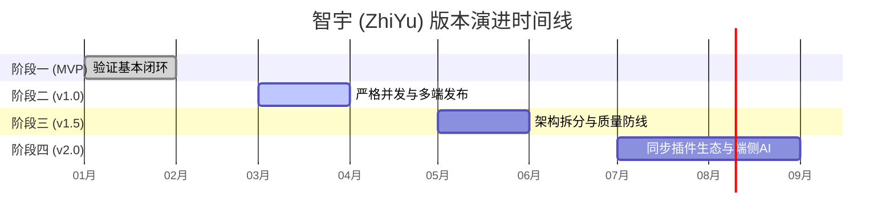

# 智宇 (ZhiYu) 产品演进路线图 (Roadmap)

## 📌 版本发布战略总览 (Release Strategy)

智宇 (ZhiYu) 作为一款 AI 原生的三端知识管理应用，其核心演进遵循 **“稳固内核 → 业务瘦身解耦 → 质量安全熔断 → 开放生态变现”** 的进阶发布路径。

---

## 🗺️ 阶段演进详图

### 🎯 阶段一：MVP (Minimum Viable Product) — 验证基本闭环 (已完成)
* **核心焦点**：实现本地语义分块与混合检索的基本业务闭环。
* **主要特性**：
  * **混合存储**：引入 SQLite (GRDB.swift) 作为核心持久化引擎，支持 SQLite 原生的全文检索 (FTS5)。
  * **语义向量化**：支持将 Markdown 内容进行粗粒度物理分块，并通过本地/远程大模型提取语义嵌入 (Embeddings) 实现向量化匹配。
  * **AI 实验室**：提供基于 OpenAI / Ollama 网关的直接一问一答文本生成页面，搭建极简 Chat 面板。

---

### 🚀 阶段二：v1.0 — 开启严格并发与多平台发布 (当前版本)
* **核心焦点**：消灭冷启动闪退，支持 iOS / macOS Catalyst / watchOS 三端独立编译，引入高阶安全与本地化。
* **主要特性**：
  * **Swift 6 Concurrency 完全适配**：开启 `SWIFT_STRICT_CONCURRENCY: complete` 严格并发编译选项，全线消除 Data Race 隐患。
  * **依赖倒置与 DIP**：实现轻量级 DI 容器 `ServiceContainer` 和 `@Inject` 包装器，全面阻断 UI Feature 跨层依赖基础设施具体类。
  * **多 Target 优化**：定制 `project.yml`。对 watchOS 客户端进行重型视图和后台数据流物理裁剪，保障轻量级载荷；支持 macOS Catalyst 桌面端多窗口运行。
  * **底层安全防线**：集成 SQLCipher 对本地数据库进行全盘硬件级物理加密；引入 HMAC-SHA256 对敏感知识库文件进行防篡改指纹签名，并借助 `signatureRepository` 持久化，保护用户数据资产。
  * **多语言强类型本地化**：通过 `L10n` 和 `.xcstrings` 收口，静态审查工具一键拦截裸露字面量。

---

### 🧱 阶段三：v1.5 — 架构微服务化拆分与质量防线建设 (当前重构焦点)
* **核心焦点**：消除 `LLMService` 神类、给 `AppStore` 瘦身，补齐全体系单测覆盖率红线，拦截质量劣化。
* **主要特性**：
  * **AI 基础设施拆分**：将 `LLMService` 彻底剥离并解耦为 `ChatLLMService` (对话编排)、`IngestLLMService` (摄入/拆分/折叠) 与 `RerankService` (同义扩展与重排)，由门面类透传，降低代码文件复杂度。
  * **AppStore Facade 物理减脂**：创建全新的 `MediaStore` 统一整合 OCR、PDF 元数据存取与 Snapshot 截图加载；完成 `SearchStore` 的物理完全切除，各 Store 独立挂载并统一注册至 DI 容器，实现状态单一源。
  * **代码覆盖率 85% 自动熔断**：通过 `check_coverage.py` 流水线脚本，对核心领域层 (`Sources/Domain`) 强加 85% 单元测试覆盖率红线，低于此红线 CI 自动拒绝合并。
  * **Golden Set 质量度量**：集成 50+ 组核心场景的召回率自动化检验，低于 90% 准确性要求时强行报错。
  * **ZhiYuTests.swift (37KB) 物理拆解**：打碎超长测试文件为 4 个职责分明的高内聚测试模块。
  * **三端 UX 质感升华**：统一实现四大模块的 `Empty States` 空白视图、通用 `AppErrorView` 错误面板、以及优雅滑入的 `Loading Skeleton` 骨架屏组件。

---

### 🌌 阶段四：v2.0 — iCloud 自动同步、开放插件 SDK 与变现生态 (展望)
* **核心焦点**：打通多终端无缝同步，开放第三方 JS 沙盒插件市场，建立商业化变现平台。
* **主要特性**：
  * **多 Vault LWW (Last-Write-Wins) iCloud 自动融合**：集成 CloudKit 增量同步，在多终端网络断开恢复后，基于修改时间戳和版本指纹自动解决数据合并冲突。
  * **JavaScript 插件 CLI 与调试工具 SDK**：为社区生态开发者提供命令行 CLI 脚手架，支持局域网无线连接真机进行插件实时热重载 (Hot Reload) 与脚本调试。
  * **插件市场支付变现**：推出变现模块 `MonetizationInfo`，集成 Apple StoreKit 2 代内购订阅，使能插件作者变现，开启智宇生态系统。
  * **离线 Edge AI**：在 iOS Simulator / iPhone 17 上，集成本地 CoreML 编译器与苹果原生 Neural Engine，无需联网即可进行端侧 3B LLM 的高速本地推理与 Embedding 计算。

---

## 🚫 阶段准入门槛与显式 Non-Goals (Quality Gates & Non-Goals)

为了维护项目敏捷性并防止过度设计，智宇定义了明确的“非目标”与质量门禁：

### 🧱 阶段二 (v1.0) & 阶段三 (v1.5) 准入红线
1. **并发安全红线**：Swift 6 严格并发检查错误数必须物理清零，任何 Data Race 警告将被 CI 拦截。
2. **测试覆盖红线**：L1.5 领域层物理单测覆盖率必须达到 **85%** 以上，Golden Set 混合检索召回率必须稳定在 **90%** 以上。
3. **架构解耦红线**：L2 Features 层绝对禁止物理引入 L1.0 基础设施（如 SQLiteStore）具体类。

### ⚠️ 显式 Non-Goals (当前不实施)
1. **SQLite 数据库静态加密**：鉴于目前多终端（如 Apple Watch）轻量化与自动化 UI 测试的高频需求，并且出于性能调优考量，**经与用户确认，本阶段暂不实施 SQLite 静态加密功能 (SQLCipher)**。这作为非目标，防止引入无必要的密钥管理负荷。
2. **多端脑裂自动合并 (LWW)**：在阶段四打通 iCloud 同步前，不在本地强行处理多设备的实时冲突，本地仅负责生成指纹签名并保障指纹的持久化一致。
