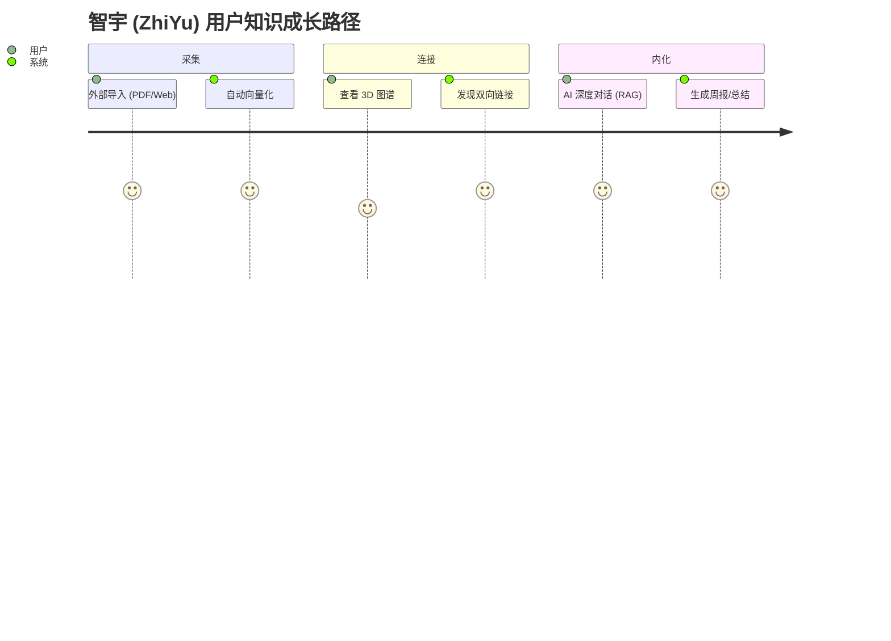

# 智宇 (KM) 产品需求文档 (PRD)

## 1. 产品愿景
打造一个“懂你”的跨端知识操作系统，通过 AI 深度感知与插件化生态，解决知识“存而不用”的痛点。

## 2. 目标用户 (User Personas)
*   **科研/学生**：需要处理海量文献，追求深度链接与 RAG 检索。
*   **开发者/产品经理**：追求键盘优先体验 (Cmd+K)，需要高度的可定制化（插件）。

## 3. 核心功能规格 (MVP+)
### 3.1 AI 深度探索 (AI Deep Research)
*   **正常流程**：用户输入问题 -> 系统提取本地 Context -> 触发 RAG -> 渲染芯片化链接。
*   **异常处理**：若无本地匹配，系统应提示“知识盲区”，并建议联网搜索。

### 3.2 插件化拦截系统
*   **业务逻辑**：插件必须在数据入库 `SQLite` 前完成 `preProcess`，确保全文搜索 (FTS5) 索引的是处理后的干净数据。

## 4. 非功能性需求 (Non-Functional Requirements)
*   **性能**：本地搜索响应延迟 < 200ms；AI 混合检索首字弹出 < 1s。
*   **隐私**：默认“离线优先”，敏感内容向量化必须在 Apple Neural Engine 内部完成。

## 4. 用户路径地图 (User Journey Map)

通过典型的“碎片化采集到知识内化”路径，展示系统的核心价值点。

## 5. 异常流程定义 (Exception Flows)

| 异常场景 | 系统行为 | 用户反馈/引导 |
| :--- | :--- | :--- |
| **网络中断** | 自动切换为“纯本地检索”模式。 | 顶部状态栏显示“离线模式”，AI 按钮置灰。 |
| **向量化失败** | 将页面标记为“待索引”，并在后台空闲时重试。 | 详情页 Badge 显示“AI 准备中”，不影响正常编辑。 |
| **插件权限冲突** | 拦截非法请求，并对插件执行“熔断”降级。 | 弹出 Toast 提示“插件 X 已因越权操作被停用”。 |
| **存储空间不足** | 优先保证数据库记录，延迟或压缩缓存。 | 弹出系统警告，建议清理过期的导出快照。 |

---

## 6. 用户引导策略 (Onboarding)
*   **初次启动**：自动挂载“欢迎金库 (Welcome Vault)”，通过一篇交互式 Markdown 文档引导用户体验双向链接与 AI 总结。
*   **功能引导**：在用户首次进入“插件中心”或“3D 图谱”时，弹出轻量级的蒙层指引，降低认知门槛。

## 7. 安全与隐私增强 (Security & Privacy+)
*   **金库锁定 (Vault Locking)**：支持通过系统原生生物识别 (FaceID/TouchID/密码) 对单个金库进行物理加锁。
*   **隐私模式切换**：支持“隐藏敏感文件夹”，在预览模式下自动对标记为 #private 的内容执行高斯模糊处理。

## 8. 反馈与生态治理 (Governance)
*   **反馈闭环**：在设置页提供“一键导出匿名诊断包”，方便用户在遇到性能瓶颈或插件崩溃时，将上下文回传给核心开发组。

## 9. 验收标准 (Acceptance Criteria)
*   [ ] 跨端适配：iPad 分屏模式下 UI 不错位，三栏/底栏自动切换。
*   [ ] 插件隔离：非法插件崩溃不影响主程序运行。
*   [ ] RAG 召回精度：混合检索 Top-5 准确率 > 90%。
*   [ ] 冷启动性能：1,000 页规模下冷启动 < 1.2s。
*   [ ] 数据完整性：模拟崩溃后重启，SQLite 数据无损，ACID 事务保证。
*   [ ] 生物识别：FaceID/TouchID 金库锁定与解锁全链路正常。
*   [ ] 多端同步：iCloud 三端 (iPhone/iPad/Mac) 数据一致，冲突自动收敛。
*   [ ] 导入稳定性：50MB+ PDF 导入不崩溃，后台队列正常推进。
*   [ ] 图谱流畅度：5,000 节点下缩放/拖拽保持 55+ FPS。
*   [ ] 本地化完整性：中英文界面所有文案通过 `Localized.tr()` 动态加载，无硬编码字符串。

---
*本文档描述产品级需求，详细技术规格见 [SOFTWARE_REQUIREMENTS_SPECIFICATION.md](SOFTWARE_REQUIREMENTS_SPECIFICATION.md)，完整特性清单见 [FEATURE_LIST.md](FEATURE_LIST.md)，测试指引见 [TEST_GUIDE.md](TEST_GUIDE.md)。*
