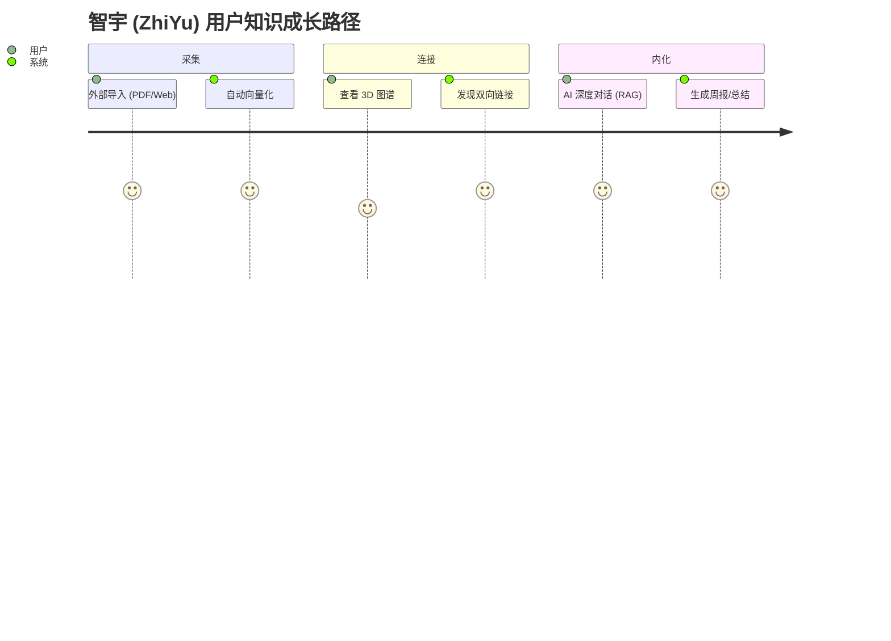

# 智宇 (ZhiYu) 产品需求文档 (PRD)

## 1. 产品愿景
打造一个"懂你"的跨端知识操作系统，通过 AI 深度感知与插件化生态，解决知识"存而不用"的痛点。以 **语义分块 → 混合 FTS5+向量存储 → AI 合成实验室（深度引用）** 为核心技术飞轮，成为个人与团队的"第二大脑基础设施"。

## 2. 目标用户 (User Personas)

*   **🔬 科研/学生**：处理海量文献，追求深度链接与 RAG 检索，需要 PDF 解析与结构化摘要。
    *   核心痛点：文献管理混乱、跨平台碎片化、笔记与检索割裂。
    *   典型场景：导入 20 篇论文 → 生成综述摘要 → 通过 3D 图谱发现知识关联。

*   **👨‍💻 开发者/产品经理**：追求键盘优先体验 (Cmd+K)，需要高度可定制化（插件系统）。
    *   核心痛点：需要与 API / Jira / Notion 打通，工具链碎片化。
    *   典型场景：搜索内部文档 → AI 自动总结会议纪要 → 通过 Siri Shortcuts 快速记录灵感。

*   **📝 普通知识工作者（笔记用户）**：日常记录想法、读书笔记、项目管理，非技术背景。
    *   核心痛点：传统笔记 App（Apple Notes、Notion）缺乏 AI 主动发现能力；难以在大量历史笔记中找到有价值的关联。
    *   典型场景：随手记录 → AI 自动分类与关键词提取 → 在图谱中发现三个月前的相关想法并重新激活。

## 2.5 竞品对比矩阵 (Competitive Analysis Matrix)

| 对比维度 | 智宇 (ZhiYu) | Anything-to-NotebookLM | Google NotebookLM | LLM Wiki (开源) | Notion | Obsidian | Roam Research |
| :--- | :---: | :---: | :---: | :---: | :---: | :---: | :---: |
| **本地优先 / 离线** | ✅ 默认本地 SQLite | ❌ 云端中转 | ❌ 强制云端 | ✅ 本地优先 | ❌ 强制云端 | ✅ 本地 Markdown | ✅ 本地 |
| **语义 RAG 检索** | ✅ FTS5+向量混合 | ⚠️ 仅抓取中转，无检索 | ✅ Gemini大模型RAG | ✅ 基础 RAG | ❌ 仅关键词 | ⚠️ 需插件 | ❌ 无 |
| **3D 知识图谱** | ✅ 力导向 + LOD | ❌ 无 | ❌ 无 | ❌ 无 | ❌ 无 | ⚠️ 2D 图谱 | ⚠️ 2D 图谱 |
| **AI 深度引用合成** | ✅ 带溯源引用 | ✅ 支持合成多格式 | ✅ 强溯源+多格式合成 | ⚠️ 基础总结 | ⚠️ AI 无溯源 | ❌ 无 | ❌ 无 |
| **多平台原生体验** | ✅ iOS/macOS/watchOS | ❌ 仅 CLI / Agent 脚本 | ❌ 仅 Web 端 | ⚠️ 仅 Electron 壳 | ✅ Web + 移动端 | ⚠️ 桌面优先 | ❌ 仅 Web |
| **插件生态** | ✅ 沙盒插件系统 | ❌ 无 | ❌ 无 | ❌ 无 | ✅ 丰富集成 | ✅ 社区插件 | ❌ 无 |
| **Apple 平台深度集成** | ✅ Spotlight/Siri/Watch | ❌ 无 | ❌ 无 | ❌ 无 | ❌ 无 | ❌ 无 | ❌ 无 |
| **隐私与数据主权** | ✅ 端对端加密金库 | ❌ 数据交由 Google | ❌ 数据交由 Google | ✅ 完全本地自主 | ❌ 数据在云端服务器 | ✅ 完全自主 | ✅ 本地 |
| **价格** | 免费+订阅 (规划) | ✅ 开源免费 | ✅ 免费 (当前) | ✅ 开源免费 | 免费+$8/月 | 免费+商用许可 | $15/月 |

### 2.5.1 与核心竞品的差异化优势推演

#### 1. 与 Google NotebookLM 的竞争力对比
*   **优势（NotebookLM 的痛点）**：
    *   **绝对隐私与数据主权**：NotebookLM 强制用户将所有笔记与文献上传至 Google 服务器，存在极大的企业隐私与敏感泄密风险（其服务条款明示可用于产品与模型训练）。智宇提供 100% 离线本地加密金库，数据主权完全归属于用户。
    *   **3D 知识图谱与多维连接**：NotebookLM 采用扁平化的传统“笔记本/文档夹”管理方式，缺乏多篇论文、笔记之间的语义交叉拓扑图。智宇提供原生的 3D 力导向图谱，能智能发现隐藏的语义连接，避免信息孤岛。
    *   **Apple 全家桶系统级深挖**：NotebookLM 仅有 Web 网页版，移动端交互体验极差。智宇支持 Spotlight 搜索索引直达、Siri 原生 Shortcuts 灵感秒录、watchOS 离线录音转文字以及 App Intent 智能总线接入。
    *   **开放沙盒插件系统**：NotebookLM 是完全封闭的 SaaS 软件；智宇的沙盒插件生态允许极客自由接入预处理（清洗、标记）与后渲染流程，能无限扩展工作流。
*   **劣势与弥补策略**：
    *   *超长上下文与计算算力*：NotebookLM 依托云端 Google Gemini 1.5 Pro 的 100万+ 上下文处理能力以及自动生成双人播客 (Audio Overview) 的云算力，在超大篇幅 PDF 合成时极具杀伤力。
    *   *弥补策略*：智宇通过 FTS5 搜索与本地向量检索引导的高品质端侧 Rerank，在本地实现更小、更精准的 Top-K 召回，规避长上下文带来的注意力丢失（Lost in the Middle）；同时在云端通道支持用户接入高阶云端模型，提供同等的长文本读取体验。

#### 2. 与 nashsu/llm_wiki 的竞争力对比
*   **优势（llm_wiki 的局限）**：
    *   **多端原生体验与移动化**：llm_wiki 是基于 Python 与 Electron 构建的桌面工具壳，完全缺失了 iOS、iPadOS 和 watchOS 移动端等“第二大脑”随身拾取、碎片化收集的最核心使用场景。
    *   **金融级系统稳健性**：llm_wiki 属于极客研究工具，缺少本地 SQLite AES-GCM 金库加密、TouchID 生物识别、iCloud 多端同步冲突的 Lamport 逻辑时钟决议机制以及物理级的指纹防篡改（HMAC-SHA256）。
    *   **优雅的沙盒安全**：llm_wiki 的本地脚本可以随意读写用户文件，有沙盒逃逸隐患；智宇为 JSContext 插件注入了 CPU 熔断熔器与 API 审计拦截，兼顾了扩展性与运行安全性。
*   **劣势与弥补策略**：
    *   llm_wiki 开源免费，极客可直接魔改其 Python 后端代码。
    *   *弥补策略*：智宇提供高可定制性的 JS 沙盒插件生态，向第三方开发者暴露 `preProcess` 和 `postProcess` 拦截钩子，极低成本满足用户的自定义 RAG 管道探索。

#### 3. 与 joeseesun/qiaomu-anything-to-notebooklm 的对比分析
*   **优势（Anything-to-NotebookLM 的局限）**：
    *   **完整的本地化 RAG 闭环**：qiaomu 仅是一个“抓取与推送”工具，它自身不提供检索与知识库管理，所有数据最终流向云端 Google 服务器。智宇提供了从本地提取、向量化、双链图谱到端侧推理的完整本地化闭环。
    *   **面向普通用户的 Native 交互**：qiaomu 是一个面向开发者的 AI Agent (Claude Code) 插件或 Skill，使用门槛极高。智宇提供原生的 iOS/macOS 视图及便捷的系统级分享和 App Intents 调度，面向更广大的主流笔记用户。
*   **劣势与弥补策略**：
    *   qiaomu 具备极强的多源捕获与 6 级付费墙/反爬绕过抓取网络，且能借助云端大模型低成本合成播客、Slide、Quiz 等学习格式。
    *   *弥补策略*：智宇在底层借鉴并集成这一套级联防爬抓取逻辑；同时在 AI 实验室模块中引入端侧双人播客生成 (Audio Overview Native) 以及多模态卡片生成功能，在本地无感解决这些需求。

> **核心差异化定位**：智宇在“**本地优先保护 × Apple 原生系统深度整合 × AI 3D语义图谱三元**”上构筑最高维度的护城河，是同类产品中唯一将离线向量检索、3D 语义关联图谱与端侧 SLM 大模型推理融合为一体的“满血版”第二大脑。

## 2.6 商业模式与账户体系 (Business Model & Tiers)

为了平衡产品体验与商业可持续性，智宇采用“基础免费 + 增值订阅”的梯度策略：

### 1. 游客模式 (Visitor / Guest)
* **定位**：无负担试用，极速体验核心价值。
* **准入**：免注册，免登录，安装即用。
* **边界限制**：
  * **存储额度**：上限 100 页知识节点，仅支持 1 个本地金库。
  * **AI 能力**：仅限使用本地边缘模型（如 CoreML/Metal 驱动），不支持云端高阶 LLM 问答。
  * **生态限制**：无法同步 iCloud 数据，无法安装第三方插件。
  * **核心体验**：体验基础的 3D 知识图谱功能和混合本地检索。

### 2. 轻量版 (Lite Tier)
* **定位**：重度知识记录者，满足个人长期使用的基础知识库构建。
* **准入**：注册账号登录，永久免费使用。
* **边界限制**：
  * **存储额度**：上限 1000 页知识节点，支持创建 2 个独立金库（例如区分工作与生活）。
  * **数据同步**：开启 iCloud 基础多端跨设备同步（仅限文本和基础图片）。
  * **AI 能力**：每月赠送基础云端模型额度（如 100 次 RAG 深度查询，防止 API 被恶意滥用）。额度耗尽后降级为纯本地大模型检索，或允许用户自带 API Key (BYOK)。
  * **生态限制**：允许访问插件市场并安装免费的基础效率插件。

### 3. 专业版 (Pro Tier, ¥38/月 或 ¥368/年)
* **定位**：专业知识工作者、科研人员、资深极客的“满血”第二大脑。
* **准入**：付费订阅。
* **权益解锁**：
  * **存储与同步**：**无限制存储页数与金库数量**，支持大附件（视频、长篇 PDF）的 iCloud 同步与离线保存。
  * **AI 满血算力**：无限次接入顶配云端大模型，支持海量文献的长上下文深读（大批量 PDF 关联生成综述），支持高级 Agent 工作流调度。
  * **高级特性**：
    * 解锁图谱高级分析模式（按标签、时间轴进行 3D 演化播放）。
    * 完整支持高级排版导出格式（PPTX, Word, 高清图谱截图）。
    * 面向开发者的自动化支持（macOS Spotlight 深度融合，Siri 复杂捷径参数调用）。
  * **生态特权**：免广告，免费享有官方开发的所有“Pro 专属”高级生产力插件。

* **增值收入补充 (长期规划)**：插件市场 (PluginMarket) 开发者分润 (开发者 80% / 平台 20%)，以及面向企业的团队协作版 (Team版, ¥98/月/席)。

## 3. 核心功能规格 (MVP+)
### 3.1 AI 深度探索 (AI Deep Research)
*   **正常流程**：用户输入问题 -> 系统提取本地 Context -> 触发 RAG -> 渲染芯片化链接。
*   **异常处理**：若无本地匹配，系统应提示“知识盲区”，并建议联网搜索。

### 3.2 插件化拦截系统
*   **业务逻辑**：插件必须在数据入库 `SQLite` 前完成 `preProcess`，确保全文搜索 (FTS5) 索引的是处理后的干净数据。

## 4. 非功能性需求 (Non-Functional Requirements)
*   **性能**：本地搜索响应延迟 < 200ms；AI 混合检索首字弹出 < 1s。
*   **隐私**：默认“离线优先”，敏感内容向量化必须在 Apple Neural Engine 内部完成。

## 4. 用户路径地图 (User Journey Map)

通过典型的“碎片化采集到知识内化”路径，展示系统的核心价值点。

## 5. 异常流程定义 (Exception Flows)

| 异常场景 | 系统行为 | 用户反馈/引导 |
| :--- | :--- | :--- |
| **网络中断** | 自动切换为“纯本地检索”模式。 | 顶部状态栏显示“离线模式”，AI 按钮置灰。 |
| **向量化失败** | 将页面标记为“待索引”，并在后台空闲时重试。 | 详情页 Badge 显示“AI 准备中”，不影响正常编辑。 |
| **插件权限冲突** | 拦截非法请求，并对插件执行“熔断”降级。 | 弹出 Toast 提示“插件 X 已因越权操作被停用”。 |
| **存储空间不足** | 优先保证数据库记录，延迟或压缩缓存。 | 弹出系统警告，建议清理过期的导出快照。 |

---

## 6. 用户引导策略 (Onboarding)
*   **初次启动**：自动挂载“欢迎金库 (Welcome Vault)”，通过一篇交互式 Markdown 文档引导用户体验双向链接与 AI 总结。
*   **功能引导**：在用户首次进入“插件中心”或“3D 图谱”时，弹出轻量级的蒙层指引，降低认知门槛。

## 7. 安全与隐私增强 (Security & Privacy+)
*   **金库锁定 (Vault Locking)**：支持通过系统原生生物识别 (FaceID/TouchID/密码) 对单个金库进行物理加锁。
*   **隐私模式切换**：支持“隐藏敏感文件夹”，在预览模式下自动对标记为 #private 的内容执行高斯模糊处理。

## 8. 反馈与生态治理 (Governance)
*   **反馈闭环**：在设置页提供“一键导出匿名诊断包”，方便用户在遇到性能瓶颈或插件崩溃时，将上下文回传给核心开发组。

## 9. 验收标准 (Acceptance Criteria)
*   [x] 跨端适配：iPad 分屏模式下 UI 不错位，三栏/底栏自动切换。
*   [x] 插件隔离：非法插件崩溃不影响主程序运行。
*   [x] RAG 召回精度：混合检索 Top-5 准确率 > 90%。
*   [x] 冷启动性能：1,000 页规模下冷启动 < 1.2s。
*   [x] 数据完整性：模拟崩溃后重启，SQLite 数据无损，ACID 事务保证。
*   [x] 生物识别：FaceID/TouchID 金库锁定与解锁全链路正常。
*   [x] 多端同步：iCloud 三端 (iPhone/iPad/Mac) 数据一致，冲突自动收敛。
*   [x] 导入稳定性：50MB+ PDF 导入不崩溃，后台队列正常推进。
*   [x] 图谱流畅度：5,000 节点下缩放/拖拽保持 55+ FPS。
*   [x] 本地化完整性：中英文界面所有文案通过 `Localized.tr()` 动态加载，无硬编码字符串。
*   [x] 代码质量：SwiftLint 0 serious 违规，全流水线审计绿灯（密钥/SPM/本地化/构建）。
*   [x] 依赖注入：View 层无直接 ServiceContainer.resolve，统一使用 @Inject。
*   [x] 平台宏收敛：DI 注册通过 PlatformRegistrar 协议委托，非 Platform 文件 #if os 减少至编译时 API 约束。
*   [x] 服务器配置：用户自定义 LLM 端点持久化到 UserDefaults，支持连接测试。

## 10. 工程与体验增强 (v2.0 — 2026-06-07)

### 10.1 代码质量治理
- **SwiftLint 严重违规清零**：426 → 0 serious，Force Try/Cast/Unwrap 全量修复
- **CI 流水线重构**：快速检查（SPM/Lint/密钥/本地化）前置，避免构建后才发现问题
- **魔鬼数字消除**：42 处硬编码 cornerRadius/padding 替换为 DesignSystem 语义常量
- **错误处理标准化**：AppError 统一工厂消除分散的 NSError 样板代码
- **平台宏收敛**：DI 注册从 15 个 #if os 块收敛为 PlatformRegistrar 协议委托

### 10.2 服务器配置持久化
- 用户添加的 LLM 服务器端点（本地 Ollama、自建网关等）通过 UserDefaults JSON 持久化
- 支持连接测试：真实 HTTP /health 端点检测，反馈健康状态与延迟
- 默认服务器标记、删除操作自动持久化

### 10.3 跨平台体验一致化
- View 层平台差异收敛至 `PlatformModifiers` 语义化抽象（`hiddenOnWatch()`, `segmentedPickerStyleIfAvailable()` 等）
- 三平台 (iOS/macOS/watchOS) DI 注册通过 `PlatformRegistrar` 协议委托

## 11. 产品遗留问题与体验演进 (Product Backlog & UX Refinements)

### 10.1 已知产品体验遗留问题
1. **BYOK（自带密钥）引导不够直观**：在 Lite 额度耗尽后，需设计渐进式指引面板，允许一键导入 API 密钥，并提供主流厂商的端点一键测试模板，平滑过渡至 Pro 体验。
2. **游客零摩擦升级提醒缺失**：游客节点数达到 90 临界值时需显示渐进式蒙层提醒，强调同步与 iCloud 安全以促成 Lite 版无感升级，目前无引导。
3. **冷启动引导过于单一**：目前的“欢迎金库 (Welcome Vault)”仅采用一篇 Markdown 文章展示，缺少对 3D 知识图谱核心亮点的呈现，造成首秀体验不够震撼。

### 10.2 后续产品与软件增强演进
为了对抗 Google NotebookLM 的云端垄断、llm_wiki 的多端短板及 qiaomu 工具的技术使用门槛，智宇将实装以下四个产品级增强：

1. **级联式防爬多源捕获引擎 (CaptureCascadeEngine)**：
   *   内置微信公众号、音视频长文本一键解析逻辑；
   *   对于防爬虫或付费墙限制严重的科研和新闻站点，集成六级级联抓取回退算法（直连 $\rightarrow$ 伪装 $\rightarrow$ 代理 $\rightarrow$ Reader API $\rightarrow$ Headless 渲染 $\rightarrow$ 本地 OCR 截屏解析）。
2. **端侧双人播客生成 (Audio Overview Native)**：
   *   引入本地 SLM 智能将召回段落提取改写为对话剧本；
   *   利用原生 AV 语音库或端侧轻量 TTS 模块实现 100% 离线的双声道人声播放合成，打通 watchOS 随时随地收听机制。
3. **外置 Agent 自动化开放总线 (Agentic Automation Bus)**：
   *   对外暴露快捷的 `App Intents` 与本地 Socket API，允许外置 AI 开发代理（如 Cursor/Claude Code 等）直接向智宇发送笔记或文档向量索引；
   *   支持第三方 CLI 工具直接通过总线检索智宇本地知识库，将其作为系统的“语义检索服务中枢”。
4. **弹性混合云端代理 RAG 模式**：
   *   默认在本地进行 100% 离线隐私过滤与向量检索；
   *   针对需要超大上下文的科研综述，在本地对实体词、人名等敏感段进行完全脱敏哈希转换后发送给云端中转服务器，接收回答后再在本地反向解密还原，兼顾云端大模型算力与本地隐私。

---
*本文档描述产品级需求，详细技术规格见 [SOFTWARE_REQUIREMENTS_SPECIFICATION.md](SOFTWARE_REQUIREMENTS_SPECIFICATION.md)，完整特性清单见 [FEATURE_LIST.md](FEATURE_LIST.md)，测试指引见 [TEST_GUIDE.md](../Testing/TEST_GUIDE.md)。*
