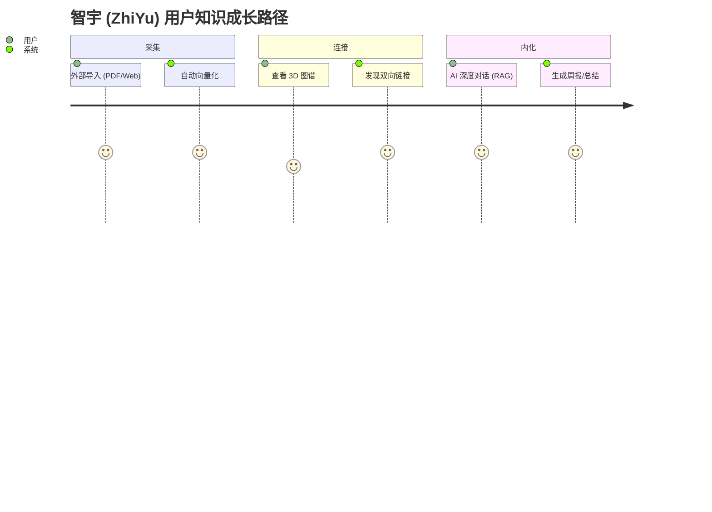

# 智宇 (KM) 产品需求文档 (PRD)

## 1. 产品愿景
打造一个"懂你"的跨端知识操作系统，通过 AI 深度感知与插件化生态，解决知识"存而不用"的痛点。以 **语义分块 → 混合 FTS5+向量存储 → AI 合成实验室（深度引用）** 为核心技术飞轮，成为个人与团队的"第二大脑基础设施"。

## 2. 目标用户 (User Personas)

*   **🔬 科研/学生**：处理海量文献，追求深度链接与 RAG 检索，需要 PDF 解析与结构化摘要。
    *   核心痛点：文献管理混乱、跨平台碎片化、笔记与检索割裂。
    *   典型场景：导入 20 篇论文 → 生成综述摘要 → 通过 3D 图谱发现知识关联。

*   **👨‍💻 开发者/产品经理**：追求键盘优先体验 (Cmd+K)，需要高度可定制化（插件系统）。
    *   核心痛点：需要与 API / Jira / Notion 打通，工具链碎片化。
    *   典型场景：搜索内部文档 → AI 自动总结会议纪要 → 通过 Siri Shortcuts 快速记录灵感。

*   **📝 普通知识工作者（笔记用户）**：日常记录想法、读书笔记、项目管理，非技术背景。
    *   核心痛点：传统笔记 App（Apple Notes、Notion）缺乏 AI 主动发现能力；难以在大量历史笔记中找到有价值的关联。
    *   典型场景：随手记录 → AI 自动分类与关键词提取 → 在图谱中发现三个月前的相关想法并重新激活。

## 2.5 竞品对比矩阵 (Competitive Analysis Matrix)

| 对比维度 | 智宇 (ZhiYu) | Notion | Obsidian | Roam Research | Mem |
| :--- | :---: | :---: | :---: | :---: | :---: |
| **本地优先 / 离线** | ✅ 默认本地 SQLite | ❌ 强制云端 | ✅ 本地 Markdown | ✅ 本地 | ❌ 强制云端 |
| **语义 RAG 检索** | ✅ FTS5+向量混合 | ❌ 仅关键词 | ⚠️ 需插件 | ❌ 无 | ✅ 基础 AI 搜索 |
| **3D 知识图谱** | ✅ 力导向 + LOD | ❌ 无 | ⚠️ 2D 图谱 | ⚠️ 2D 图谱 | ❌ 无 |
| **AI 深度引用合成** | ✅ 带溯源引用 | ⚠️ AI 生成无溯源 | ❌ 无 | ❌ 无 | ⚠️ 基础摘要 |
| **多平台原生体验** | ✅ iOS/macOS/watchOS | ✅ Web + 移动端 | ⚠️ 桌面优先 | ❌ 仅 Web | ✅ iOS/macOS |
| **插件生态** | ✅ 沙盒插件系统 | ✅ 丰富集成 | ✅ 社区插件 | ❌ 无 | ❌ 无 |
| **Apple 平台深度集成** | ✅ Spotlight/Siri/Watch | ❌ | ❌ | ❌ | ⚠️ 基础 |
| **隐私与数据主权** | ✅ 端对端加密金库 | ❌ 数据在 Notion 服务器 | ✅ 完全自主 | ✅ 本地 | ❌ 数据在云端 |
| **价格** | 免费+订阅 (规划) | 免费+$8/月 | 免费+商用许可 | $15/月 | 免费+$8/月 |

> **核心差异化定位**：智宇在"本地优先 × Apple 原生体验 × AI 语义图谱三元"上构建独有护城河，是同类产品中唯一将离线向量检索、3D 知识图谱与端侧模型推理融合为一体的方案。

## 2.6 商业模式与账户体系 (Business Model & Tiers)

为了平衡产品体验与商业可持续性，智宇采用“基础免费 + 增值订阅”的梯度策略：

### 1. 游客模式 (Visitor / Guest)
* **定位**：无负担试用，极速体验核心价值。
* **准入**：免注册，免登录，安装即用。
* **边界限制**：
  * **存储额度**：上限 100 页知识节点，仅支持 1 个本地金库。
  * **AI 能力**：仅限使用本地边缘模型（如 CoreML/Metal 驱动），不支持云端高阶 LLM 问答。
  * **生态限制**：无法同步 iCloud 数据，无法安装第三方插件。
  * **核心体验**：体验基础的 3D 知识图谱功能和混合本地检索。

### 2. 轻量版 (Lite Tier)
* **定位**：重度知识记录者，满足个人长期使用的基础知识库构建。
* **准入**：注册账号登录，永久免费使用。
* **边界限制**：
  * **存储额度**：上限 1000 页知识节点，支持创建 2 个独立金库（例如区分工作与生活）。
  * **数据同步**：开启 iCloud 基础多端跨设备同步（仅限文本和基础图片）。
  * **AI 能力**：每月赠送基础云端模型额度（如 100 次 RAG 深度查询，防止 API 被恶意滥用）。额度耗尽后降级为纯本地大模型检索，或允许用户自带 API Key (BYOK)。
  * **生态限制**：允许访问插件市场并安装免费的基础效率插件。

### 3. 专业版 (Pro Tier, ¥38/月 或 ¥368/年)
* **定位**：专业知识工作者、科研人员、资深极客的“满血”第二大脑。
* **准入**：付费订阅。
* **权益解锁**：
  * **存储与同步**：**无限制存储页数与金库数量**，支持大附件（视频、长篇 PDF）的 iCloud 同步与离线保存。
  * **AI 满血算力**：无限次接入顶配云端大模型，支持海量文献的长上下文深读（大批量 PDF 关联生成综述），支持高级 Agent 工作流调度。
  * **高级特性**：
    * 解锁图谱高级分析模式（按标签、时间轴进行 3D 演化播放）。
    * 完整支持高级排版导出格式（PPTX, Word, 高清图谱截图）。
    * 面向开发者的自动化支持（macOS Spotlight 深度融合，Siri 复杂捷径参数调用）。
  * **生态特权**：免广告，免费享有官方开发的所有“Pro 专属”高级生产力插件。

* **增值收入补充 (长期规划)**：插件市场 (PluginMarket) 开发者分润 (开发者 80% / 平台 20%)，以及面向企业的团队协作版 (Team版, ¥98/月/席)。

## 3. 核心功能规格 (MVP+)
### 3.1 AI 深度探索 (AI Deep Research)
*   **正常流程**：用户输入问题 -> 系统提取本地 Context -> 触发 RAG -> 渲染芯片化链接。
*   **异常处理**：若无本地匹配，系统应提示“知识盲区”，并建议联网搜索。

### 3.2 插件化拦截系统
*   **业务逻辑**：插件必须在数据入库 `SQLite` 前完成 `preProcess`，确保全文搜索 (FTS5) 索引的是处理后的干净数据。

## 4. 非功能性需求 (Non-Functional Requirements)
*   **性能**：本地搜索响应延迟 < 200ms；AI 混合检索首字弹出 < 1s。
*   **隐私**：默认“离线优先”，敏感内容向量化必须在 Apple Neural Engine 内部完成。

## 4. 用户路径地图 (User Journey Map)

通过典型的“碎片化采集到知识内化”路径，展示系统的核心价值点。

## 5. 异常流程定义 (Exception Flows)

| 异常场景 | 系统行为 | 用户反馈/引导 |
| :--- | :--- | :--- |
| **网络中断** | 自动切换为“纯本地检索”模式。 | 顶部状态栏显示“离线模式”，AI 按钮置灰。 |
| **向量化失败** | 将页面标记为“待索引”，并在后台空闲时重试。 | 详情页 Badge 显示“AI 准备中”，不影响正常编辑。 |
| **插件权限冲突** | 拦截非法请求，并对插件执行“熔断”降级。 | 弹出 Toast 提示“插件 X 已因越权操作被停用”。 |
| **存储空间不足** | 优先保证数据库记录，延迟或压缩缓存。 | 弹出系统警告，建议清理过期的导出快照。 |

---

## 6. 用户引导策略 (Onboarding)
*   **初次启动**：自动挂载“欢迎金库 (Welcome Vault)”，通过一篇交互式 Markdown 文档引导用户体验双向链接与 AI 总结。
*   **功能引导**：在用户首次进入“插件中心”或“3D 图谱”时，弹出轻量级的蒙层指引，降低认知门槛。

## 7. 安全与隐私增强 (Security & Privacy+)
*   **金库锁定 (Vault Locking)**：支持通过系统原生生物识别 (FaceID/TouchID/密码) 对单个金库进行物理加锁。
*   **隐私模式切换**：支持“隐藏敏感文件夹”，在预览模式下自动对标记为 #private 的内容执行高斯模糊处理。

## 8. 反馈与生态治理 (Governance)
*   **反馈闭环**：在设置页提供“一键导出匿名诊断包”，方便用户在遇到性能瓶颈或插件崩溃时，将上下文回传给核心开发组。

## 9. 验收标准 (Acceptance Criteria)
*   [x] 跨端适配：iPad 分屏模式下 UI 不错位，三栏/底栏自动切换。
*   [x] 插件隔离：非法插件崩溃不影响主程序运行。
*   [x] RAG 召回精度：混合检索 Top-5 准确率 > 90%。
*   [x] 冷启动性能：1,000 页规模下冷启动 < 1.2s。
*   [x] 数据完整性：模拟崩溃后重启，SQLite 数据无损，ACID 事务保证。
*   [x] 生物识别：FaceID/TouchID 金库锁定与解锁全链路正常。
*   [x] 多端同步：iCloud 三端 (iPhone/iPad/Mac) 数据一致，冲突自动收敛。
*   [x] 导入稳定性：50MB+ PDF 导入不崩溃，后台队列正常推进。
*   [x] 图谱流畅度：5,000 节点下缩放/拖拽保持 55+ FPS。
*   [x] 本地化完整性：中英文界面所有文案通过 `Localized.tr()` 动态加载，无硬编码字符串。

---
*本文档描述产品级需求，详细技术规格见 [SOFTWARE_REQUIREMENTS_SPECIFICATION.md](SOFTWARE_REQUIREMENTS_SPECIFICATION.md)，完整特性清单见 [FEATURE_LIST.md](FEATURE_LIST.md)，测试指引见 [TEST_GUIDE.md](TEST_GUIDE.md)。*
