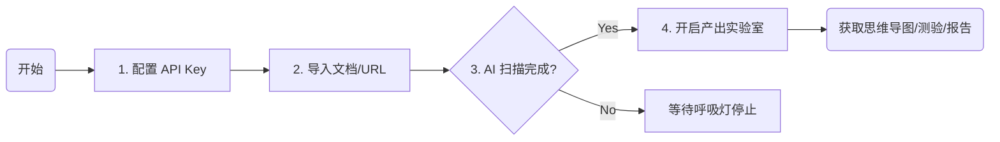
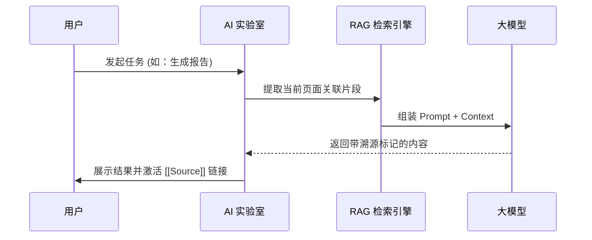
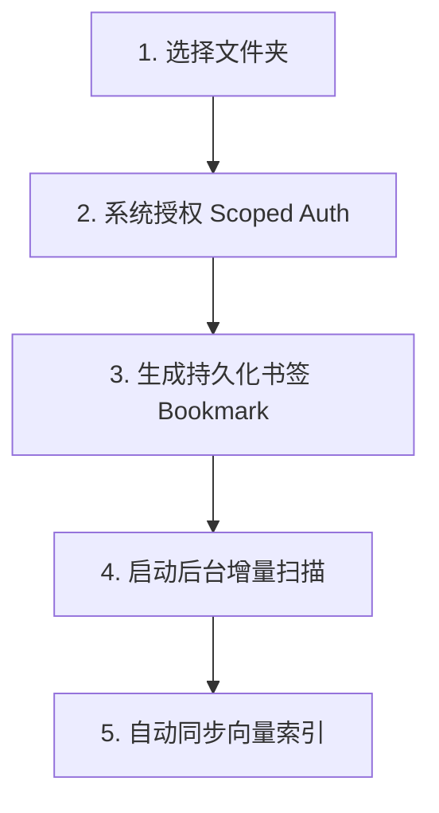

# Knowledge Management 用户操作指南 (Official User Guide)

欢迎使用 Knowledge Management！本指南将带您从零开始，逐步掌握这款 AI 原生知识管理引擎的核心超能力。

---

## 🗺️ 核心操作概览 (Workflow Overview)

---

## 🛠️ 1. 快速开始：配置您的第一个 AI 大脑

### 1.1 接入 AI 引擎
1. 打开 **设置 (Settings) -> 大模型配置 (AI Configuration)**。
2. 输入您的 API Key（支持 DeepSeek, OpenAI, Claude）。
3. 点击“测试连接”，确保网络与 Key 有效。
4. **建议**：开启“深度扫描模式 (Deep Scan)”，这会让系统在导入文档时自动进行语义切片。

### 1.2 导入第一份知识
- **剪贴板**：直接粘贴 URL，系统会自动抓取网页内容并剔除广告。
- **物理文档**：将 PDF 或 Word 拖入应用窗口，系统将自动启动“语义分块”流程。

---

## 🧠 2. 核心玩法：玩转产出实验室 (Synthesis Lab)

在任何页面详情页，点击右上角的 **✨ (AI 实验室)** 图标，即可开启知识转化之旅：

### 2.1 知识产出工作流 (Interaction Flow)

### 2.2 知识测验 (Quiz)
- **场景**：读完一篇长文，想测试自己是否真正掌握。
- **操作**：选择“生成测验”，AI 会基于内容出 3-5 道单选题。
- **交互**：实时选择答案，查看 AI 提供的深度解析。

### 2.2 深度总结与溯源
- **操作**：选择“生成总结报告”。
- **杀手锏：语义溯源**：在总结文本中看到 `[[Source]]` 时，点击它！编辑器会自动滚动到原文对应位置并高亮，杜绝 AI 幻觉。

### 2.3 思维导图 (Mindmap)
- **操作**：选择“生成思维导图”。
- **功能**：自动构建 Mermaid 逻辑图谱，可视化复杂的技术架构或逻辑关系。

---

## 📂 3. 进阶：外部库挂载 (External Vaults)

Knowledge Management 可以作为您现有知识体系（如 Obsidian, Logseq）的“AI 加速层”：

1. 点击侧边栏底部的 **“挂载外部库”**。
2. 选择您的本地文件夹（例如您的 Obsidian Vault）。

3. **重要 (iOS 用户)**：请在系统弹窗中点击“授权访问”，以便 Knowledge Management 能够持久化读取。
4. **同步**：Knowledge Management 会实时扫描该目录下的文件变更并同步至向量索引。

---

## ⚙️ 4. 专家模式：指令工坊 (Prompt Workshop)

如果您对 AI 的语气或逻辑不满意，可以自行定义：

1. 进入 **设置 -> 指令工坊**。
2. 您可以修改 **思维导图、测验、报告、演示文稿** 的系统指令。
3. **技巧**：在指令中加入“请使用苏格拉底式提问”或“请以专业架构师的口吻”，AI 的产出将瞬间变样。

---

## ❓ 常见问题 (FAQ)

**Q: 为什么有些 PDF 无法检索到内容？**
A: 请确保在“设置”中开启了“深度扫描”。此外，扫描件 PDF 需要经过 OCR 处理后才能被 Knowledge Management 的分块引擎识别。

**Q: 如何在 iPhone 上查看任务进度？**
A: 详情页顶部有一个呼吸脉搏灯。如果它在闪烁，说明后台正在进行 AI 运算。您可以随时切换页面，任务不会中断。

**Q: 搜索结果不够精准怎么办？**
A: 尝试使用“高级搜索 (Advanced Search)”。它会启动 AI 查询改写，能理解您的模糊意图而非仅仅匹配关键词。

---

## ⌚ 5. 腕上记录：Apple Watch 联动 (KMWatch)

智宇现已支持 Apple Watch，让您在移动场景下也能快速捕捉灵感。

### 5.1 快速采集 (Voice Capture)
1. 在 Apple Watch 上打开 **智宇 (KMWatch)**。
2. 点击 **“语音采集”** 按钮并开始说话。
3. 采集完成后，您的手腕会感受到一次 **触觉反馈 (Haptic)**，表示内容已成功保存。

### 5.2 表盘秒开 (Complications)
*   您可以将“智宇”添加到您的常用表盘中。
*   点击表盘上的智宇图标，即可 **秒级唤起** 语音采集界面，无需在应用列表中寻找。

### 5.3 自动同步
*   手表记录的所有灵感都会通过 **WCSession** 实时推送到您的 iPhone。
*   iPhone 接收后会自动触发 AI 向量化，确保您的知识库跨端保持最新状态。
