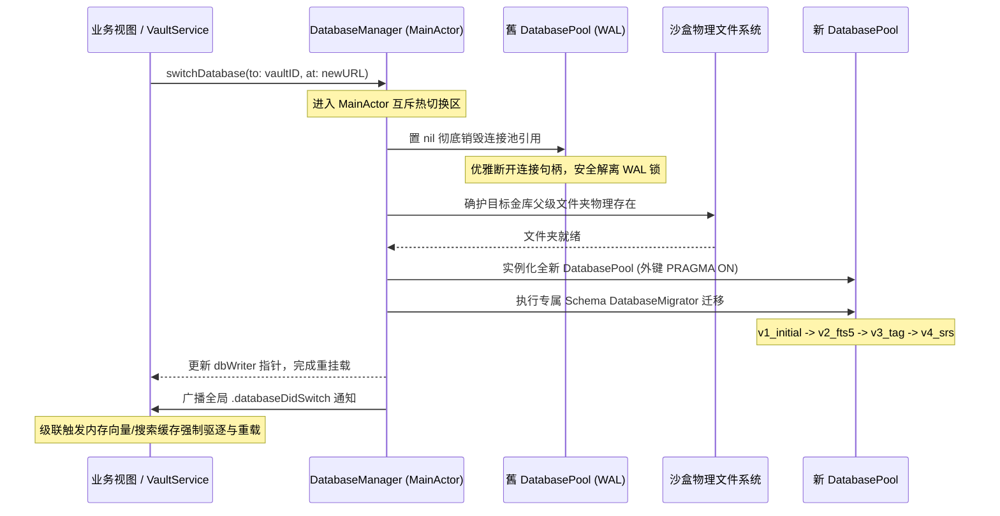

# ZhiYu (智宇) - 多笔记本物理隔离 WAL 热切换与高性能本地化架构设计规范

本规范详细阐述了 智宇 (ZhiYu) 知识管理应用在基础设施层（L1）中，针对**专属多笔记本（Multi-Vault）WAL 级运行时物理热切换机制**，以及**多多国语言 Catalog 内存常驻 Bundle 与优雅降级路由（Fallback）机制**的工业级设计实现。

---

## 1. 多租户 (Multi-Vault) 物理库隔离与 WAL 级运行时热切换机制

### 1.1 物理隔离设计背景
为了确保用户不同笔记本（金库/Vault）之间的数据彻底解耦与隐私隔离，智宇摒弃了在单 SQLite 物理库中使用 `vault_id` 过滤的软隔离设计，采用**彻底的物理沙盒分库隔离方案**：
- **全局偏好共享库（Global DB）**：存放 `global.sqlite3`，负责托管全库 HMAC 防篡改完整性指纹、系统偏好设置、多笔记本 Vault 名册列表以及合规审计日志。
- **专属笔记本库（Workspace DB）**：存放 `vault.sqlite3`，位于独立的 UUID 沙盒文件夹内。仅记录该特定笔记本内的页面、双向链接、分块（Chunks）、向量嵌入、SRS 重复复习元数据。

### 1.2 运行时 WAL 级热切换算法（Multi-Vault Switching）
在运行时，用户切换笔记本时必须能够实时连断旧库并挂载新库，此机制必须满足 **ACID 事务安全性** 并**防范 SQLite WAL 独占锁死锁对撞**。

其核心调用流程及状态机如下图所示：



#### 关键步骤详解：
1. **WAL 优雅解离锁**：
   在物理热插拔目标库前，必须强制将 `self.dbWriter = nil`。由于 GRDB.swift 的 `DatabasePool` 基于 Swift 引用计数管理，当连接池置为 `nil` 后，所有读写进程连接句柄被安全关闭，SQLite 自动释放 WAL 独占锁文件，为新库安全挂载铺平物理道路。
2. **PRAGMA 级联保护**：
   重开新物理库时，自动注入外键约束强制校验：
   ```swift
   config.prepareDatabase { db in
       try db.execute(sql: "PRAGMA foreign_keys = ON")
   }
   ```
3. **全局事务迁移级联（Migrator Schema Upgrade）**：
   热切换完成后，新库连接自动跑一遍 `DatabaseMigrator`，平滑进行高维向量映射、SRS复习、FTS5搜索引擎触发器配置更新，确保旧版本笔记本在热挂载后 100% 兼容最新物理表设计。

---

## 2. 去中心化多 Catalog 高性能本地化与 Fallback 降级架构

### 2.1 性能隐患与去中心化设计
智宇在本地化（Localization）改造中，将原有的硬编码文本全量去中心化至 9 个独立的 String Catalog 表（`Common`、`Knowledge`、`AI`、`Insight`、`System`、`Ingest`、`Plugin`、`Platform` 等）。

#### 历史性能隐患：
在旧的设计中，每次调用 `tr(key, table)` 获取本地化翻译时，系统都会调用 `Bundle.main.path(forResource:currentLanguage, ofType: "lproj")` 去物理磁盘扫描路径，然后通过 `Bundle(path: path)` 实例化新的临时 `Bundle` 实例。
- **危害**：在高频页面滚动、长列表刷新或图谱节点多语言批量计算中，该操作导致了**成百上千次的昂贵磁盘 I/O 扫描与瞬态内存介质对象分配**，直接诱发 UI 帧率抖动。

### 2.2 高性能 Bundle 内存常驻机制
重构版引入了常驻内存的 Bundle 缓存器（Thread-Safe MainActor），实现了 **"一次装载，内存持久击中"** 的极致性能：

```swift
internal struct Localized {
    private static var cachedBundle: Bundle?
    private static var cachedLanguage: String?

    private static func getOrLoadBundle() -> Bundle {
        let currentLang = currentLanguage
        // 击中缓存：如果已经装载过相同语言的 Bundle，直接闪回内存对象
        if let cached = cachedBundle, cachedLanguage == currentLang {
            return cached
        }
        // 未击中缓存：执行物理路径扫描与磁盘初始化
        let bundle = Bundle(path: Bundle.main.path(forResource: currentLang, ofType: "lproj") ?? "") ?? .main
        cachedBundle = bundle
        cachedLanguage = currentLang
        return bundle
    }
}
```

### 2.3 动态路由与优雅 Fallback 降级检索算法
为了规避由于模块去中心化导致某些 Key 未及时录入对应的垂直业务表而造成界面 Missing 的严重缺陷，设计了基于 **Domain Map 动态路由表** 及 **Common 兜底 Fallback 表** 的双轨道容灾重定向翻译查找机制：

```mermaid
graph TD
    A[调用 L10n.tr key, table] --> B(resolveTableName key, table)
    B --> C{domainMap 中是否存在映射?}
    C -- 是 --> D[将 resolvedTable 改为领域表]
    C -- 否 --> E[保持 resolvedTable = table]
    D --> F[从内存常驻缓存 getOrLoadBundle 检索 NSLocalizedString]
    E --> F
    F --> G{翻译结果 == MISSING_KEY_MARKER?}
    G -- 否 --> H[返回正确翻译内容]
    G -- 是 --> I{resolvedTable == 'Common'?}
    I -- 否 --> J[自动降级至 NSLocalizedString key, tableName: 'Common']
    I -- 是 --> K[返回 [MISSING: key] 标签并打印控制台警示]
    J --> L{Common 检索成功?}
    L -- 是 --> H
    L -- 否 --> K
```

#### 双轨 Fallback 策略亮点：
- **第一层：核心领域动态映射**：将所有零散模块的请求（如 `Creation`、`Editor` 等）自动按领域聚合路由至主力 Catalog（如 `Knowledge.xcstrings`），提高翻译击中率。
- **第二层：物理表级别降级**：若主力 Catalog 查找失败（如由于版本开发延迟未同步录入），自动向通用 Catalog（`Common.xcstrings`）请求兜底翻译。
- **第三层：防崩保障**：若均未检索成功，返回非硬编码的 `[MISSING: key@table]` 格式，并精确报告控制台，既保证应用平稳运行不崩溃，又方便开发者通过 Lint 脚本自动物理审计排查。

---

## 3. 治理规范与团队守则

1. **绝对禁止硬编码**：新功能开发若需要任何面向用户的字符串，必须在对应的 `.xcstrings` 中录入，并在 `Localized.swift` 的 `L10n` 命名空间下注册强类型访问路径。
2. **严格 MainActor 隔离**：由于 `DatabaseManager` 与 `VaultService` 涉及核心 UI 状态绑定及连接池操作，这二者必须使用 `@MainActor` 标注，确保 UI 线程安全。
3. **WAL 连接安全销毁**：任何需要对 Vault 物理文件进行转移、备份、删除前，必须首要求 `VaultService.shared.exitVault()` 物理切断 `dbWriter`，待连接池彻底置空后，再调用 `FileManager` 操作以防止句柄受损。
