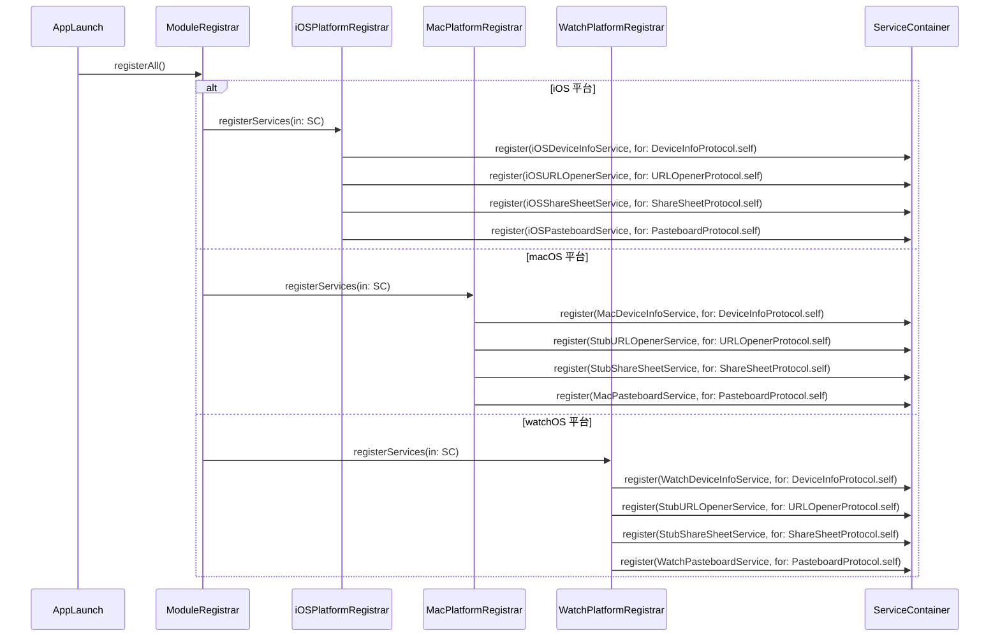
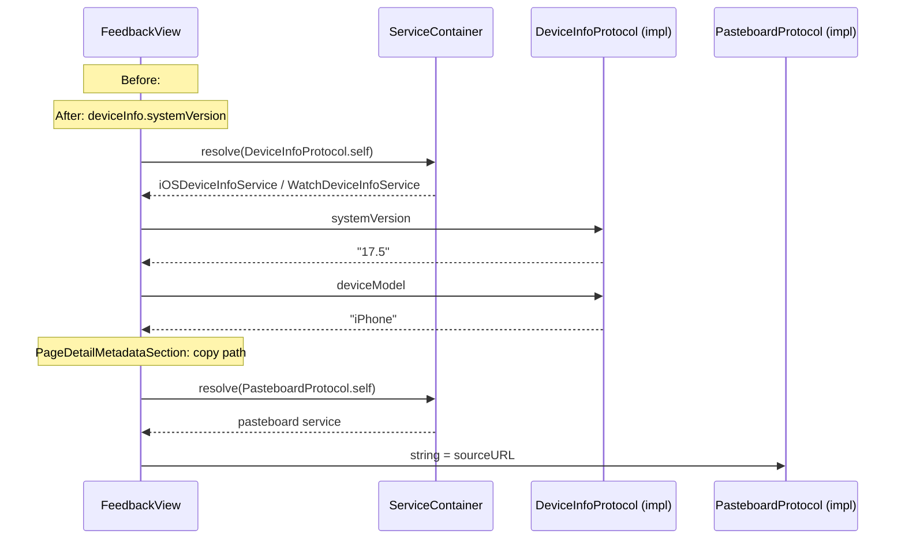
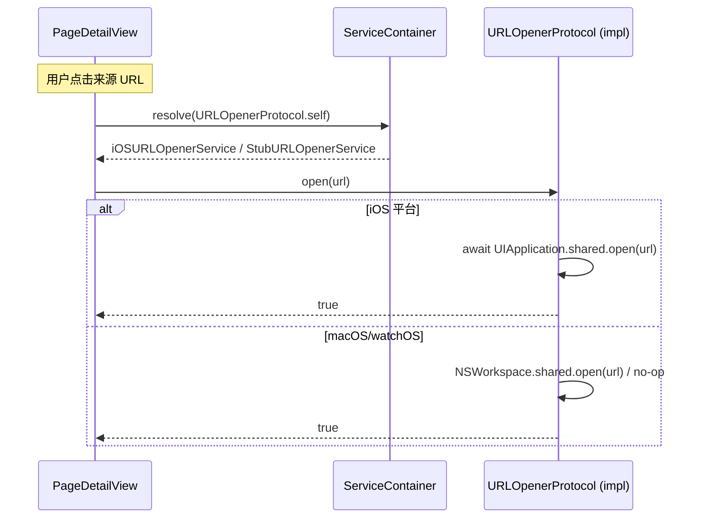
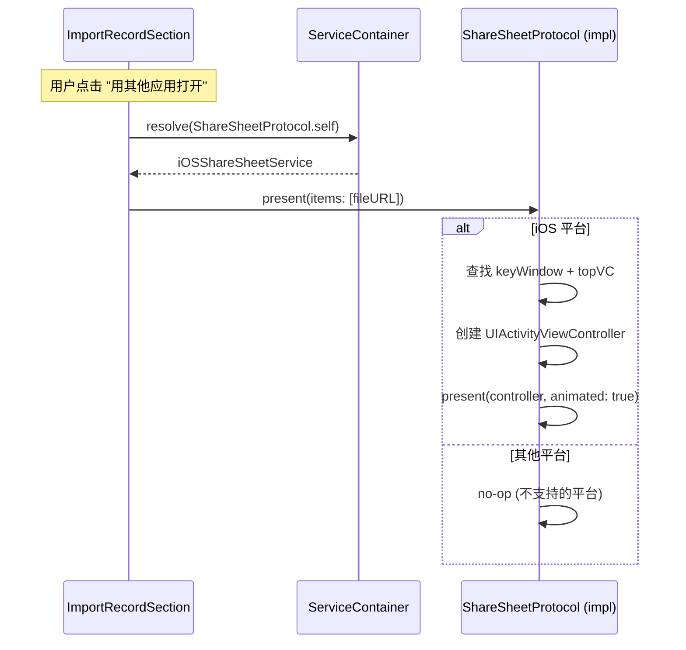
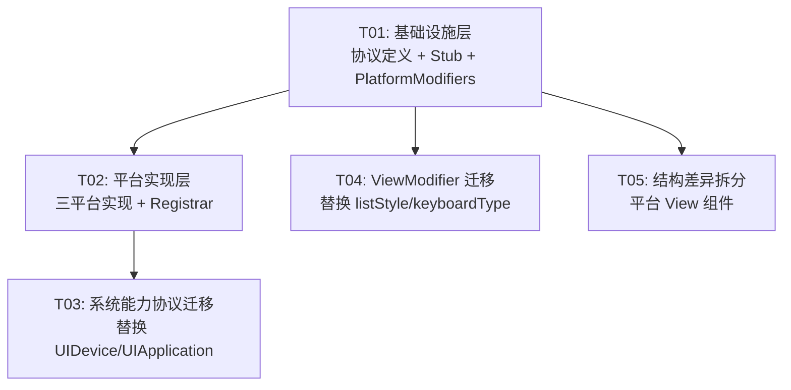

# ZhiYu Features 层 #if os() 协议化架构设计

> **Architect**: Bob | **Date**: 2026-06-22 | **Target**: Features 层 30 处 `#if os()` 消除

---

## Part A: 系统设计

### 1. 实现方案

#### 1.1 核心挑战

| 挑战 | 当前问题 | 方案 |
|------|---------|------|
| 系统 API 差异 | `UIDevice` / `NSScreen` / `UIApplication` 直接调用 | 协议抽象 + DI 注入 |
| ViewModifier 差异 | `.listStyle(.insetGrouped)` 等 8 处平台条件 | 已有 `PlatformModifiers.swift` 扩展 + 业务层迁移 |
| 结构性控件差异 | `Button` vs `Menu`, `TextField` vs `TextEditor` | 平台 View 拆分 + 共享 `AdaptiveTextEditor` 组件 |
| 编译期隔离 | `#if os()` 污染 Features 层 L3 代码 | 协议 + 平台独立 target |

#### 1.2 架构决策

**新增 3 个协议（L0 层）**：

| 协议 | 职责 | 替代的系统 API |
|------|------|---------------|
| `DeviceInfoProtocol` | 设备信息查询 | `UIDevice.current.systemVersion/model/name` + `NSScreen.main?.frame.height` + `UIScreen.main.bounds.height` |
| `URLOpenerProtocol` | 打开外部 URL | `UIApplication.shared.open(url)` |
| `ShareSheetProtocol` | 系统分享面板 | `UIActivityViewController` |

**复用已有协议**：
- `PasteboardProtocol`：已存在，用于 `UIPasteboard.general.string`（3 处）
- `AppEnvironmentProtocol`：已存在，`deviceName` 属性替代 `UIDevice.current.name`

**新增 1 个共享组件**：
- `AdaptiveTextEditor`：封装 watchOS `TextField` vs iOS/macOS `TextEditor`（解决 4 处 #if os）

**复用已有 PlatformModifiers**：
- `insetGroupedListStyleIfIOS()` — 替代 6 处 `.listStyle(.insetGrouped)` 
- `numberPadKeyboardIfAvailable()` — 替代 2 处 `.keyboardType(.numberPad)`
- `hideBackButtonIfIOS()` / `hideNavigationBarIfIOS()` — 替代 2 处 NavigationBar 控制

#### 1.3 框架选型

| 层次 | 选型 | 理由 |
|------|------|------|
| 协议定义 | Swift `protocol` + `Sendable` | 沿袭现有 `PasteboardProtocol` 模式 |
| DI 注入 | `ServiceContainer` + `@Inject` | 沿袭现有基础设施 |
| 平台注册 | `PlatformRegistrar` 模式 | 三平台各一实现类 |
| ViewModifier | SwiftUI `View` extension | 沿袭 `PlatformModifiers.swift` 模式 |

---

### 2. 文件清单

```
# ── 新增文件 ──

# 协议定义（L0）
Sources/Core/Base/Protocols/DeviceInfoProtocol.swift        # 设备信息协议
Sources/Core/Base/Protocols/URLOpenerProtocol.swift          # URL 打开协议
Sources/Core/Base/Protocols/ShareSheetProtocol.swift         # 系统分享协议

# 通用 Stub（L0）
Sources/Core/Base/Stubs/StubDeviceInfoService.swift          # 非 iOS 平台 Stub
Sources/Core/Base/Stubs/StubURLOpenerService.swift           # 非 iOS 平台 Stub
Sources/Core/Base/Stubs/StubShareSheetService.swift          # 非 iOS 平台 Stub

# iOS 实现
Sources/Platforms/iOS/Services/iOSDeviceInfoService.swift
Sources/Platforms/iOS/Services/iOSURLOpenerService.swift
Sources/Platforms/iOS/Services/iOSShareSheetService.swift

# macOS 实现
Sources/Platforms/macOS/MacDeviceInfoService.swift
Sources/Platforms/macOS/MacURLOpenerService.swift
Sources/Platforms/macOS/MacShareSheetService.swift

# watchOS 实现
Sources/Platforms/watchOS/Services/WatchDeviceInfoService.swift
Sources/Platforms/watchOS/Services/WatchURLOpenerService.swift
Sources/Platforms/watchOS/Services/WatchShareSheetService.swift

# 共享 UI 组件
Sources/Shared/UIComponents/Editors/AdaptiveTextEditor.swift # watchOS TextField ↔ TextEditor 适配

# 平台特有 View 组件
Sources/Platforms/iOS/Views/PageDetailAIButton.swift         # iOS Menu-based AI 操作按钮
Sources/Platforms/watchOS/Views/WatchPageDetailAIButton.swift # watchOS 简化 AI 按钮
Sources/Platforms/iOS/Views/PageDetailMetadataSection.swift  # iOS DisclosureGroup 元数据区
Sources/Platforms/watchOS/Views/WatchPageDetailMetadataSection.swift # watchOS VStack 元数据区

# ── 修改文件 ──

# PlatformModifiers 扩展
Sources/Shared/UIComponents/Modifiers/PlatformModifiers.swift # 新增 adaptiveListStyle/adaptiveToolbarBackground

# 三平台 Registrar
Sources/Platforms/iOS/Registrar/iOSPlatformRegistrar.swift
Sources/Platforms/macOS/MacPlatformRegistrar.swift
Sources/Platforms/watchOS/Registrar/WatchPlatformRegistrar.swift

# Features 层迁移（共 19 个文件）
Sources/Features/System/Settings/View/System/FeedbackView.swift
Sources/Features/System/Collaboration/View/CollaborationView.swift
Sources/Features/Insight/Dashboard/View/TagCloudView.swift
Sources/Features/Insight/Dashboard/View/PageDetailView.swift
Sources/Features/Insight/Dashboard/View/Subviews/PageDetailHeader.swift
Sources/Features/Insight/Dashboard/View/Subviews/PageDetailMetadataSection.swift
Sources/Features/Insight/Dashboard/View/BacklinksView.swift
Sources/Features/Insight/Lint/View/LintView.swift
Sources/Features/Insight/Log/View/LogView.swift
Sources/Features/System/Settings/View/System/iCloudSyncView.swift
Sources/Features/System/Settings/View/System/DeveloperSettingsView.swift
Sources/Features/Knowledge/Ingest/View/PDFReaderView.swift
Sources/Features/Knowledge/Ingest/View/Components/PDFComponents.swift
Sources/Features/Knowledge/Ingest/View/Components/OCRScanComponents.swift
Sources/Features/Knowledge/Ingest/View/Components/URLImportSheet.swift
Sources/Features/Knowledge/Ingest/View/Components/ImportRecordSection.swift
Sources/Features/Knowledge/Graph/View/Graph3DView.swift
Sources/Features/AI/VoiceNote/View/VoiceNoteView.swift
Sources/Features/System/Settings/View/Components/OnDeviceComponents.swift
```

---

### 3. 数据结构与接口

```mermaid
classDiagram
    %% ── L0 协议层 ──
    class DeviceInfoProtocol {
        <<protocol>> 
        +systemVersion: String
        +deviceModel: String
        +deviceName: String
        +screenHeight: CGFloat
        +isPad: Bool
        +isPhone: Bool
    }

    class URLOpenerProtocol {
        <<protocol>>
        +open(URL) async -> Bool
    }

    class ShareSheetProtocol {
        <<protocol>>
        +present(items: [Any], from: UIViewController?) async
    }

    class PasteboardProtocol {
        <<protocol>>
        +string: String?
    }

    class AppEnvironmentProtocol {
        <<protocol>>
        +deviceName: String
        +screenClass: ScreenClass
        +interactionStyle: InteractionStyle
    }

    %% ── L0 Stub 层 ──
    class StubDeviceInfoService {
        +systemVersion: String
        +deviceModel: String
        +deviceName: String
        +screenHeight: CGFloat
        +isPad: Bool
        +isPhone: Bool
    }

    class StubURLOpenerService {
        +open(URL) async -> Bool
    }

    class StubShareSheetService {
        +present(items: [Any], from: UIViewController?) async
    }

    %% ── 平台实现层 ──
    class iOSDeviceInfoService {
        +systemVersion: String
        +deviceModel: String
        +deviceName: String
        +screenHeight: CGFloat
        +isPad: Bool
        +isPhone: Bool
    }

    class MacDeviceInfoService {
        +systemVersion: String
        +deviceModel: String
        +deviceName: String
        +screenHeight: CGFloat
        +isPad: Bool
        +isPhone: Bool
    }

    class WatchDeviceInfoService {
        +systemVersion: String
        +deviceModel: String
        +deviceName: String
        +screenHeight: CGFloat
        +isPad: Bool
        +isPhone: Bool
    }

    class iOSURLOpenerService {
        +open(URL) async -> Bool
    }

    class MacURLOpenerService {
        +open(URL) async -> Bool
    }

    class WatchURLOpenerService {
        +open(URL) async -> Bool
    }

    class iOSShareSheetService {
        +present(items: [Any], from: UIViewController?) async
    }

    class MacShareSheetService {
        +present(items: [Any], from: UIViewController?) async
    }

    class WatchShareSheetService {
        +present(items: [Any], from: UIViewController?) async
    }

    %% ── DI 容器 ──
    class ServiceContainer {
        +register(T, for: T.Type)
        +resolve(T.Type) T
    }

    %% ── Registrar ──
    class iOSPlatformRegistrar {
        +registerServices(in: ServiceContainer)
    }
    class MacPlatformRegistrar {
        +registerServices(in: ServiceContainer)
    }
    class WatchPlatformRegistrar {
        +registerServices(in: ServiceContainer)
    }

    %% ── 关系 ──
    DeviceInfoProtocol <|.. iOSDeviceInfoService : implements
    DeviceInfoProtocol <|.. MacDeviceInfoService : implements
    DeviceInfoProtocol <|.. WatchDeviceInfoService : implements
    DeviceInfoProtocol <|.. StubDeviceInfoService : implements

    URLOpenerProtocol <|.. iOSURLOpenerService : implements
    URLOpenerProtocol <|.. MacURLOpenerService : implements
    URLOpenerProtocol <|.. WatchURLOpenerService : implements
    URLOpenerProtocol <|.. StubURLOpenerService : implements

    ShareSheetProtocol <|.. iOSShareSheetService : implements
    ShareSheetProtocol <|.. MacShareSheetService : implements
    ShareSheetProtocol <|.. WatchShareSheetService : implements
    ShareSheetProtocol <|.. StubShareSheetService : implements

    iOSPlatformRegistrar ..> ServiceContainer : registers into
    MacPlatformRegistrar ..> ServiceContainer : registers into
    WatchPlatformRegistrar ..> ServiceContainer : registers into
```



---

### 4. 程序调用流程

#### 4.1 服务注册时序（应用启动）



#### 4.2 Features 层消费协议（以 FeedbackView 为例）



#### 4.3 URLOpener 调用流



#### 4.4 ShareSheet 调用流



---

### 5. 待澄清项

| # | 问题 | 当前假设 | 影响 |
|---|------|---------|------|
| 1 | `URLOpenerProtocol` 在 macOS 是否实现 `NSWorkspace.shared.open`？ | 是，提供 Stub（当前 macOS 无调用点） | macOS 实现类复杂度 |
| 2 | `ShareSheetProtocol` 是否仅 iOS 需要真实实现？ | 是，macOS/watchOS 用 Stub | 减少平台实现工作量 |
| 3 | `deviceName` 已有 `AppEnvironmentProtocol.deviceName`，是否复用？ | 是，不重复定义 | CollaborationView 改用 `AppEnvironmentProtocol` |
| 4 | `OCRScanComponents` 的 `#if canImport(UIKit)` vs `#if canImport(AppKit)` 分支也一起消除？ | 是，用 `AppImage` 类型别名已经存在 | 统一到平台 View 文件 |
| 5 | `QuizPresentationModifier.swift` 的 `#if os(iOS) && !targetEnvironment(macCatalyst)` 是否也迁移？ | 是，纳入 Category C | 加到 T04 任务 |

---

## Part B: 任务分解

### 6. 依赖包

```
无新增第三方依赖。所有方案基于 Swift 标准库 + SwiftUI 原生 API。
```

---

### 7. 任务列表

#### T01: 基础设施层 — 新协议定义 + 通用 Stub + PlatformModifiers 扩展

| 属性 | 内容 |
|------|------|
| **Task ID** | T01 |
| **Priority** | P0 |
| **Dependencies** | 无 |

**创建文件**：
- `Sources/Core/Base/Protocols/DeviceInfoProtocol.swift`
- `Sources/Core/Base/Protocols/URLOpenerProtocol.swift`
- `Sources/Core/Base/Protocols/ShareSheetProtocol.swift`
- `Sources/Core/Base/Stubs/StubDeviceInfoService.swift`
- `Sources/Core/Base/Stubs/StubURLOpenerService.swift`
- `Sources/Core/Base/Stubs/StubShareSheetService.swift`
- `Sources/Shared/UIComponents/Editors/AdaptiveTextEditor.swift`

**修改文件**：
- `Sources/Shared/UIComponents/Modifiers/PlatformModifiers.swift` — 新增 `adaptiveListStyle()`、`adaptiveToolbarBackground()`

**产出标准**：
- 3 个新协议均标注 `Sendable`
- Stub 提供合理的默认返回值（如 `deviceModel = "Unknown"`）
- `AdaptiveTextEditor` 封装 `TextField ↔ TextEditor` 差异
- `PlatformModifiers` 新增 2 个方法：
  - `adaptiveListStyle()`：iOS → `.listStyle(.insetGrouped)`，macOS → `.listStyle(.inset)`，其他 → `self`
  - `adaptiveToolbarBackground()`：iOS → `.toolbarBackground(.visible, for: .navigationBar)`，其他 → `self`

---

#### T02: 平台实现层 — 三平台实现类 + Registrar 注册

| 属性 | 内容 |
|------|------|
| **Task ID** | T02 |
| **Priority** | P0 |
| **Dependencies** | T01 |

**创建文件**：
- `Sources/Platforms/iOS/Services/iOSDeviceInfoService.swift`
- `Sources/Platforms/iOS/Services/iOSURLOpenerService.swift`
- `Sources/Platforms/iOS/Services/iOSShareSheetService.swift`
- `Sources/Platforms/macOS/MacDeviceInfoService.swift`
- `Sources/Platforms/macOS/MacURLOpenerService.swift`
- `Sources/Platforms/macOS/MacShareSheetService.swift`
- `Sources/Platforms/watchOS/Services/WatchDeviceInfoService.swift`
- `Sources/Platforms/watchOS/Services/WatchURLOpenerService.swift`
- `Sources/Platforms/watchOS/Services/WatchShareSheetService.swift`

**修改文件**：
- `Sources/Platforms/iOS/Registrar/iOSPlatformRegistrar.swift` — 注册 3 个新服务
- `Sources/Platforms/macOS/MacPlatformRegistrar.swift` — 注册 DeviceInfo + Stub URLOpener + Stub ShareSheet
- `Sources/Platforms/watchOS/Registrar/WatchPlatformRegistrar.swift` — 注册 DeviceInfo + Stub URLOpener + Stub ShareSheet

**产出标准**：
- `iOSDeviceInfoService`：实现 `UIDevice.current` 包装
  - `systemVersion` → `UIDevice.current.systemVersion`
  - `deviceModel` → `UIDevice.current.model`
  - `deviceName` → `UIDevice.current.name`
  - `screenHeight` → `UIScreen.main.bounds.height`
  - `isPad` → `UIDevice.current.userInterfaceIdiom == .pad`
  - `isPhone` → `UIDevice.current.userInterfaceIdiom == .phone`
- `MacDeviceInfoService`：
  - `screenHeight` → `NSScreen.main?.frame.height ?? 800`
  - 其余属性通过 `ProcessInfo` / `IOKit` 或固定值
- `WatchDeviceInfoService`：
  - `screenHeight` → `WKInterfaceDevice.current().screenBounds.height`
  - `deviceName` → `WKInterfaceDevice.current().name`
- `iOSURLOpenerService.open(url)` → `await UIApplication.shared.open(url)`
- `iOSShareSheetService`：把现有 `ImportRecordSection` 中的 `UIActivityViewController` 逻辑移入
- macOS/watchOS URLOpener & ShareSheet：Stub 实现（当前无调用点）
- 所有实现类标注 `final`、遵循对应协议

---

#### T03: 系统能力协议迁移 — 替换 UIDevice/UIApplication/ShareSheet/Pasteboard 直接调用

| 属性 | 内容 |
|------|------|
| **Task ID** | T03 |
| **Priority** | P0 |
| **Dependencies** | T02 |

**修改文件**：
- `Sources/Features/System/Settings/View/System/FeedbackView.swift`
  - `UIDevice.current.systemVersion` → `@Inject var deviceInfo: any DeviceInfoProtocol` + `deviceInfo.systemVersion`
  - `UIDevice.current.model` → `deviceInfo.deviceModel`
  - 删除 `#if os(iOS) import UIKit`
- `Sources/Features/System/Collaboration/View/CollaborationView.swift`
  - `UIDevice.current.name` → `deviceInfo.deviceName`（或复用 `AppEnvironmentProtocol.deviceName`）
- `Sources/Features/Insight/Dashboard/View/TagCloudView.swift`
  - `NSScreen.main?.frame.height` / `UIScreen.main.bounds.height` → `deviceInfo.screenHeight`
  - 删除 `#if os(macOS)` 及 `#if os(macOS) import AppKit`
- `Sources/Features/Insight/Dashboard/View/PageDetailView.swift`
  - `UIApplication.shared.open(urlObject)` → `urlOpener.open(urlObject)`
- `Sources/Features/Insight/Dashboard/View/Subviews/PageDetailMetadataSection.swift`
  - `UIPasteboard.general.string = sourceURL` → `AppPasteboard.string = sourceURL`
- `Sources/Features/Knowledge/Ingest/View/Components/ImportRecordSection.swift`
  - `UIApplication.shared.open(url)` → `urlOpener.open(url)`
  - `UIActivityViewController(...)` → 迁移到 `iOSShareSheetService`，调用 `shareSheet.present(items: [fileURL])`
  - 删除 `#if os(iOS)` 包裹

---

#### T04: ViewModifier 迁移 — 替换 listStyle/keyboardType/toolbar/navigationBar 的 #if os()

| 属性 | 内容 |
|------|------|
| **Task ID** | T04 |
| **Priority** | P1 |
| **Dependencies** | T01（仅依赖 PlatformModifiers 扩展，可与 T02 并行） |

**修改文件**：
- `Sources/Features/Insight/Dashboard/View/BacklinksView.swift`
  - `#if os(iOS) .listStyle(.insetGrouped)` → `.adaptiveListStyle()`
- `Sources/Features/Insight/Lint/View/LintView.swift`
  - `#if os(iOS) .listStyle(.insetGrouped)` → `.adaptiveListStyle()`
- `Sources/Features/Insight/Log/View/LogView.swift`
  - `.listStyle(.insetGrouped)` → `.adaptiveListStyle()`
  - `.toolbarBackground(.visible, for: .navigationBar)` → `.adaptiveToolbarBackground()`
- `Sources/Features/System/Settings/View/System/iCloudSyncView.swift`
  - `.listStyle(.insetGrouped)` → `.adaptiveListStyle()`
- `Sources/Features/System/Settings/View/System/DeveloperSettingsView.swift`
  - `.listStyle(.insetGrouped)` → `.adaptiveListStyle()`
- `Sources/Features/Knowledge/Ingest/View/PDFReaderView.swift`
  - `.listStyle(.insetGrouped)` → `.adaptiveListStyle()`
- `Sources/Features/Knowledge/Ingest/View/Components/PDFComponents.swift`
  - 2 处 `.keyboardType(.numberPad)` → `.numberPadKeyboardIfAvailable()`
- `Sources/Features/Knowledge/Graph/View/Graph3DView.swift`
  - `.navigationBarBackButtonHidden` + `.toolbar(.hidden)` → `.hideBackButtonIfIOS()` + `.hideNavigationBarIfIOS()`
- `Sources/Features/AI/VoiceNote/View/VoiceNoteView.swift`
  - 2 处 `.toolbar(.hidden/.visible)` → `.hideNavigationBarIfIOS()`

**产出标准**：
- 全部 9 个文件移除 `#if os(iOS)` / `#if os(macOS)` 修饰符差异
- 统一调用 `PlatformModifiers.swift` 中已有或 T01 新增的方法
- 业务代码只看到 `.adaptiveListStyle()` 等语义化 API

---

#### T05: 结构差异拆分 — 平台特定 View 组件 + AdaptiveTextEditor 替换

| 属性 | 内容 |
|------|------|
| **Task ID** | T05 |
| **Priority** | P1 |
| **Dependencies** | T01 |

**创建文件**：
- `Sources/Platforms/iOS/Views/PageDetailAIButton.swift`
- `Sources/Platforms/watchOS/Views/WatchPageDetailAIButton.swift`
- `Sources/Platforms/iOS/Views/PageDetailMetadataSection.swift`
- `Sources/Platforms/watchOS/Views/WatchPageDetailMetadataSection.swift`

**修改文件**：
- `Sources/Features/Insight/Dashboard/View/PageDetailView.swift`
  - `aiMenuButton` 中的 `#if os(watchOS) Button / #else Menu` → 使用平台 View 组件
- `Sources/Features/Insight/Dashboard/View/Subviews/PageDetailHeader.swift`
  - `#if os(watchOS) VStack / #else DisclosureGroup` → 使用 `PageDetailMetadataSection` 平台组件
- `Sources/Features/Knowledge/Ingest/View/Components/OCRScanComponents.swift`
  - `OCRImagePickerArea` 中的图片渲染 `#if os(watchOS)/canImport(UIKit)/canImport(AppKit)` → 利用 `AppImage` 类型 + `AdaptiveTextEditor`
  - `OCRResultDisplay` 中的 `TextField ↔ TextEditor` → `AdaptiveTextEditor(text: $recognizedText)`
- `Sources/Features/Knowledge/Ingest/View/Components/URLImportSheet.swift`
  - `TextField ↔ TextEditor` → `AdaptiveTextEditor(text: $urlText)`
- `Sources/Features/System/Settings/View/Components/OnDeviceComponents.swift`
  - `TextField ↔ TextEditor` → `AdaptiveTextEditor(text: $prompt)`

**产出标准**：
- `PageDetailAIButton`：iOS 返回 `Menu { ... }`，watchOS 返回 `Button { ... }`
- `PageDetailMetadataSection`：iOS 返回 `DisclosureGroup`，watchOS 返回 `VStack`
- 4 处 `TextField ↔ TextEditor` 替换为 `AdaptiveTextEditor`
- Features 层所有 `#if os(watchOS)` 消除

---

### 8. 共享知识（跨切面约定）

```
- 所有新协议定义在 Core/Base/Protocols/，标注 @MainActor + Sendable
- 平台实现遵循 final class 命名：{Platform}{Protocol}Service (如 iOSDeviceInfoService)
- Stub 实现放在 Core/Base/Stubs/，提供非破坏性默认值
- 注册在 PlatformRegistrar.registerServices(in:) 中，保持与现有服务一致的注册顺序
- Features 层通过 @Inject 或 ServiceContainer.shared.resolve() 获取协议实例
- ViewModifier 方法命名遵循 adaptive* / *IfAvailable 模式
- 平台 View 组件命名遵循 {Platform}{ComponentName} 模式
- 所有现有 PasteboardProtocol 调用继续使用 AppPasteboard 包装器，无需修改调用方
- AppEnvironmentProtocol.deviceName 已存在，直接复用，不在 DeviceInfoProtocol 中重复定义
```

---

### 9. 任务依赖图



> **说明**：T04 仅依赖 T01（PlatformModifiers 扩展），可与 T02 并行。T05 依赖 T01（AdaptiveTextEditor 组件）。T03 依赖 T02（平台实现就绪后才能迁移业务层调用）。

---

## Part C: 协议体系优化建议

### 10. 死协议处理

| 协议 | 文件 | 建议 | 理由 |
|------|------|------|------|
| `AppStoreProtocol` | `Core/Base/Protocols/AppStoreProtocol.swift` | ⚠️ 暂保留，标记 `@available(*, deprecated)` | 作为 L3 Facade 抽象接口有价值，但当前未被 DI 使用。如果确认无用，下次清理窗口删除。 |
| `RouterProtocol` | `Core/Base/Protocols/RouterProtocol.swift` | 同 `AppStoreProtocol` | 同上 |

> **不在此次变更中删除**：死协议清理属于独立重构任务，避免范围蔓延。建议另开 P2 任务统一处理。

### 11. 空协议处理

| 协议 | 文件 | 建议 |
|------|------|------|
| `TextChunker {}` | `Core/Base/Protocols/TextChunker.swift` | **删除**。空协议体无任何契约价值。如未来需要文本分块抽象，届时重新定义。 |
| `TagStoreProtocol {}` | `Domain/Protocols/TagStoreProtocol.swift` | **删除** 或 **补全方法签名**。如果是占位符，建议至少定义 `var tags: [String] { get }` 和 `func addTag(_:)`。 |

### 12. 命名规范统一建议

| 当前 | 建议 | 影响文件 |
|------|------|---------|
| `AuthStrategy` (裸名) | `AuthStrategyProtocol` | `Domain/Protocols/AuthStrategy.swift` → 重命名 |
| `PlatformRegistrar` (裸名) | `PlatformRegistrarProtocol` | 但当前作为 DI 入口使用频率极高，重命名影响面大，建议**暂缓** |
| `BiometricAuthProviderProtocol` + `MLModelCompilerProtocol` + `SecurityScopedStorageProtocol` | 三者都在 `PlatformCapabilities.swift` 中，其中 `*Capabilities` 后缀与文件名不一致 | 建议拆分为独立文件，使用 `*Protocol` 后缀 |
| `CollaborationProviderDelegate` | 放在 `Core/Base/Protocols/`（L0），但实际是 L2 业务委托 | 移至 `Domain/Protocols/` 或 `Features/System/Collaboration/` |

> **本次不强制统一**：命名规范统一属于 P2 债务，建议创建单独的清理 Story。本次新增的 3 个协议（`DeviceInfoProtocol`、`URLOpenerProtocol`、`ShareSheetProtocol`）均遵循主流 `*Protocol` 后缀。

### 13. Sendable 补全清单

| 类型 | 文件 | 建议 |
|------|------|------|
| `PlatformRegistrar` | `Core/Base/Protocols/PlatformRegistrar.swift` | 已有 `@MainActor`，但协议本身不含 `Sendable`。建议标注 `: Sendable` |
| `RouterProtocol` | `Core/Base/Protocols/RouterProtocol.swift` | 同上，建议标注 `: Sendable` |
| `CollaborationProviderDelegate` | `Core/Base/Protocols/CollaborationProviderProtocol.swift` | 建议标注 `: Sendable` |
| `CollaborationProviderProtocol` | 同上 | 建议标注 `: Sendable` |
| `TextChunker` | `Core/Base/Protocols/TextChunker.swift` | 如保留，标注 `: Sendable` |
| `TagStoreProtocol` | `Domain/Protocols/TagStoreProtocol.swift` | 如保留，标注 `: Sendable` |

---

## Part D: 业界对比总结

### 14. 方案对比

| 维度 | 本项目方案 | Apple 原生模式 | TCA 模式 |
|------|-----------|--------------|---------|
| **抽象形式** | Protocol + DI | Protocol (如 `UIApplicationDelegate`) + `@Environment` | Struct + `@Dependency` key path |
| **Sendable** | Protocol 显式标注 `Sendable` | 不强制 | Struct 天然 Sendable |
| **平台差异** | `PlatformRegistrar` 三套实现 | `#available` 标注 + 条件编译 | `liveValue` / `testValue` |
| **测试性** | DI 注入 Mock/Stub | `EnvironmentValues` 覆盖 | 内置 `testValue` 支持 |
| **代码量** | 中（需定义协议 + 多套实现） | 低（直接使用系统 API） | 中（需定义 DependencyKey） |
| **编译隔离** | ✅ 独立文件 + target | ❌ `#if os()` 宏 | ✅ 独立文件 |
| **学习成本** | 低（团队已熟悉） | 极低 | 中（需引入 TCA 框架） |

### 15. 选择理由

1. **沿袭现有架构**：本方案 = `PasteboardProtocol` 模式的横向复制。团队已熟悉 `Protocol → Stub → PlatformImpl → Registrar` 全链路，零学习成本。

2. **增量最小化**：新增 3 个协议（仅 60 行模板代码）+ 1 个共享组件（15 行），远低于引入 TCA 框架的代价。

3. **编译期隔离**：平台实现放在独立文件并用 `#if os()` 守卫（仅一次），Features 层完全消除 `#if os()`，编译速度与代码可读性双赢。

4. **不引入框架依赖**：TCA 需要 import `Dependencies` 及 `ComposableArchitecture`，与项目现有架构风格（Observable + Store 模式）不兼容。

5. **与 Apple 原生模式互补**：协议 + DI 处理运行时能力差异，`ViewModifier` 集中化处理声明式 UI 差异，`#available` 标注处理 API 可用性差异——三者各司其职。

---

> **文档版本**: v1.0 | **最后更新**: 2026-06-22
