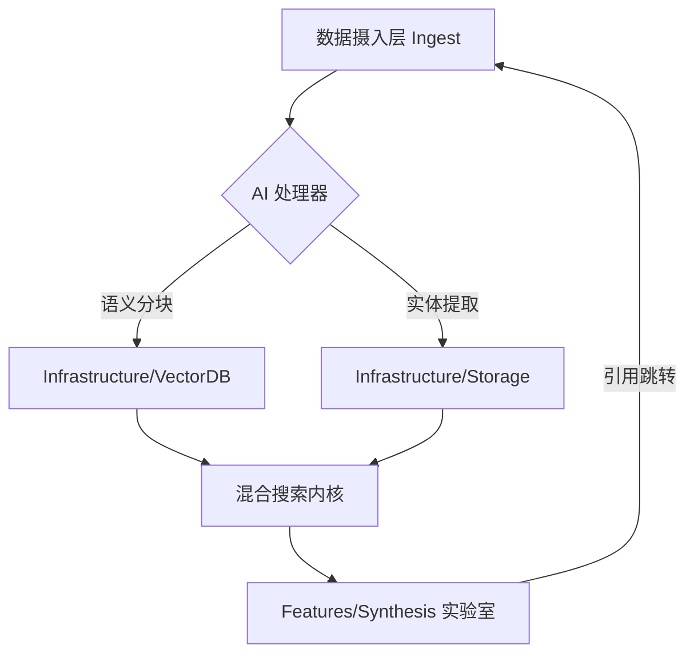

# 智宇 (ZhiYu)
> 基于 Karpathy LLM Wiki 方法论的 AI 原生知识管理进化引擎。

---

## 📚 深度文档 (Documentation)

### 产品与需求
- [产品需求文档](Docs/Requirements/PRODUCT_REQUIREMENTS.md)
- [软件需求规格说明书](Docs/Requirements/SOFTWARE_REQUIREMENTS_SPECIFICATION.md)
- [全量特性清单](Docs/Requirements/FEATURE_LIST.md)
- [插件市场 PRD](Docs/Requirements/PLUGIN_MARKET_PRD.md)
- [进化路线图](Docs/ROADMAP.md)
- [本地化规范](Docs/Requirements/LOCALIZATION.md)

### 架构与设计
- [架构 4+1 视图](Docs/Architecture/ARCHITECTURE_4PLUS1.md)
- [统一认证架构](Docs/Architecture/AUTH_ARCHITECTURE.md)
- [L0-L3 分层定义](Docs/Architecture/LAYERING_L0_L3.md)
- [详细设计文档](Docs/Design/DETAILED_DESIGN.md)
- [安全设计](Docs/Design/SECURITY_DESIGN.md)
- [插件市场 HLD](Docs/Design/PLUGIN_MARKET_HLD.md)
- [插件 SDK](Docs/Design/PLUGIN_SDK.md)
- [可视化设计系统](Docs/Design/VISUAL_SYSTEM.md)

### 测试与质量
- [系统测试计划](Docs/Testing/SYSTEM_TEST_PLAN.md)
- [功能测试指引](Docs/Testing/TEST_GUIDE.md)
- [性能基准报告](Docs/Testing/PERFORMANCE_BENCHMARK.md)
- [测试用例库](Docs/Testing/TEST_CASES.md)
- [CI/CD 工作流](Docs/CI_CD_WORKFLOW.md)

### 开发与社区
- [贡献指南](Docs/CONTRIBUTING.md)
- [用户操作指南](Docs/USER_GUIDE.md)
- [致谢](Docs/ACKNOWLEDGMENTS.md)

---

## 🏗️ 架构全景：知识编译生态 (Knowledge Compiler Ecosystem)

智宇 (ZhiYu) 不仅是 Markdown 编辑器，它是一个 **AI 原生 RAG 闭环系统**，采用 **L0-L3 垂直功能架构** 设计。

### 1. 核心架构图谱

### 2. 垂直化技术模型

#### 🟢 基础设施层 (Infrastructure)
- **语义分块 (TextChunkerProcessor)**：基于 `Infrastructure/Processors/Document/` 的递归拆分算法。
- **分块策略**：`Header (#) > Paragraph (\n\n) > Sentence (.)`，确保检索片段的上下文连续性。
- **混合存储**：结合 SQLite (FTS5) 与向量距离 (Vector Index) 的双引擎召回。

#### 🔵 业务功能层 (Features)
- **按域分组**：目前分为 `Knowledge` (核心知识流)、`AI` (AI 实验室)、`Insight` (洞察与质量) 和 `System` (通用系统) 四大领域。
- **对话中心 (Features/AI/Chat)**：垂直集成的对话历史管理与 RAG 调度。
- **产出实验室 (Features/AI/Synthesis)**：支持生成思维导图、JSON 测验、深度总结，利用 `[[Source]]` 实现语义溯源。
- **安全金库 (Features/Knowledge/Vault)**：基于生物识别的二层加密存储。

#### 🟣 应用与共享层 (App & Shared)
- **全局调度 (App)**：管理 `AppEnvironment` 的初始化与 `Router` 全局导航。
- **原子设计系统 (Shared)**：统一的颜色、间距及玻璃拟态 (Glassmorphism) 视觉规范。

---

## 🌟 核心特性矩阵

| 特性 | 描述 | 技术实现 |
|------|------|---------|
| **响应式架构** | iPad/Mac 自动进化为三栏式桌面布局 | `NavigationSplitView` + 平台适配器 |
| **指令中枢** | 全局 Cmd+K 唤起搜索与高频指令 | `CommandPalette` + 模糊检索模型 |
| **感知透明化** | AI 实时思维日志展示 | `TaskCenter` 动态日志流渲染 |
| **语义溯源** | 知识芯片化跳转，点击瞬间定位原文 | `MarkdownRenderer` + 互动 Chip 组件 |

---

## 📱 跨平台适配细节 (Adaptive Design)

智宇采用一套代码实现多端差异化交互：

- **iPhone**: 经典的 `TabView` 底栏导航。
- **iPad**: 自动切换为 **三栏式 SplitView**。左侧模块导航，中间列表，右侧详情。
- **macOS**: Catalyst 模式，支持多窗口、全局快捷键及 `Cmd + K` 搜索。

---

## 📖 操作指南

### 1. RAG 知识导入
拖入 PDF 或粘贴 URL，系统会自动执行 **“深度扫描”**。
> **Tip**: 在 `Sources/Infrastructure/Processors/Document/TextChunkerProcessor.swift` 中可以调整分块大小（默认 800 字符）。

### 2. 交互式溯源
在 AI 生成的报告中点击 `[[Source]]`：
1. 系统会通过 **HapticFeedback** 提供触感反馈。
2. 原文编辑器会自动滚动并高亮该出处。

### 3. 外部库挂载
点击侧边栏 **“挂载外部库”**，授权访问物理文件夹。智宇 (ZhiYu) 将作为这些 Markdown 文件的“AI 增强层”。

---

## 🛠️ 技术栈选型

- **UI**: SwiftUI (iOS 17+ / macOS 14+)
- **DB**: SQLite3 + FTS5 + Vector Extension
- **NLP**: NaturalLanguage.framework + Accelerate (vDSP)
- **Auth**: Security-Scoped Bookmarks (iOS Persistence)
- **AI**: DeepSeek-V3 / GPT-4o / Claude 3.5

---

## 🚀 快速开始

1. **环境**：Xcode 16.0 & `brew install xcodegen`。
2. **构建**：
   - 运行 `xcodegen generate` 生成项目。
   - **iOS**: 选择 `ZhiYu` Scheme 进行编译（已包含 `ZhiYuTests` 单元测试）。
   - **macOS**: 选择 `ZhiYuMac` 目标，支持 Catalyst 模式。
   - **watchOS**: 选择 `ZhiYuWatch` 目标进行独立构建。
3. **配置**：在设置中填入 API Key，并开启 **“深度扫描模式”**。

---

> *"人类的工作是策展来源、引导分析、问好问题。大模型的工作是除此之外的一切。"*  
> — Andrej Karpathy
